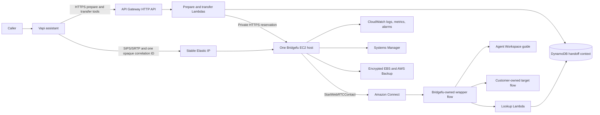

# Bridgefu AWS Engineering Handoff and Implementation Specification

- **Audience:** Qualified AWS infrastructure and CloudFormation engineer
- **Status:** Engineering handoff; not approved for production deployment
- **Last reconciled:** 2026-08-03
- **Product scope:** Free/community single-server Starter only
- **Explicit exclusion:** No HA architecture, deployment, validation, or
  production-readiness work is part of this assignment
- **Environments:** Separate nonproduction and production workload accounts
- **Primary region:** `us-west-2`
- **Primary path:** Vapi → Bridgefu Starter → Amazon Connect → Agent Workspace
- **Canonical infrastructure:** AWS CloudFormation
- **Repository:** `eisenzopf/bridgefu`
- **Current local branch:** `codex/recipe-first-production`
- **Source status:** Public-source review and checkpoint commit pending

## Current recovery and qualification status (authoritative)

A fresh IP-only Starter execution is initialized under a non-root IAM Identity
Center session. Its guarded identity, absence, permission, collision, and
regional-capacity preflight passed. Both required Vapi credentials are loaded
and validated only in the operator process; their values were never written to
Git, durable state, reports, logs, or command arguments.

The exact foundation bootstrap reached `CREATE_COMPLETE`, and the controller
verified its template, parameters, tags, outputs, roles, and complete resource
set against private durable state. Publication generation 3 is stale after
qualification-source changes and has no published release objects or release
ID. No bootstrap-refresh review, application review, application stack, or
qualification stack exists. The next AWS mutation is exactly one generation-4
`publish --refresh-candidate`; after verified publication, the next action is
`bootstrap-refresh` in review-only mode.

A historical execution, whose exact ID remains in private operator evidence,
is permanently retired. Its local ledger was lost and recovered only through
the controller's bootstrap-only, teardown-only path. **No application change
set was executed.** Do not publish, deploy, qualify, resume paid work, or
initialize again with any retired ID.

Use the
[IP-only nonproduction live-qualification runbook](recipes/vapi-amazon-connect-screen-pop/runbooks/nonproduction-live-qualification.md).
The mandatory recovery sequence is:

```text
read-only review → independent review of the exact file and file-byte SHA-256
→ read-only execute/adoption → inventory → destroy
→ retain three identical complete zero observations over at least 60 seconds
→ initialize a fresh execution ID
```

The recovered ledger authorizes only `inventory`, `destroy`, and, after a
prior destroy intent and separately authorized external cleanup when needed,
`destroy-finalize`. Recovery review and execute do not mutate AWS. A fresh
recovered `destroy-finalize` is prohibited before `destroy` records intent.

Local live authority resides in a controller-enforced private location outside
the repository and build directories. The portable default root is
`${XDG_STATE_HOME:-$HOME/.local/state}/bridgefu/aws-live`; an operator may set
`BRIDGEFU_AWS_LIVE_STATE_DIR` to another private root satisfying the same
boundary. No resolved operator-specific path is repository data. The state and
browser credentials are private to their host and must never be copied. Remote
recovery capsules are write-only evidence and are not consumed. There is no
distributed lock, so exactly one operator and host owns recovery at a time.

The current guarded preflight observed a non-root Identity Center role and
sufficient regional headroom for the bounded qualification. Exact account
utilization is intentionally not repository data. Later lifecycle boundaries
must repeat their fail-closed checks. If one returns an authorization error,
request only the exact denied action and scope.

The private deadline for the retired execution has expired. It forbids paid
work under that ID but never blocks inventory or teardown and never deletes
resources automatically. The private cost value was a planning estimate, not
a real-time cap. Stable zero proof has been retained privately. The current
fresh Starter `sip_rtp` IP-only execution requires no DNS, hostname,
certificate, or HA work. It has passed preflight and its foundation bootstrap;
application deployment remains prohibited.

## 1. Purpose of this handoff

This document is the implementation contract for the AWS engineer taking over
the Bridgefu Starter deployment. It is intended to be self-contained. It
records:

1. the product and ownership decisions that are already approved;
2. the target AWS design for nonproduction and production;
3. what has already been implemented and tested;
4. what happened during the prior live AWS attempts;
5. the known defects, security gaps, and external blockers;
6. the exact work that remains;
7. the evidence required before production traffic is allowed; and
8. the owner inputs and approvals the engineer will need.

The engineer should independently review the templates and application
assumptions. Local linting and a historical `CREATE_COMPLETE` do not establish
that the current candidate is production-ready.

## 2. Executive assessment

The repository contains a substantial implementation, including a nested
CloudFormation application, account-foundation templates, least-privilege
application roles, release signing, guarded change-set review, deployment
readiness signaling, qualification tooling, and runbooks. Static validation is
strong and one superseded application candidate reached `CREATE_COMPLETE`.

The deployment is **not ready for production** for five principal reasons:

1. The current source tree is dirty and has no clean, approved, immutable
   Starter-only release.
2. The current foundation bootstrap is proven, but the revised application
   templates have not completed a live create, update, rollback, qualification,
   and teardown cycle.
3. The approved long-term production/nonproduction account layout, governance,
   production DNS, secrets, and persistent nonproduction Connect foundation
   are not yet in place. The organization-member account used for the retired
   bootstrap was a disposable qualification target; it is not
   designated as the long-term Bridgefu nonproduction workload account.
4. The public release path still includes HA selections and HA assets even
   though HA is now a separate premium Marketplace product.
5. Several production engineering issues remain, including production Lambda
   concurrency planning and IAM isolation around customer-owned Amazon Connect
   flows. The narrower Connect CloudFormation update-handler action gap is
   fixed and covered by contract checks.

No Bridgefu application stack is currently retained. The known production
Connect instance and target flow were unchanged at the last successful audit.

## 3. Fixed product and ownership decisions

These decisions should not be changed by implementation convenience. Any
proposed deviation requires written owner approval.

1. The current free/community product is the **single-server Starter** profile.
2. HA is out of this release and will be a separate premium AWS Marketplace
   product. The engineer's only HA-related task is to ensure HA cannot be
   selected or published through the Starter release; the engineer is not
   being asked to finish, deploy, or qualify HA.
3. Nonproduction and production use separate AWS workload accounts.
4. The AWS Organizations management account contains no Bridgefu workload.
5. Production uses the existing customer Amazon Connect instance and approved
   target flow. They are reference-only resources.
6. Nonproduction uses one persistent test Amazon Connect foundation in its
   dedicated account. The Bridgefu application stack remains disposable.
7. Nonproduction qualification uses the Starter Elastic IP directly with
   SIP/RTP and has no public DNS or certificate dependency. Production uses
   DNS plus SIPS/SRTP and must pass a synthetic secure-path test before any
   customer traffic.
8. Human access uses IAM Identity Center. CI uses GitHub OIDC. Root and
   long-lived IAM-user credentials are prohibited for application work.
9. Production executes the exact CloudFormation change set that was reviewed.
10. A clean, content-bound, cryptographically verified release must pass two
    complete nonproduction cycles before production review.
11. Starter is not highly available. Host failure or replacement can interrupt
    active calls. Measured recovery time and capacity must be disclosed.

## 4. Known production boundary

The following placeholders define the required production boundary. Supply
their exact values through the approved private configuration path and
revalidate them from a fresh federated AWS session before creating any change
set.

| Item | Known value | Required treatment |
|---|---|---|
| Production account | `<PRODUCTION_ACCOUNT_ID>` | Owner-supplied workload account; invite to the production OU |
| Production region | `us-west-2` | All application and Connect resources remain regional |
| Connect alias | `<PRODUCTION_CONNECT_ALIAS>` | Customer-owned; do not modify ownership or delete |
| Connect instance ID | `<PRODUCTION_CONNECT_INSTANCE_ID>` | Owner-supplied reference only |
| Approved target flow ID | `<PRODUCTION_TARGET_FLOW_ID>` | Owner-supplied reference only; hash before and after deployment |
| GitHub repository | `eisenzopf/bridgefu` | OIDC trust must bind to this exact repository and environment |
| Direct Connect | Customer-owned resources may exist | Entirely out of scope; do not mutate |

An expired AWS CLI session is a normal federated-session reauthentication
condition, not an access-level failure. The table contains placeholders, not
deployable values. The qualification profile described in section 8.5 belongs
to a different account and does not grant production visibility.

## 5. Target architecture



Audio remains on the Vapi → Bridgefu → Amazon Connect media path. DynamoDB,
Lambda, CloudWatch, and the handoff API are outside the media packet path.
Only an opaque, short-lived correlation value is carried in SIP.

## 6. Repository and CloudFormation inventory

### 6.1 Application and foundation templates

| File | Intended role | Current assessment |
|---|---|---|
| `cloudformation/account-governance.yaml` | Per-workload-account audit, Config, Access Analyzer, GuardDuty, production Security Hub, and budget | Implemented and statically validated; not deployed; must be reconciled with Control Tower or existing singleton services |
| `cloudformation/nonproduction-foundation.yaml` | Persistent nonproduction Connect instance, test flow, agent, and credentials | Implemented and statically validated; no dedicated nonproduction account exists yet |
| `cloudformation/account-foundation.yaml` | Persistent artifact bucket, ECR repository, rollback alarm, deployer, and CloudFormation service role | Implemented and statically validated; not deployed; production role design needs separation from qualification roles |
| `cloudformation/test-deployment-role.yaml` | Historical qualification/deployment permissions | Used by the account foundation; must be refactored before production use |
| `cloudformation/template.yaml` | Root application stack | Implemented; still selects Starter or HA and therefore violates the approved Starter-only release boundary |
| `cloudformation/nested/network.yaml` | New or existing VPC, two-AZ subnet layout, endpoints, transfer Lambda security group | Implemented; Starter does not create NAT gateways |
| `cloudformation/nested/handoff-service.yaml` | DynamoDB, three Lambdas, HTTP API, generated application secrets | Implemented; quota description/math and production retention need correction |
| `cloudformation/nested/connect.yaml` | Recipe-owned wrapper flow, guide, Lambda association | Implemented; production permissions do not yet enforce the customer-flow boundary strongly enough |
| `cloudformation/nested/vapi.yaml` | Ownership-aware Vapi assistant/tool provisioning | Implemented; live provisioning for the current candidate remains unproved |
| `cloudformation/nested/runtime-starter.yaml` | One hardened ARM EC2 runtime, EIP, ACM, private control DNS, storage, backup, recovery | Implemented; current AMI and package installation are not fully immutable |
| `cloudformation/nested/observability.yaml` | Starter dashboard, topic, metric filters, and alarms | Implemented; alarm routing and operational ownership remain external gates |
| `cloudformation/nested/qualification-runner.yaml` | Separate nonproduction CodeBuild/Playwright runner | Implemented after the last executed run; not live-proven |
| `cloudformation/nested/demo-connect.yaml` | Nonproduction-only Connect foundation internals | Implemented; must never be reachable from the production application entry point |
| `cloudformation/production-stack-policy.json` | Root nested-stack replacement/deletion protection | Implemented; nested policies are generated after deployment by the CLI |

Paths above are relative to
`recipes/vapi-amazon-connect-screen-pop/`.

### 6.2 Administrator and release implementation

| File | Delivered behavior | Remaining concern |
|---|---|---|
| `src/recipe_admin.rs` | Schema-2 account binding, preflight, signed-manifest check, named change-set review/execute binding, recursive nested review, status, doctor, drift, stack policies, guarded destroy | Still exposes HA; quota math is wrong; signing trust and several baseline checks need hardening |
| `src/main.rs` | Recipe discovery/init and generation of deployment files | Still writes `parameters-ha.json` |
| `scripts/build-recipe-release.py` | Deterministic bundle, inventory, limits, Ed25519 signing | Still copies HA parameters, templates, runbooks, and Terraform assets |
| `.github/workflows/bridgefu-recipe-deploy.yml` | Environment-bound OIDC deployment workflow with preflight/review/execute/doctor | Still offers `high-availability`; production/nonproduction environment controls must be created in GitHub |
| `scripts/aws-recipe-live-test.py` | Guarded disposable publication, qualification, lifecycle, and zero-state controller | Historical qualification path; must be aligned to persistent foundations and Starter-only packaging |

### 6.3 HA assets outside this specification

HA source currently exists in the working tree, including:

- `cloudformation/nested/runtime-ha*.yaml`;
- `cloudformation/nested/observability-ha.yaml`;
- `parameters-ha.json`;
- `terraform/modules/aws-ha/`;
- HA runbooks, qualification logic, controller permissions, and CLI choices.

These assets are technical reference only. They must not be included in the
free release manifest, download bundle, Launch Stack path, ordinary workflow,
or support claim. The repository is MIT licensed; anything publicly released
under that license remains usable under its terms. The owner must choose a
private repository, private package input, or separate license before the HA
implementation is published as a restricted commercial product.

## 7. Work completed so far

### 7.1 Application and data path

The following exists locally and is covered by unit or contract tests:

- a strict data-only recipe schema and deterministic compiler;
- Vapi-to-SIP admission with one-use attachments;
- exact duplicate/missing/malformed correlation-header handling;
- durable handoff context with bounded fields, TTL, idempotency, and replay
  protection;
- prepare, transfer-destination, lookup, and Vapi-provisioner Lambdas;
- server-owned transfer destination and correlation ID;
- an Amazon Connect wrapper flow and Agent Workspace guide;
- missing-context fail-open behavior for voice routing;
- StartWebRTCContact integration and cleanup authority;
- SIPS/SRTP and explicit diagnostic SIP/RTP runtime modes;
- runtime, context, call, and cleanup evidence schemas.

### 7.2 Starter infrastructure hardening already present

- one ARM EC2 instance and one stable Elastic IP;
- no EC2 key pair and no SSH ingress;
- Systems Manager administration;
- IMDSv2 required with hop limit 1;
- encrypted root and separate state volumes;
- a retained production data-volume mode and disposable test mode;
- AWS Backup plan and vault in production retention mode;
- automatic EC2 system recovery alarm;
- non-root container, read-only container filesystem, and dropped
  capabilities;
- digest-pinned container image input;
- versioned S3 artifact inputs and runtime checksums;
- private Lambda-to-Bridgefu control endpoint;
- ACM export and certificate bootstrap for SIPS;
- EC2 `CreationPolicy` readiness signaling;
- CloudWatch dashboard and alarm set;
- stack ownership tags and guarded teardown.

### 7.3 CloudFormation and deployment safety already present

- a dedicated CloudFormation service-role field in schema 2;
- exact account, environment, role, stack, release, policy, and alarm binding;
- refusal to deploy from AWS account root;
- review-only named change-set creation;
- execution of the exact previously reviewed change-set name;
- recursive review of AWS-generated nested change sets;
- bounded resource/action/replacement allowlists;
- rollback triggers;
- production termination protection after successful deployment;
- root and nested production stack policies;
- recursive drift detection;
- production destroy blocked in the ordinary CLI;
- ownership checks before nonproduction destroy.

### 7.4 Release and CI work already present

- deterministic Lambda, runtime, demo-site, and recipe builders;
- byte-for-byte comparison of independent builds;
- manifest inventory with artifact count and size guards;
- SHA-256 binding for the working tree, image, templates, and artifacts;
- detached Ed25519 release signatures;
- a verified 64-byte signature path exercised in CI;
- CloudFormation lint and policy-as-code checks;
- Terraform Starter wrapper and contract tests;
- shell and documentation checks.

### 7.5 Last recorded validation results

The current qualification-release path natively builds on the ARM host while
cross-compiling only the two required Rust SIP probes for x86-64 Linux. The
isolated package graph excludes the disallowed cryptographic dependency; pinned
builder-image, source-inventory, ELF architecture, and glibc compatibility
guards pass in both packaging and the packaged runner. Focused builder tests,
locked package checks, the release-image policy, public-document identifier
checks, neutral naming, and whitespace checks pass. A complete final regression
pass remains required before generation 4 is published.

The historical local remediation pass on 2026-08-02 recorded:

- all locked Rust tests and all-target/all-feature Clippy passing;
- all 88 flagship Python tests passing;
- all 23 recipe documentation/runbook checks passing;
- all 20 CloudFormation templates passing `cfn-lint` and CloudFormation Guard;
- 19 templates within the inline API limit passing AWS
  `ValidateTemplate` in both `us-west-2` and `us-east-1`, for 38 API
  validations;
- the 55,816-byte deployment-role template passing local validation and being
  treated as URL-only;
- deterministic unsigned release builds matching byte for byte;
- one complete signed release build passing independent signature
  verification;
- Starter and HA Terraform contract validation passing.

These results establish source quality. The current foundation bootstrap has
also reached `CREATE_COMPLETE`, but no current application stack exists and no
real Vapi/Connect media result has been established.

## 8. Historical live AWS work

### 8.1 What succeeded

- A historical disposable run reached application
  `CREATE_COMPLETE` in the disposable test path in `us-east-1`.
- The existing production Connect instance and approved target flow were not
  changed or deleted.
- The application stack and historical test infrastructure were later removed.
- Cleanup evidence records zero remaining matching application stacks,
  bootstrap roles/policies, and tagged test resources.

### 8.2 What failed

Qualification after the successful create failed because the CodeBuild project
combined `NO_SOURCE` with an invalid local-cache setting. The `NO_CACHE`
correction was reviewed in a subsequent retired run but was not executed.

Earlier attempts also exposed and led to fixes for:

- root-role assumption behavior;
- IAM managed-policy size limits;
- missing resource-provider permissions and service-linked roles;
- Connect quota and contact-flow behavior;
- custom-resource lifecycle behavior;
- readiness not being tied to real runtime health;
- stale `REVIEW_IN_PROGRESS` root stack shells;
- empty Connect log groups left by failed provider operations;
- release bundles accidentally including Terraform provider caches;
- interrupted publication and stale candidate reviews.

### 8.3 Changes made after the last executed application create

The current working tree subsequently added or changed:

- CodeBuild `NO_CACHE` handling;
- a dedicated CloudFormation service role;
- EC2 `CreationPolicy` readiness;
- a separate qualification-runner stack;
- schema-2 account and environment preflight;
- persistent account and nonproduction foundations;
- the governance template;
- exact Connect log ownership;
- the bounded Amazon Connect CloudFormation update-handler IAM actions and
  their catalog/contract regressions;
- the native ARM-hosted, x86-64-targeted qualification package with packaged
  ABI compatibility guards;
- production stack policies, termination protection, and recursive drift;
- review-shell and log-group cleanup inventory.

Those changes pass their focused local validation. The current foundation
bootstrap completed a live `CREATE_COMPLETE`, but no current application or
qualification stack has been created. All historical release candidates are
superseded and must not be deployed.

### 8.4 Cleanup already completed

On 2026-08-02 the prior cleanup removed:

- 86 zero-resource `REVIEW_IN_PROGRESS` stack shells;
- 17 zero-byte Connect log groups;
- obsolete bootstrap stack, roles, policies, IAM user, and access key;
- one non-delegated Route 53 test zone;
- one temporary Vapi secret;
- three ECR images;
- approximately 1.6 GB across 1,048 versioned S3 objects.

The customer Connect instance, approved target flow, and customer Direct
Connect resources were not removed. AWS inventory was reported zero at the
time. The repository-local live-state files for that earlier, separate cleanup
were subsequently removed and were not migrated into durable private state; do
not cite those absent files as retained evidence. This does not refer to the
later retired-execution zero proof that is retained privately.

### 8.5 Private audit of the selected federated account

A private read-only audit confirmed a non-root IAM Identity Center session and
historical headroom for the narrowly scoped disposable qualification. Exact
account, organization, role, resource, security-posture, quota, and utilization
details are intentionally excluded from the repository and retained only in
private operator evidence.

That historical audit is not a fresh-deploy authorization or a guarantee that
no administrator change will be needed after current preflight. The controller
must re-query identity, account-wide absence, service quotas, and regional
capacity on every new execution. Temporary qualification use does not
redesignate a shared account as the long-term nonproduction environment or
satisfy the production landing-zone plan.

## 9. Known defects, gaps, and blockers

The engineer should track these identifiers in the implementation record.

| ID | Priority | Problem | Why it matters | Required resolution |
|---|---|---|---|---|
| G-01 | P0 | HA is still selectable and packaged | Violates the approved product boundary and risks publishing premium source under MIT | Produce a Starter-only public entry point, bundle, CLI, workflow, docs, and tests |
| G-02 | P0 | The working tree is large, dirty, and partly untracked | No auditable release source or trustworthy rollback point exists | Reconcile owner changes, review scope, commit intentionally, and build only from a clean commit |
| G-03 | P0 | Current application templates are not live-proven | The foundation bootstrap passed, but static validation cannot expose application provider lifecycle and service integration failures | Complete two clean current-candidate nonproduction cycles |
| G-04 | P0 | The target production/nonproduction landing-zone design is not complete | This remains a production-readiness and long-term environment gap, although it does not block the current disposable qualification | Establish the final landing zone, account separation, Identity Center, and GitHub OIDC before production |
| G-05 | P0 production gate | Long-term account governance and persistent foundations are not deployed | The current execution-scoped foundation bootstrap is proven, but it does not establish the final audit, budget, artifact, rollback-alarm, or persistent nonproduction Connect posture | Reconcile singleton services, then deploy and protect the long-term foundations before production |
| G-06 | P0 production gate; not current disposable blocker | Production preflight uses `4N + 10` and only 10 unreserved units | Current nonproduction uses `N=0` and creates no reservation, while production `N=20` needs 80 target units plus AWS's required 100-unit unreserved pool and existing-reservation headroom | Correct template docs, CLI math, and tests before production |
| G-07 | P0 | Production Connect IAM boundary is too broad | The service role currently permits update/delete of every contact flow under the supplied instance ARN, including the customer target | Add an explicit deny for customer-owned flows and redesign permissions around recipe-owned flows/tags/ARNs |
| G-08 | P0 | Production foundation reuses `test-deployment-role.yaml` | It creates an unconditional qualification role and carries test/demo/HA permissions and naming into production | Split persistent production deployer/service-role templates from disposable qualification roles |
| G-09 | Resolved privately | A historical execution lost its local ledger and is permanently retired | Recovery could not permit application work; no application change set was executed | Two-stage bootstrap-only recovery, independent file/SHA review, inventory, destroy, and retained three-sample zero proof completed; use a fresh ID |
| G-10 | P1 | Host build is not fully immutable | Nested runtime defaults to the latest AL2023 SSM AMI and runs unpinned `dnf install` at boot, so identical releases can create different hosts | Pin an approved AMI and package baseline, preferably through a reviewed golden AMI |
| G-11 | P1 | Release signature lacks an independent trust anchor | Preflight fetches the public key from the same release bundle and checks the fingerprint declared by that bundle | Pin the approved signer fingerprint outside the bundle and require an exact match |
| G-12 | P1 | Several preflight checks prove existence, not exact posture | Any budget/trail/recorder may satisfy checks; DNS delegation, alarms, Connect state, and policies are not fully bound | Strengthen preflight to verify exact account controls and go/no-go state |
| G-13 | P1 | Production retention and recovery are incomplete | DynamoDB/data volume are retained, but application secrets and logs are not consistently retained; retained resources lack a tested import/recovery path | Define the resource-by-resource retention matrix and test rebuild/import/restore |
| G-14 | P1 | Template support claim conflicts with evidence | Root output reports Starter as `supported` while documentation correctly calls it preview/pilot | Emit `preview`/`pilot` until the release evidence gate passes |
| G-15 | P1 | Operational security is not centralized | Current governance is per-account and lacks a central log archive/security tooling design, finding routing, VPC Flow Logs, and Session Manager audit configuration | Use Control Tower/SRA-style centralization or document and implement an approved equivalent |
| G-16 | P1 | Public handoff API uses application-layer authentication only | API Gateway routes use `AuthorizationType: NONE`; correctness depends entirely on Lambda bearer validation | Threat-model, test fail-closed auth, consider Lambda authorizer/static Vapi HTTP egress, and alarm on abuse |
| G-17 | P1 | Production parameters assume capacity that is not measured | `MaxConcurrentCalls=100` and `t4g.large` are defaults, not proven limits | Load, soak, and recovery-test; set a conservative pilot cap from evidence |
| G-18 | P1 | Customer target-flow drift is not enforced by the CLI | Current preflight confirms ARN but not flow state/type/content hash | Record and compare target-flow state/type/hash before review, before execute, and after deploy |
| G-19 | P2 | Nonproduction alarm email is empty in the example | Tests can run without anyone receiving application alarms | Require a confirmed operational destination in the final nonproduction parameters |
| G-20 | P2 | Artifact retention costs are not fully governed | Versioned S3 and immutable ECR resources are retained and can grow indefinitely | Define release retention, rollback minimums, and safe lifecycle rules |
| G-21 | Resolved for current bounded step; recheck later | Current non-root authority and regional capacity required fresh proof | The current guarded preflight passed, but usage and sessions can change | Repeat fail-closed reads at later lifecycle boundaries; request an exact missing action or quota only on evidence |
| G-22 | Foundation proof passed; application proof pending | IP-only nonproduction previously required a public hosted-zone ID | The current preflight and foundation bootstrap accepted the no-DNS posture; no application stack exists yet | Prove the application no-DNS path after generation-4 publication and reviewed foundation refresh |
| G-23 | Foundation proof passed; qualification proof pending | Qualification previously required SIPS/SRTP and rejected SIP/RTP host recovery | Qualification now selects scenarios by deployed SIP posture, and Starter recovery supports the IP-only SIP/RTP endpoint | Prove the path in the current live qualification; retain a separate production-only SIPS/SRTP synthetic gate |
| G-24 | P0 | The persistent account foundation does not create the qualification-source EIP/runner roles | `account-foundation.yaml` selects `ConnectMode=Existing`, while `test-deployment-role.yaml` creates those resources only for `ConnectMode=Disposable` | Split persistent nonproduction qualification roles from production roles and give the qualification-source EIP an explicit retained owner |
| G-25 | Resolved locally; current foundation proven | Regional CloudFormation Amazon Connect handlers require update actions during managed-resource lifecycle operations | Missing actions can fail create, rollback, or stabilization even when the operator did not request an update | The bounded deployment-role policy now includes the required update-handler actions and the IAM catalog/contract checks cover them; application live proof remains pending |

## 10. Current controlled qualification gates

1. **Retired-bootstrap cleanup is complete.** Its exact identity and stable
   teardown proof remain private. Never use any publication, review, execute,
   verify, lifecycle, or qualification command for a retired execution.
2. **Current preflight and foundation bootstrap are complete.** The non-root
   session passed the guarded account-wide checks, and the exact foundation
   bootstrap reached `CREATE_COMPLETE` with full controller verification.
3. **Generation 3 is stale and incomplete.** It has no published release
   objects or release ID. Finish the full local audit, then run exactly one
   generation-4 `publish --refresh-candidate`. A retry without a later source
   change must resume with ordinary `publish`.
4. **Review remains non-executing.** After verified publication, create only the
   `bootstrap-refresh` review and independently audit it. Do not execute that
   review or create an application or qualification review in the same step.
5. **The current application has not completed a live cycle.** Application
   review, execution, qualification, lifecycle rollback, teardown, and the
   second clean nonproduction cycle remain separately gated.

Broader production controls—including final account separation, governance,
production-role isolation, production Lambda quota, DNS/certificates, and two
passing nonproduction cycles—remain later production-readiness gates and must
not be inferred as complete.

## 11. Landing-zone and account specification

### 11.1 Required account layout

```text
AWS Organizations management account — no Bridgefu workload
└── Workloads OU
    ├── NonProduction OU/account — dedicated Bridgefu test workload
    └── Production OU/account <PRODUCTION_ACCOUNT_ID> — customer Connect plus Bridgefu
```

For a full production AWS baseline, the engineer should recommend AWS Control
Tower or an equivalent landing zone with separate Log Archive and Audit/Security
Tooling accounts. If the owner defers those extra accounts for the pilot, the
engineer must document that exception and implement the minimum per-account
controls below without putting application resources in the management
account.

### 11.2 Identity requirements

- Root MFA enabled in every account.
- No root access keys.
- Root used only for AWS operations that explicitly require root.
- IAM Identity Center enabled with named users/groups and permission sets.
- Separate human roles for account administration and application deployment.
- No long-lived IAM-user access keys for Bridgefu.
- Local AWS profiles use SSO and resolve to the expected account and role.
- GitHub OIDC provider created once per workload account or managed centrally.
- OIDC trust uses exact audience and exact `sub`:
  `repo:eisenzopf/bridgefu:environment:bridgefu-<environment>`.
- GitHub production environment has required reviewers, protected deployment
  branches/tags, no self-approval, and environment-scoped variables.
- CloudFormation uses a service role trusted only by
  `cloudformation.amazonaws.com`.
- The deployer may pass only that exact service role.

### 11.3 Governance requirements

Minimum controls in each workload account:

- active multi-region CloudTrail including global events and log-file
  validation;
- private, encrypted, versioned, retained audit storage;
- active AWS Config recorder and healthy delivery channel;
- active account external-access analyzer;
- GuardDuty enabled in both accounts;
- Security Hub enabled in production;
- monthly budget and confirmed notifications;
- owner-assigned routing for security findings and budget alerts;
- CloudFormation API events retained in CloudTrail;
- periodic access, drift, and findings review.

The engineer must check for pre-existing Control Tower or organization-managed
CloudTrail, Config, GuardDuty, Security Hub, and Access Analyzer resources.
These services have account/region singleton behavior. Do not deploy duplicate
resources blindly. Prefer organization delegation and StackSets where the
landing zone already owns them.

### 11.4 SCP requirements

- Do not attach a new restrictive production SCP until its effect on Amazon
  Connect and any Direct Connect dependencies has separate evidence.
- Recommended baseline guardrails include denying member-account departure,
  account closure, root access-key creation, and disabling central audit
  controls, subject to owner review.
- SCPs are guardrails, not grants. The engineer must still implement
  least-privilege IAM roles.

## 12. Common CloudFormation engineering specification

### 12.1 Stack boundaries

Keep distinct stacks by lifecycle and ownership:

1. organization/landing-zone controls;
2. workload account governance;
3. persistent nonproduction Connect foundation, nonproduction only;
4. persistent account artifact and deployment foundation;
5. disposable nonproduction qualification runner;
6. Bridgefu Starter application;
7. no HA stack in the free release.

Customer-owned production Connect and Direct Connect resources are never
imported into, adopted by, or deleted through the Bridgefu stack.

### 12.2 Template requirements

- Root template is Starter-only.
- Nested templates use immutable, release-bound URLs.
- All resources carry at least `Project`, `ManagedBy`, `Environment`,
  `BridgefuExecutionId`, and recipe/release identity where supported.
- Parameters use constraints and AWS-specific parameter types where practical.
- No secret value appears in a parameter file, output, tag, stack event, or
  build artifact.
- Image inputs require `@sha256:` digests.
- S3 code/runtime inputs require object version IDs; runtime/site inputs also
  require SHA-256 checksums.
- AMI ID and host package baseline are pinned to the release.
- Production stateful resources have explicit `DeletionPolicy` and
  `UpdateReplacePolicy` matching the retention matrix.
- Nonproduction application resources are deletable and ownership-scoped.
- Every custom resource is idempotent, bounded, timeout-safe, and
  ownership-aware on update/delete.
- Every log group is explicitly owned with a retention setting.
- Creation failure preserves useful bounded evidence without leaving
  indefinite review shells or unmanaged log groups.

### 12.3 Change management requirements

- Run preflight before review and again immediately before execution.
- Create one named change set with nested stacks included.
- Capture the complete recursive change tree.
- Reject unapproved resource types, actions, replacements, and deletions.
- Bind review to account, region, stack, service role, environment, release
  manifest digest, parameter digest, tags, rollback alarms, and change-set
  name.
- Execute that exact named change set. Do not regenerate it after approval.
- Initial create uses automatic rollback.
- Updates use rollback triggers and a ten-minute monitoring window or a
  reviewed replacement value.
- Production root and nested stack policies protect stateful and
  customer-facing resources.
- Production root termination protection is enabled and verified.
- Run recursive drift detection after deployment and on a recurring schedule.
- No manual console repair may be hidden from the evidence. Any required manual
  action must be recorded and converted to code before the next cycle.

### 12.4 Validation requirements

Every changed template must pass:

- YAML duplicate-key detection;
- `cfn-lint` with pinned version;
- CloudFormation Guard policy;
- AWS `ValidateTemplate` in `us-west-2`;
- IAM Access Analyzer policy validation;
- a complete nested change-set review in the target account;
- create, non-replacing update, forced rollback, drift, and delete/retain tests
  appropriate to the environment.

`ValidateTemplate` is syntax/API validation only. It is not provider lifecycle
evidence.

## 13. Starter network and host specification

### 13.1 Network

- Default `NetworkMode=NewVpc` for the initial deployment.
- One VPC with two public and two private subnets across two Availability Zones.
- The single Starter host runs in public subnet A and owns one stable EIP.
- Private subnets host the transfer Lambda network interfaces.
- Starter creates no NAT gateways.
- Gateway VPC endpoints for S3 and DynamoDB.
- Interface endpoints for Secrets Manager and CloudWatch Logs.
- Private Route 53 control zone and A record for Lambda-to-host control.
- VPC Flow Logs sent to a retained, encrypted destination with an approved
  retention period. This is not present in the current template and must be
  added or explicitly waived.
- CIDRs must be checked for collision with account networks and any future
  peering/transit design.

### 13.2 Ingress and egress

Nonproduction ingress:

- UDP/TCP 5060 only from the release-reviewed Vapi US signaling `/32`
  addresses;
- UDP 16384–32767 for RTP media;
- TCP 443 only from the transfer Lambda security group;
- one stack-owned Elastic IP advertised directly in the SIP URI; and
- no public Route 53 record, ACM certificate, port 5061, SSH, or EC2 key pair.

Production ingress:

- TCP 5061 only from the release-reviewed Vapi US signaling `/32` addresses;
- UDP 16384–32767 for Bridgefu's local RTP/SRTP ports;
- TCP 443 only from the transfer Lambda security group;
- no port 22, no EC2 key pair, and no public administration endpoint.

The currently documented Vapi US signaling addresses are
`44.229.228.186/32` and `44.238.177.138/32`. Vapi US media source addresses are
dynamic. The broad media source CIDR is therefore an explicit, documented
exception mitigated by the bounded destination port range, SIP-dialog binding,
one-use admission, symmetric RTP validation, call limits, and runtime cleanup.
The engineer must recheck Vapi's official network reference for every release
and provide an allowlist-update process.

SIP/RTP on port 5060 is the approved nonproduction qualification posture. It
must not be carried into production. The nonproduction evidence proves the
functional, lifecycle, media, Connect, and cleanup paths, but does not prove
TLS, SRTP, public DNS, or ACM certificate automation.

### 13.3 Host

- ARM64 Amazon Linux 2023 base approved and pinned by AMI ID.
- Initial instance class `t4g.large` is provisional; final size follows load
  evidence.
- Detailed monitoring enabled.
- IMDSv2 required, hop limit 1, metadata tags disabled.
- No SSH daemon exposure or key pair.
- Session Manager used for administration and configured for auditable session
  logging where technically supported.
- Root volume encrypted and deleted on replacement.
- Separate encrypted state volume.
- Production state volume retained; nonproduction state volume deleted.
- Bridgefu container runs non-root with read-only root filesystem and dropped
  Linux capabilities.
- Image pulled by exact digest from the approved repository.
- Bootstrap verifies the runtime artifact version and checksum.
- Bootstrap signals CloudFormation success only after the real configuration
  validator, service startup, `/livez`, and `/readyz` succeed.
- Failed bootstrap signals `FAILURE` with a non-sensitive step identifier.
- EC2 system-recovery alarm configured.
- Daily production backups with owner-approved retention and a tested restore.
- OS/package updates occur through a reviewed release, not unbounded boot-time
  drift.

### 13.4 Starter availability contract

Starter has no zero-downtime guarantee. The engineer must measure and publish:

- process restart time;
- EC2 recovery time;
- full instance-replacement time;
- DNS/EIP continuity behavior;
- active-call loss behavior;
- recovery point objective for the state volume;
- recovery time objective for host replacement.

No HA claim may be made based on EC2 automatic recovery alone.

## 14. Production DNS and certificate specification

- Nonproduction has no public hosted zone, SIP hostname, or public
  certificate; use `PublicHostedZoneId=none`,
  `SipHostname=unused.bridgefu.invalid`, and `SipSecurity=sip_rtp`.
- Create a public hosted zone or delegated subzone only for production.
- Create a production SIP hostname only after both nonproduction cycles pass.
- Parent zone owner installs the exact Route 53 delegation NS records.
- Preflight compares the public delegation to the hosted zone's assigned
  nameservers; a merely nonempty NS answer is insufficient.
- SIPS hostname resolves to the Starter EIP.
- Private control hostname resolves only inside the VPC to the instance private
  IP.
- ACM certificate covers both the public SIP hostname and private control
  hostname.
- DNS validation completes without manual resource edits.
- Export passphrase stays in Secrets Manager.
- Certificate/key/chain/hostname are checked before proxy reload.
- Certificate creation and rotation must be covered by static/template tests
  before production, then by a synthetic production secure-path test before
  customer traffic. The owner accepts that IP-only nonproduction cannot provide
  a live preproduction certificate-rotation test.
- Alarm at or before 21 days remaining and an assigned response owner.
- DNS and certificate ownership survives ordinary application rollback.

## 15. Serverless, API, data, and secret specification

### 15.1 Functions

The ordinary Starter application contains four Lambda functions:

1. prepare handoff;
2. transfer destination;
3. Connect lookup;
4. Vapi provisioner.

The optional demo-site publisher is disabled and does not count toward the
ordinary production profile.

Each function must have:

- its own least-privilege role;
- explicit log group and retention;
- ARM64 runtime artifact from a versioned S3 object;
- bounded timeout and memory;
- alarms for errors and relevant throttles;
- no secret values in environment variables or logs.

If production keeps `LambdaReservedConcurrencyPerFunction=20`, reserve 80
total units for these four functions and preserve AWS's required 100-unit
unreserved pool. The requested account quota must also account for all existing
function reservations. Nonproduction uses `0` unless a separate load-test
decision is approved.

### 15.2 Public handoff API

- HTTPS API exposes only `POST /v1/prepare-handoff` and
  `POST /v1/transfer-destination`.
- Missing, invalid, replayed, or conflicting authentication fails closed.
- Transfer destination and correlation ID remain server-owned.
- API rate and burst limits are explicitly set and load-tested.
- Access logs contain only request ID, route, status, and response length.
- No raw body, bearer token, customer context, or correlation ID in access
  logs.
- Threat model the current Lambda-level bearer validation.
- Prefer API Gateway/Lambda authorizer enforcement if it can be implemented
  without breaking Vapi; otherwise retain explicit evidence that application
  authentication is fail-closed.
- If the Vapi account enables fixed outbound HTTP IPs, evaluate a second
  network-layer restriction in nonproduction first.

### 15.3 DynamoDB and context

- Key is opaque `correlation_id`.
- Only approved bounded display fields are stored.
- Default TTL is 86,400 seconds unless the data owner approves another value.
- Production table uses on-demand billing, encryption, point-in-time recovery,
  deletion protection, `Retain`, and `UpdateReplacePolicy: Retain`.
- Nonproduction table uses the same functional schema but is deletable.
- Replays are idempotent only for identical source events; conflicting replay
  fails closed.
- Missing or expired context fails open for voice and shows generic agent
  context.
- TTL deletion is asynchronous and must be described accurately in the data
  retention policy.

### 15.4 Secrets

- Distinct nonproduction and production Vapi API keys.
- Vapi keys are created out of band and passed only by secret ARN.
- Generated correlation, webhook, control bearer, and certificate secrets have
  an explicit retention and rotation policy.
- Production recovery preserves or deliberately rotates secrets without
  making retained data or active integrations unusable.
- Secret KMS ownership is explicit; use customer-managed keys if compliance or
  cross-account recovery requires them.
- No secret value enters Git, chat, CloudFormation parameters/outputs, GitHub
  artifacts, or qualification evidence.
- Test secret deletion is ownership-verified.

## 16. Vapi specification

- Use a dedicated Vapi environment/credential for nonproduction.
- Use a distinct production credential.
- CloudFormation may create only the recipe-owned assistant, prepare tool,
  transfer tool, and webhook credential.
- Every remote object records Bridgefu ownership metadata and IDs.
- Updates reuse only owned IDs and reject ownership conflicts.
- Nonproduction delete removes only exact recipe-owned Vapi objects.
- Production uses `RetainVapiResourcesOnDelete=true`; retained object inventory
  and manual retirement procedure must be documented.
- The model cannot supply the transfer target, SIP URI, or correlation ID.
- Only one opaque `X-Correlation-Id` value is forwarded in SIP.
- No transcript, recording, payment data, password, or full customer record is
  put in SIP.
- Model/voice selection is an owner-approved parameter, not an implicit
  infrastructure change.
- Vapi API/network behavior and signaling IPs are revalidated before each
  release.

## 17. Amazon Connect specification

### 17.1 Common requirements

- Connect instance and Bridgefu are in the same account and region for each
  environment.
- The target is an active `CONTACT_FLOW`.
- Bridgefu creates exactly two recipe-owned flows: wrapper entry and Agent
  Workspace guide.
- Bridgefu associates only the recipe lookup Lambda.
- Wrapper invokes lookup, copies bounded attributes, sets the guide, and
  transfers to the supplied target flow.
- Lookup failure or missing context does not prevent voice transfer.
- Agents receive the `CustomViews.Access` permission through an owner-approved
  security profile change. CloudFormation must not silently broaden agent
  permissions.
- Flow and guide syntax are tested through real Connect execution, not just
  template validation.

### 17.2 Nonproduction

- `nonproduction-foundation.yaml` creates one persistent test Connect instance.
- Creation requires the exact
  `CREATE_PERSISTENT_NONPRODUCTION_CONNECT` acknowledgement.
- Foundation owns the test queue, hours, routing profile, security profile,
  user, target flow, log group, and generated agent credential secret.
- Root foundation termination protection is enabled.
- Application create/delete does not create or delete the Connect instance.
- Agent credential value remains only in Secrets Manager and the controlled
  browser runner session.

### 17.3 Production

- Use account `<PRODUCTION_ACCOUNT_ID>`, instance
  `<PRODUCTION_CONNECT_INSTANCE_ID>`, and approved target flow
  `<PRODUCTION_TARGET_FLOW_ID>`, after fresh private revalidation.
- Export the target flow's state, type, ARN, and content hash before review.
- Repeat the hash check immediately before execute and after deployment.
- Add an explicit IAM `Deny` preventing update, rename, metadata change, or
  deletion of the customer target flow.
- Prefer tag/ARN conditions that allow mutation only on Bridgefu-owned flows.
- The ordinary production service role has no permission to create/delete a
  Connect instance, user, queue, routing profile, security profile, or hours of
  operation.
- Any unexpected customer-flow difference is an immediate no-go/rollback
  condition.
- Direct Connect is not part of the Bridgefu stack or test.

## 18. Observability and operations specification

### 18.1 Application alarms

The current Starter template includes alarms for:

- prepare, transfer, lookup, and provisioner Lambda errors;
- transfer throttles;
- API 5xx responses;
- DynamoDB throttles;
- transfer-contract failures;
- unavailable screen-pop context;
- runtime readiness;
- runtime errors;
- durable cleanup backlog;
- certificate expiry;
- sustained EC2 CPU pressure;
- EC2 system recovery.

The engineer must verify each alarm's metric namespace, dimensions, missing-data
behavior, threshold, runbook link, and SNS routing against a real deployment.
Both environment subscriptions must be confirmed. Production alarms must reach
an actively monitored destination, not just create an unconfirmed email
subscription.

### 18.2 Deployment rollback alarm

- Persistent account-foundation alarm exists before application review.
- Preflight verifies the exact ARN and rejects an active alarm.
- Change set contains the exact reviewed rollback trigger.
- A controlled invalid-artifact update proves automatic rollback.
- The prior working artifact version and runtime health are restored.

### 18.3 Operational controls

- CloudWatch dashboard loads all expected series after synthetic traffic.
- No per-packet logging.
- No high-cardinality customer/call/correlation labels.
- VPC Flow Logs and Session Manager access evidence have approved retention.
- CloudTrail, Config, GuardDuty, Security Hub, Access Analyzer, budgets, backup
  jobs, and certificate health have named owners and review cadence.
- Monthly stack drift and access review.
- Recurring nonproduction synthetic call after launch.
- Patch, secret rotation, certificate rotation, restore, replacement, and
  rollback runbooks exercised in nonproduction.

## 19. Nonproduction environment specification

| Setting | Required value or rule |
|---|---|
| Account | Dedicated workload account; ID supplied after account creation |
| Region | `us-west-2` |
| Application stack | `bridgefu-bft-nonproduction` or reviewed equivalent |
| Deployment ID | `bft-nonproduction` or reviewed equivalent |
| Runtime | Starter only |
| Instance | `t4g.large` provisional; pin approved AMI |
| Network | `NewVpc` initially |
| SIP | `sip_rtp` advertised by the exact stack-owned Elastic IP |
| DNS | None; `PublicHostedZoneId=none` and `SipHostname=unused.bridgefu.invalid` |
| Connect | Persistent nonproduction foundation output |
| Target flow | Persistent test target-flow output |
| Vapi | Dedicated nonproduction secret ARN |
| Data mode | `TestDelete` |
| Retain Vapi on delete | `false` |
| Lambda reserved concurrency | `0` |
| Demo site | `false` for ordinary application stack |
| Context TTL | 86,400 seconds unless approved otherwise |
| Log retention | 30 days proposed; owner/engineer confirm |
| Alarm destination | Required and confirmed |
| Application termination protection | `false` so qualified teardown is possible |
| Foundation termination protection | `true` |
| Monthly budget | `<NONPRODUCTION_MONTHLY_BUDGET>`; owner confirms |
| Customer data | Synthetic only |

### 19.1 Nonproduction foundation exit criteria

- Organization membership and OU placement verified.
- Federated role and GitHub environment verified.
- Governance controls actively healthy.
- Persistent Connect instance is `ACTIVE`.
- Test target flow is active and published.
- Artifact bucket and ECR are private, encrypted, versioned/immutable, and
  retained.
- CloudFormation role trust and pass-role scope verified.
- A new stack-owned Elastic IP can be allocated and is not borrowed from an
  unrelated workload.
- No public DNS record or ACM certificate is created by nonproduction.
- Vapi test secret resolves only from approved roles.
- Required service quotas have headroom.

### 19.2 Qualification cycle 1

1. Start from zero Bridgefu application state.
2. Run complete schema-2 preflight.
3. Create and retain a named recursive change-set review.
4. Obtain independent approval.
5. Execute the exact reviewed change set.
6. Require `CREATE_COMPLETE` and real EC2 readiness.
7. Run structural health, drift, alarm, backup, EIP, no-public-DNS, SSM, and
   security checks.
8. Run the full functional matrix in section 24.
9. Apply one bounded non-replacing update.
10. Trigger and prove automatic rollback with an invalid owned artifact.
11. Run process restart, EC2 recovery, load, adverse-network, and soak tests.
12. Destroy only the application and qualification-runner stacks.
13. Prove zero application resources while retaining governance, account
    foundation, artifacts, and persistent Connect.

Any release change after a failure starts cycle counting over at cycle 1.

### 19.3 Qualification cycle 2

Repeat cycle 1 from zero application state using:

- the exact same commit;
- the exact same image digest;
- the exact same signed manifest and public-key fingerprint;
- the exact same template and artifact digests/versions;
- a fresh federated session;
- a new named change set;
- an independent reviewer.

No console repair is allowed. Compare resource inventory, call counts,
latencies, capacity, recovery, and teardown results between the two cycles.

## 20. Production environment specification

| Setting | Required value or rule |
|---|---|
| Account | `<PRODUCTION_ACCOUNT_ID>` |
| Region | `us-west-2` |
| Application stack | `bridgefu-bft-production` or reviewed equivalent |
| Deployment ID | `bft-production` or reviewed equivalent |
| Runtime | Starter only |
| Instance | Evidence-selected ARM type; `t4g.large` is provisional |
| AMI | Explicit release-pinned ID |
| Network | `NewVpc` initially unless a reviewed existing VPC is selected |
| SIP | `sips_srtp` only |
| Connect instance | Existing `<PRODUCTION_CONNECT_INSTANCE_ID>` |
| Target flow | Existing `<PRODUCTION_TARGET_FLOW_ID>` |
| Vapi | Distinct production secret ARN |
| Data mode | `ProductionRetain` |
| Retain Vapi on delete | `true` |
| Lambda reserved concurrency | 20 per each of four functions, subject to corrected quota gate |
| Minimum concurrency capacity | 180 with no other reservations; increase for existing reservations/headroom |
| Demo site | `false` |
| Context TTL | 86,400 seconds unless data owner approves another value |
| Log retention | 90 days proposed; owner/security engineer confirm |
| Alarm destination | Required, confirmed, and actively monitored |
| App termination protection | `true` |
| Foundation termination protection | `true` |
| Stack policies | Root and every nested stack verified |
| Monthly pilot budget | `<PRODUCTION_MONTHLY_BUDGET>`; owner confirms |
| Initial call limit | Set from retained nonproduction evidence; do not assume 100 |
| Traffic | Synthetic first, then separately approved bounded pilot |

### 20.1 Production go/no-go

Production is a no-go if any of the following is true:

- caller is root, an IAM user, or the wrong account/role;
- source is dirty or release is unsigned/untrusted;
- HA appears in the public bundle or selected change set;
- preflight fails or is weaker than the requirements in this document;
- target flow is not active, has the wrong type, or its hash changed;
- the service role can mutate the customer target flow without an explicit
  deny;
- a rollback or Bridgefu alarm is active;
- quota headroom is insufficient;
- DNS or certificate is incomplete;
- any nonproduction cycle failed or used a different candidate;
- change set contains an unapproved create, delete, replacement, or IAM
  expansion;
- rollback owner, operations owner, reviewer, or change window is missing.

### 20.2 Production deployment sequence

1. Capture account, role, quota, audit, Connect, target-flow, DNS, certificate,
   secret-ARN, alarm, backup, and release baselines.
2. Run production preflight.
3. Create a named review-only change set with nested stacks.
4. Independently review every root and nested change.
5. Bind approval to the exact change-set ARN/name and evidence bundle.
6. Re-run preflight and target-flow hash immediately before execute.
7. Execute the exact reviewed change set.
8. Wait for `CREATE_COMPLETE` and application readiness.
9. Verify termination protection, root/nested stack policies, alarms, drift,
   backup, SSM, DNS, certificate, and health endpoints.
10. Run one synthetic production Vapi → Bridgefu → Connect test using only
    approved synthetic context.
11. Verify two-way audio, DTMF, screen pop, both-leg teardown, one Connect
    contact, and final zero call/cleanup state.
12. Re-hash the customer target flow.
13. Keep customer traffic disabled until the owner explicitly accepts the
    synthetic evidence.
14. Enable only the bounded pilot described in the approved change record.
15. Monitor continuously through the change window.

### 20.3 Production rollback

Rollback triggers include:

- EC2 readiness or health failure;
- DNS/certificate failure;
- failed audio, DTMF, transfer, screen pop, or teardown;
- customer target-flow difference;
- repeated Lambda, API, DynamoDB, Connect, or runtime errors;
- cleanup backlog or leaked contacts/routes;
- capacity or latency outside the nonproduction envelope;
- any active rollback alarm.

Rollback procedure:

1. Stop new pilot traffic.
2. Execute or allow CloudFormation rollback to the last approved release.
3. Preserve bounded, redacted logs and evidence.
4. Verify the customer target flow and instance.
5. Verify contact/call/attachment/route cleanup.
6. Do not delete retained production data, Vapi assets, foundations, or
   customer-owned Connect resources.
7. If stack recovery cannot preserve retained resources, stop and use the
   separately tested break-glass recovery/import runbook.

Ordinary production destroy remains prohibited.

## 21. IAM remediation specification

The production permissions require an explicit redesign before deployment.

### 21.1 Split roles by lifecycle

Create separate templates and roles for:

- persistent nonproduction deployer;
- persistent production deployer;
- CloudFormation application service role per environment;
- disposable nonproduction qualification runner and qualifier;
- foundation administration, if required.

Production must not create a qualification EIP, runner role, qualifier role,
demo Connect permissions, or HA permissions.

### 21.2 Protect customer Connect resources

At minimum:

- explicit deny for `connect:UpdateContactFlowContent`,
  `connect:UpdateContactFlowMetadata`, `connect:UpdateContactFlowName`, and
  `connect:DeleteContactFlow` on the approved customer target-flow ARN;
- no `connect:DeleteInstance` in the production role;
- no production permissions for users, queues, routing profiles, security
  profiles, hours, or instance creation;
- create/update/delete permissions for Bridgefu-owned flows constrained by
  tags, exact ARNs, or a reviewed two-stage provisioning model;
- Connect instance ARN and account/region bound exactly;
- IAM Access Analyzer validation with no unresolved security warnings.

An explicit deny on only the target flow is the minimum safety floor. The
preferred result prevents mutation of every pre-existing customer flow while
allowing only Bridgefu-owned flow IDs.

### 21.3 General least privilege

- Remove HA, demo, and qualification actions from Starter production.
- Scope artifact read to exact bucket prefixes/versions where CloudFormation
  supports it.
- Scope ECR to pull-only for the approved repository.
- Restrict KMS grants to exact keys and services.
- Restrict Secrets Manager access to exact secret ARNs.
- Retain wildcard `Describe` only where AWS APIs do not support resource-level
  permissions and record each exception.
- Add permission-boundary or SCP defense in depth only after testing Connect
  and Direct Connect compatibility.
- Review the permanence of CloudFormation service-role authority: anyone who
  can update the stack can cause CloudFormation to use that role, so stack and
  change-set permissions must stay tightly scoped.

## 22. Required source changes

### 22.1 Starter-only package boundary

- Remove `HighAvailability` from the free root template's allowed values or
  eliminate `RuntimeProfile` entirely from the public Starter entry point.
- Remove HA parameters, nested stacks, outputs, conditions, and metadata from
  the free root template.
- Remove HA from the public recipe manifest.
- Remove `parameters-ha.json` from `recipe init`.
- Remove HA from `deployment.example.yaml`.
- Remove HA from the ordinary GitHub deployment workflow.
- Exclude HA templates, Terraform module, runbooks, scripts, and qualification
  assets from `build-recipe-release.py` output.
- Reduce the free CLI resource allowlist and profile enum to Starter.
- Add a CI test that inspects the complete release inventory and fails if an HA
  selector or HA-only path is present.
- Preserve HA source without publishing it until the owner selects its private
  or separately licensed boundary.

### 22.2 IP-only nonproduction contract

- Set the nonproduction example to `SipSecurity=sip_rtp`,
  `PublicHostedZoneId=none`, and
  `SipHostname=unused.bridgefu.invalid`.
- Allow `none` in `account-foundation.yaml` and propagate it to the deployment
  role without granting access to a public hosted zone.
- Make nonproduction preflight skip public DNS, delegation, ACM, and
  certificate checks while proving the exact stack-owned EIP output.
- Add negative tests proving the no-DNS posture is accepted only for Starter
  nonproduction and cannot be selected for production.
- Split the qualification matrix and validator by environment. Nonproduction
  must require SIP/RTP PCMU/PCMA, Vapi transfer, media, DTMF, Connect,
  screen-pop, negative cases, recovery, load, soak, and teardown without
  requiring SIPS/SRTP observations.
- Make the Starter host-recovery drill support the deployed SIP/RTP listener;
  it currently fails unless `SipSecurity=sips_srtp`.
- Add a production-only secure synthetic gate for SIPS/TLS, SRTP, hostname and
  certificate validation before customer traffic.
- Verify nonproduction creates no public Route 53 record or ACM certificate.
- Create the persistent qualification-source EIP and runner roles independently
  of disposable Connect mode; the current `ConnectMode=Existing` foundation
  suppresses them.
- Keep production preflight fail-closed on a delegated public zone, exact
  hostname, valid certificate path, and `SipSecurity=sips_srtp`.

### 22.3 Quota correctness

- Correct `handoff-service.yaml` documentation that currently states
  `3N + 10`.
- Correct `src/recipe_admin.rs` from `4N + 10` and `unreserved >= 10` to the
  AWS-compatible calculation that preserves 100 unreserved units and accounts
  for existing reservations.
- Add tests for quota 10, 90, 179, 180, existing reservations, zero reserved
  concurrency, and optional function counts.
- Report required quota and current headroom clearly in preflight output.

### 22.4 Production role separation

- Replace production use of `test-deployment-role.yaml` with a persistent
  Starter production role template.
- Put qualification roles in a nonproduction-only template.
- Remove unconditional `QualificationRole` from production.
- Remove disposable Connect and HA permissions from production.
- Add customer target-flow denies and owned-flow constraints.
- Update account-foundation outputs, docs, tests, and preflight accordingly.

### 22.5 Immutable runtime

- Expose `AmiId` at the root and bind it to the signed manifest/parameters.
- Replace the moving SSM `latest` default in released deployments.
- Pin or bake Docker, HAProxy, CloudWatch Agent, and host dependencies.
- Record AMI owner, architecture, creation date, and package inventory.
- Make the boot path retry bounded network operations and fail with a safe
  readiness step.
- Add a tested patch/upgrade path that intentionally replaces the single host
  and documents downtime.

### 22.6 Trust and preflight

- Add a descriptor or installed trust-store field for the approved Ed25519
  public-key SHA-256 fingerprint.
- Compare the fetched key to that independent trust anchor.
- Verify every release-required artifact path/digest, not only the root
  template.
- Compare public DNS delegation with the hosted zone delegation set.
- Require target flow active/type/hash.
- Require rollback alarms not in `ALARM`.
- Verify the exact environment budget name/amount/notifications.
- Verify trail logging destination/protection and Config health, not merely
  existence.
- Verify exact foundation role/policy fingerprints where practical.
- Verify GitHub environment protection through retained configuration evidence.

### 22.7 Retention and recovery

- Produce a resource-by-resource production retention table.
- Align Secrets Manager resources and log groups with that table.
- Define secret deletion recovery windows rather than implicit force deletion.
- Test recovery with retained DynamoDB, EBS, backup vault, Vapi objects, and
  generated secrets.
- Add import/adoption or restore procedures for a lost CloudFormation root
  stack.
- Add a production log/evidence retention path independent of application
  deletion.

### 22.8 Accuracy and operations

- Change Starter `SupportTier` output to `preview` or `pilot` until qualified.
- Require nonproduction alarm destination.
- Add VPC Flow Logs or record an approved exception.
- Configure Session Manager audit logging appropriate to the access methods in
  use.
- Add central finding/alert routing or document the approved pilot exception.
- Define S3/ECR lifecycle policy that preserves approved rollback releases.

## 23. Release specification

An eligible release must contain and bind:

- clean Git commit SHA and source-tree digest;
- `source_dirty=false`;
- Starter-only root and nested templates;
- exact ARM64 image URI by digest;
- SBOM, build provenance, and vulnerability policy result;
- exact AMI ID and host package/golden-image identity;
- each Lambda/runtime artifact key, S3 version ID, size, and SHA-256;
- every template path, size, and SHA-256;
- public release ID and manifest SHA-256;
- detached Ed25519 signature;
- independent trusted public-key fingerprint;
- builder/workflow revision;
- compatibility and qualification schema revisions.

Release requirements:

- build from a clean, reviewed commit;
- no local caches, state, credentials, evidence, or HA assets;
- no mutable image tag or branch URL used as authority;
- no unversioned S3 object used by the application;
- public/non-secret template URLs are content-addressed or otherwise immutable;
- same release is promoted from nonproduction to production without rebuild;
- signer private key remains outside the repository and release bundle;
- independent verification occurs before any change set.

## 24. Functional and lifecycle acceptance matrix

### 24.1 Positive call path

Each counted cycle must prove with real Vapi and real Amazon Connect:

- Vapi assistant/tool provisioning succeeds and owns only expected objects;
- prepare returns bounded server-approved context;
- transfer returns only server-owned routing values;
- exactly one opaque correlation header is present on the received SIP INVITE;
- TLS and SRTP are negotiated;
- PCMU and PCMA required cases pass;
- exactly one Amazon Connect contact starts;
- wrapper invokes lookup and transfers to the expected target flow;
- Agent Workspace displays the expected synthetic fields;
- bidirectional non-silent audio markers pass;
- required DTMF directions pass;
- Vapi-originated hangup cleans up both legs;
- agent-originated hangup cleans up both legs;
- final call, route, attachment, contact, and cleanup counts are zero.

### 24.2 Negative and replay cases

- missing correlation header;
- duplicate correlation headers;
- malformed correlation value;
- expired attachment;
- attachment replay;
- unauthorized webhook request;
- invalid bearer;
- conflicting prepare replay;
- missing DynamoDB context;
- source cancellation before answer;
- Lambda timeout/error;
- Connect lookup failure.

Negative cases must fail safely, create no duplicate contact, expose no raw
context, and leave zero cleanup state. Missing context must preserve voice
transfer with a generic screen-pop state.

### 24.3 Infrastructure lifecycle

- clean create;
- status and doctor;
- recursive drift in sync;
- bounded non-replacing update;
- intentionally invalid owned-artifact update;
- `UPDATE_ROLLBACK_COMPLETE` and restored health;
- process restart;
- EC2 system recovery;
- full host replacement and retained-data reattachment/recovery;
- certificate rotation;
- Vapi secret rotation;
- backup restore;
- application delete in nonproduction;
- zero-state inventory with persistent foundations intact.

### 24.4 Load, latency, and soak

- bounded concurrency test up to the proposed pilot cap;
- CPU, memory, file descriptor, RTP port, interface error, media drop, and
  cleanup metrics retained;
- prepare, transfer, lookup, SIP setup, Connect setup, answer, and screen-pop
  latency measured;
- adverse network profiles executed;
- one-hour soak with repeated calls and both hangup origins;
- no counter reset, leaked contact, leaked route, pending cleanup, Lambda
  error, DynamoDB throttle, or host exhaustion;
- supported capacity set below the measured failure point with documented
  headroom.

## 25. Evidence package required for approval

Retain exact account, principal, ARN, EIP, Connect, and proof identities only
in the private durable state root. Git may contain only bounded, redacted
summaries with placeholders. The private approval package may retain:

- account, region, assumed-role ARN, and execution ID;
- organization/OU/account mapping;
- root MFA/access-key posture without credential material;
- governance health and alert subscription confirmation;
- commit, source digest, image digest, AMI ID, manifest digest, template
  digests, artifact versions, and signer fingerprint;
- exact CloudFormation root and nested change-set IDs;
- recursive action/replacement review;
- IAM policy validation results;
- stack events, status, role, policy, termination protection, and drift;
- resource inventory before create and after teardown;
- production DNS delegation and certificate results; nonproduction instead
  records the exact EIP and proves no public DNS/certificate resources exist;
- Connect instance/flow identity, state/type, and target-flow hashes;
- synthetic scenario outcomes and call/contact counts;
- audio-marker, DTMF, latency, recovery, load, and soak facts;
- alarm/dashboard state;
- backup and restore evidence;
- final nonproduction zero-state evidence.

Never retain:

- API keys, passwords, bearer tokens, private keys, or agent passwords;
- raw customer context or customer identifiers;
- full SIP headers or correlation IDs;
- transcripts, recordings, or customer audio;
- browser authentication state;
- secret values from CloudFormation or Secrets Manager.

## 26. Required owner inputs

### 26.1 Before landing-zone work

- management account ID or authorization to create/select it;
- unique owner-controlled nonproduction account email, or existing account ID;
- approval to invite production account `<PRODUCTION_ACCOUNT_ID>`;
- Identity Center users/groups and required roles;
- billing and security alert mailbox;
- approval or deferral of Control Tower plus Log Archive/Audit accounts;
- nonproduction and production pilot budget approval or
  replacement values;
- GitHub production reviewers and allowed deployment branches/tags.

### 26.2 Before IP-only nonproduction

- approval to use clear SIP/RTP with synthetic data in nonproduction;
- an available Elastic IP allocation or approved quota increase;
- dedicated nonproduction Vapi API key stored in Secrets Manager;
- only the resulting secret ARN, never the key value;
- approved release-distribution location;
- release-signing custodian and trusted public-key fingerprint;
- confirmed nonproduction alarm destination;
- approval for synthetic call costs and test window.

### 26.3 Before production review

- production DNS subdomain and SIP hostname;
- distinct production Vapi secret ARN;
- reconfirmation of Connect instance and target flow;
- approval of IAM changes needed to create the two Bridgefu-owned flows and
  Lambda association;
- data classification and retention requirements;
- production alarm/security destination;
- Lambda quota-increase approval based on corrected calculation;
- approved instance type and concurrent-call pilot cap from nonproduction;
- change window, reviewer, rollback owner, operations owner;
- synthetic-only versus bounded customer pilot decision.

## 27. Engineer deliverables

The handoff is complete when the engineer supplies:

1. reviewed landing-zone/account design and recorded owner decisions;
2. updated Starter-only CloudFormation templates;
3. separate nonproduction qualification and production IAM templates;
4. IAM policy review with explicit customer Connect protections;
5. corrected quota calculation and tests;
6. independent signing trust configuration;
7. pinned AMI/host supply-chain design;
8. production retention/recovery matrix and tested runbook;
9. final nonproduction and production descriptors/parameter files with no
   placeholders or secrets;
10. immutable signed Starter release and inventory;
11. two complete nonproduction evidence packages;
12. production recursive change-set review package;
13. production synthetic test and target-flow integrity evidence;
14. cost estimate and recurring-cost inventory;
15. operations handoff with owners, alarms, rotation, restore, replacement,
    incident, rollback, and drift procedures;
16. a concise residual-risk statement covering single-host availability and
    any approved governance exceptions.

## 28. Execution workplan

### Milestone 0 — Source and commercial boundary

- owner reviews the current dirty tree;
- engineer separates Starter public packaging from HA;
- CI proves no HA asset/selector in the free release;
- owner approves HA source destination/licensing boundary;
- clean implementation commit created.

**Exit:** clean Starter-only source baseline.

### Milestone 1 — Landing zone and identity

- create/select management account;
- establish OUs and workload accounts;
- enroll/invite production safely;
- enable Identity Center;
- configure federated CLI profiles and GitHub OIDC;
- record root and access baseline.

**Exit:** no Bridgefu application action depends on root or IAM-user keys.

### Milestone 2 — Template remediation

- fix P0/P1 engineering gaps in sections 9 and 22;
- split production/qualification IAM;
- pin host/release inputs;
- strengthen preflight and retention;
- run all local/static validations.

**Exit:** engineer-reviewed Starter candidate with no open P0 source defect.

### Milestone 3 — Persistent foundations

- reconcile/deploy governance;
- create persistent nonproduction Connect;
- deploy account foundations;
- enable foundation termination protection;
- establish nonproduction EIP capacity, secrets, alerts, and quotas; do not
  create public DNS or certificates.

**Exit:** nonproduction preflight can reach only release-specific checks and
its IP-only prerequisites are healthy.

### Milestone 4 — Immutable release

- build, scan, sign, publish, and independently verify one clean release;
- generate exact descriptors and parameters;
- owner approves release identity.

**Exit:** one immutable Starter release eligible for qualification.

### Milestone 5 — Nonproduction cycle 1

- deploy, functionally qualify, update, rollback, recover, load, soak, destroy;
- correct any failure in source and restart cycle counting.

**Exit:** complete passing evidence or new candidate required.

### Milestone 6 — Nonproduction cycle 2

- repeat from zero application state with the same release and independent
  review;
- compare results and finalize capacity/RTO/RPO.

**Exit:** release eligible for production review.

### Milestone 7 — Production review

- establish and validate production DNS, ACM, and SIPS/SRTP inputs now that
  both nonproduction cycles have passed;
- capture target-flow and account baselines;
- create recursive named change set;
- prove IAM boundary and no destructive changes;
- obtain owner approval.

**Exit:** exact approved change set; no production mutation yet.

### Milestone 8 — Controlled production deployment

- recheck, execute exact change set, verify protections and health;
- run synthetic path;
- prove target flow unchanged;
- obtain separate pilot-traffic approval.

**Exit:** healthy controlled Starter pilot or completed rollback.

### Milestone 9 — Operations acceptance

- finalize owner rotations and support limits;
- schedule canary, drift, access, security, backup, and certificate reviews;
- publish single-host limitation and recovery measurements.

**Exit:** operations owner accepts the service.

## 29. Definition of done

The Starter deployment is complete only when:

- the free release contains no HA selector or HA-only asset;
- source and release are clean, immutable, signed, and independently trusted;
- nonproduction and production are separate organization member accounts;
- human and CI access are federated and root-free;
- governance and foundations are healthy and protected;
- production IAM cannot mutate the customer target flow;
- quota checks use AWS-correct reserved/unreserved math;
- AMI and host dependencies are release-pinned;
- two identical IP-only nonproduction cycles pass all required tests and
  teardown cleanly;
- production change set is independently approved and executed unchanged;
- synthetic production audio, DTMF, screen pop, and teardown pass;
- customer target flow hash is unchanged;
- capacity, RTO, RPO, retention, and single-host limitation are published;
- operations accepts alarms, security findings, backups, rotation, recovery,
  incident response, drift, and rollback.

Until all criteria are met, the correct support statement is **preview or
controlled production pilot**, not generally available or highly available.

## 30. Repository references

- `BRIDGEFU-AWS-STARTER-WORKPLAN.md`
- `BRIDGEFU-AWS-ADMIN-NONPRODUCTION-REQUEST.md`
- `BRIDGEFU-RECIPE-IMPLEMENTATION-PROGRESS.md`
- `BRIDGEFU-RECIPE-IMPLEMENTATION-PLAN.md`
- `recipes/vapi-amazon-connect-screen-pop/README.md`
- `recipes/vapi-amazon-connect-screen-pop/deployment.nonproduction.example.yaml`
- `recipes/vapi-amazon-connect-screen-pop/deployment.example.yaml`
- `recipes/vapi-amazon-connect-screen-pop/parameters-nonproduction-starter.json`
- `recipes/vapi-amazon-connect-screen-pop/parameters-starter.json`
- `recipes/vapi-amazon-connect-screen-pop/runbooks/account-foundations.md`
- `recipes/vapi-amazon-connect-screen-pop/runbooks/deployment-readiness.md`
- `recipes/vapi-amazon-connect-screen-pop/runbooks/upgrade-rollback.md`
- `recipes/vapi-amazon-connect-screen-pop/runbooks/starter-recovery.md`
- `recipes/vapi-amazon-connect-screen-pop/runbooks/production-destroy.md`
- `.github/workflows/bridgefu-recipe-deploy.yml`
- `scripts/prepare-bridgefu-nonproduction-account.sh`

## 31. Authoritative guidance

- [AWS Organizations management-account best practices](https://docs.aws.amazon.com/organizations/latest/userguide/orgs_best-practices_mgmt-acct.html)
- [AWS account separation — Well-Architected Security Pillar](https://docs.aws.amazon.com/wellarchitected/latest/security-pillar/aws-account-management-and-separation.html)
- [AWS CloudFormation best practices](https://docs.aws.amazon.com/AWSCloudFormation/latest/UserGuide/best-practices.html)
- [CloudFormation termination protection](https://docs.aws.amazon.com/AWSCloudFormation/latest/UserGuide/using-cfn-protect-stacks.html)
- [GitHub OIDC role configuration in AWS IAM](https://docs.aws.amazon.com/IAM/latest/UserGuide/id_roles_create_for-idp_oidc.html)
- [AWS Lambda concurrency behavior](https://docs.aws.amazon.com/lambda/latest/dg/lambda-concurrency.html)
- [AWS Systems Manager Session Manager](https://docs.aws.amazon.com/systems-manager/latest/userguide/session-manager.html)
- [Amazon EBS encryption](https://docs.aws.amazon.com/ebs/latest/userguide/ebs-encryption.html)
- [EC2/EBS backup and recovery guidance](https://docs.aws.amazon.com/prescriptive-guidance/latest/backup-recovery/backup-and-recovery-for-amazon-ec2-with-ebs-volumes.html)
- [Amazon Connect StartWebRTCContact API](https://docs.aws.amazon.com/connect/latest/APIReference/API_StartWebRTCContact.html)
- [Amazon Connect custom-view permissions](https://docs.aws.amazon.com/connect/latest/adminguide/security-profile-list.html)
- [Vapi SIP networking and firewall configuration](https://docs.vapi.ai/advanced/sip/sip-networking)
