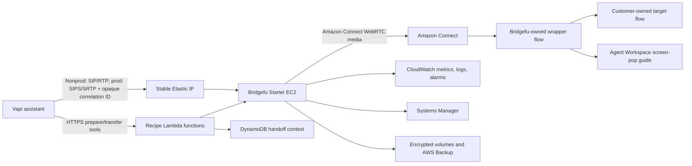

# Bridgefu AWS Starter Deployment Workplan

- **Status:** Current non-root preflight and foundation bootstrap passed;
  generation-4 publication refresh is the next permitted AWS mutation
- **Last updated:** 2026-08-03
- **Current release scope:** Single-server Starter only
- **Explicit exclusion:** No HA architecture, deployment, validation, or
  production-readiness work is part of this plan
- **Environments:** Dedicated nonproduction and production workload accounts
- **Primary path:** Vapi → Bridgefu Starter → Amazon Connect → Agent Workspace
- **Production region:** `us-west-2`
- **Infrastructure interface:** CloudFormation first; Terraform remains a wrapper

> Engineering handoff: the self-contained implementation specification,
> current-state assessment, known defects, environment contracts, and acceptance
> criteria are in `BRIDGEFU-AWS-ENGINEERING-HANDOFF.md`. That document is the
> primary handoff for the qualified AWS engineer; this file remains the concise
> owner/execution checklist.
>
> The project-neutral AWS administrator status is in
> `AWS-ADMIN-NONPRODUCTION-BLOCKERS-REQUEST.md`. Use it only when a fresh
> controller preflight identifies a missing AWS permission or current quota;
> do not infer current authority from a historical audit. The former detailed request in
> `BRIDGEFU-AWS-ADMIN-NONPRODUCTION-REQUEST.md` is superseded and must not be
> sent or executed.
>
> The privately recorded historical execution is permanently retired. Its
> local ledger was lost, it is
> eligible only for the controller's bootstrap-only, teardown-only recovery,
> and **no application change set was executed**. Never publish, deploy, test,
> or initialize with that ID. Recover and remove its exact bootstrap resources,
> retain the controller's zero proof, and use a fresh execution ID for all new
> work.

## Current recovery and qualification status (authoritative)

The historical recovery and teardown completed, and its exact execution ID and
proof remain private. The only commands ever authorized for a recovered ID are
`inventory`, `destroy`, and—only after a prior destroy intent and separately
authorized external cleanup when needed—`destroy-finalize`. The reusable
sequence remains documented in the
[IP-only nonproduction live-qualification runbook](recipes/vapi-amazon-connect-screen-pop/runbooks/nonproduction-live-qualification.md):

```text
review → independent file and SHA-256 review → execute → inventory → destroy
       → three identical complete zero observations spanning at least 60 seconds
       → fresh execution ID
```

Recovery state is host-private authority in a controller-enforced location
outside the repository and build directories. The portable default root is
`${XDG_STATE_HOME:-$HOME/.local/state}/bridgefu/aws-live`; an operator may set
`BRIDGEFU_AWS_LIVE_STATE_DIR` to another private root satisfying the same
boundary. No resolved operator-specific path is repository data. Never copy a
ledger or browser credential to another host. Remote recovery capsules are
write-only evidence and are not consumed. Because the controller has no
distributed lock, exactly one operator and host may own recovery at a time.

A current non-root Identity Center session passed the guarded identity,
absence, permission, collision, and regional-capacity preflight for the bounded
IP-only qualification. Exact account usage and quota observations remain
private operator data.

The retired execution's private deadline has expired. It permanently forbids
starting or resuming paid work under that ID, but never blocks inventory or
teardown and never deletes resources automatically. Its cost value was only a
planning estimate, not a spend cap or AWS Budget. New work must use a fresh
Starter `sip_rtp` IP-only execution with no hosted-zone, hostname, certificate,
HA, or production work in scope.

That fresh execution is now initialized. Both required Vapi credentials are
loaded and validated in the operator process and have never been stored in the
repository, ledger, reports, logs, or command arguments. Its exact foundation
bootstrap reached `CREATE_COMPLETE` and passed controller verification. No
application or qualification stack has been created or executed.

Publication generation 3 is stale after qualification-source changes and has
no published release objects or release ID. The next AWS mutation is exactly
one `publish --refresh-candidate` transition to generation 4 after the final
local regression pass. After successful publication, run `bootstrap-refresh`
in review-only mode; do not execute that review or create an application review
until it has been independently audited.

## 1. Decisions recorded

The following decisions are now fixed for this workstream:

1. Use separate nonproduction and production AWS workload accounts.
2. Keep the AWS Organizations management account free of Bridgefu workloads.
3. Ship and qualify only the single-server `Starter` profile in the current
   free/community release.
4. Use the Starter Elastic IP directly with SIP/RTP for nonproduction. Do not
   require public DNS or a public certificate before the two nonproduction
   cycles pass. Production adds DNS, ACM, SIPS/SRTP, and a synthetic secure-path
   test before any customer traffic.
5. Use the existing production Amazon Connect instance and approved target flow.
   Bridgefu may reference them but must not update or delete them.
6. Create one persistent Amazon Connect test foundation in the dedicated
   nonproduction account for repeatable tests.
7. Keep HA out of the current launch, support claim, public release bundle, and
   qualification critical path. HA will receive a separate AWS Marketplace
   product, commercial, licensing, deployment, and qualification plan.
8. Use federated human access and GitHub OIDC. Application deployment from AWS
   root or long-lived IAM-user credentials is prohibited.
9. Require a clean, immutable, cryptographically signed release and execute the
   exact CloudFormation change set that was reviewed.

## 2. Product and packaging boundary

### 2.1 Current free/community product

The current release will include:

- one hardened Graviton EC2 Bridgefu host;
- one stable Elastic IP for SIP/SIPS and RTP/SRTP;
- no SSH access or EC2 key pair;
- Systems Manager administration;
- encrypted root and state volumes;
- automatic EC2 recovery, backups, alarms, dashboards, and runbooks;
- Vapi assistant/tool provisioning;
- DynamoDB-backed handoff context;
- Lambda prepare, transfer, lookup, and provisioning functions;
- a recipe-owned Amazon Connect wrapper flow and Agent Workspace guide;
- IP-only SIP/RTP for nonproduction qualification and SIPS/SRTP for production;
- guarded deploy, status, doctor, test, drift, rollback, and teardown operations.

Starter is deliberately not zero-downtime. Host failure or replacement can
interrupt active calls. Recovery time must be measured during nonproduction
qualification and disclosed as a Starter limitation.

### 2.2 HA premium boundary

HA is not part of this workplan's delivery criteria. Before the current branch
is committed or published, complete an explicit free-versus-premium packaging
review:

- [ ] Inventory all HA-only CloudFormation, Terraform, controller, runbook, and
      qualification assets.
- [ ] Exclude HA templates, parameters, modules, examples, and claims from the
      free release manifest and downloadable bundle.
- [ ] Make the free deployment entry point accept only `RuntimeProfile=Starter`.
- [ ] Make the ordinary deployment workflow expose only the Starter profile.
- [ ] Add a release test proving the free bundle cannot select or deploy HA.
- [ ] Leave any reusable generic runtime capability required by Starter intact.
- [ ] Decide whether premium HA implementation lives in a private repository,
      private release input, or a separately licensed package.
- [ ] Write a separate Marketplace plan covering product type, entitlement,
      metering, pricing, upgrades, support, regional availability, and HA
      qualification.

The repository currently uses the MIT license. Anything published under that
license remains usable under its terms. If HA implementation is intended to be
commercially restricted rather than merely sold with packaging/support, it
must be separated before public publication. This is a product/legal decision,
not a deployment task.

## 3. Target account and environment layout

```text
AWS Organizations management account
└── Workloads OU
    ├── Nonproduction account
    │   ├── account governance foundation
    │   ├── persistent test Amazon Connect foundation
    │   ├── account artifact/ECR/deployment foundation
    │   └── disposable Bridgefu Starter application stack
    └── Production account `<PRODUCTION_ACCOUNT_ID>`
        ├── account governance foundation
        ├── existing customer Amazon Connect instance
        ├── account artifact/ECR/deployment foundation
        └── retained Bridgefu Starter production stack
```

Known production resources:

- AWS account: `<PRODUCTION_ACCOUNT_ID>`
- Region: `us-west-2`
- Existing Connect instance ID: `<PRODUCTION_CONNECT_INSTANCE_ID>`
- Approved target flow ID: `<PRODUCTION_TARGET_FLOW_ID>`
- GitHub repository: `eisenzopf/bridgefu`

The existing Connect instance, target flow, and any Direct Connect resources
are customer-owned. They are reference-only boundaries for this workplan.

The current qualification profile is a non-root Identity Center role in the
operator-selected nonproduction account. A private audit found it sufficient
for the narrowly scoped disposable qualification at that time. The account
still contains unrelated workloads and incomplete long-term governance, so
this use does not designate it as the final nonproduction environment. See
`BRIDGEFU-AWS-ENGINEERING-HANDOFF.md`, section 8.5, for the read-only audit.

## 4. Target single-server architecture



Audio stays on the Vapi → Bridgefu → Amazon Connect media path. Customer
context is stored in DynamoDB and represented in SIP only by one opaque,
short-lived correlation value.

## 5. Information and actions required from the owner

No passwords, root credentials, Vapi API-key values, private signing keys, or
customer data should be placed in this file, Git, chat, CloudFormation
parameters, or workflow artifacts.

### 5.1 Required before account work begins

- [ ] Confirm or create a workload-free AWS Organizations management account.
- [ ] Provide the management account ID.
- [ ] Supply a unique email address for the new nonproduction AWS account, or
      provide the ID if that account already exists.
- [ ] Confirm that production account `<PRODUCTION_ACCOUNT_ID>` may be invited into the
      organization.
- [ ] Approve the minimal OU structure: `Workloads/NonProduction` and
      `Workloads/Production`.
- [ ] Identify the people who require administrator access through IAM Identity
      Center.
- [ ] Provide the budget/alert mailbox and approve owner-selected monthly
      budget amounts for nonproduction and the controlled production pilot.
- [ ] Confirm the GitHub production reviewers for the protected
      `bridgefu-production` environment.

### 5.2 Required before IP-only nonproduction deployment

- [ ] Approve use of two dedicated Elastic IPs (qualification source and
      Starter gateway) and clear SIP/RTP for synthetic nonproduction
      qualification only.
- [ ] Create a dedicated nonproduction Vapi API key, store it in nonproduction
      AWS Secrets Manager, and provide only its secret ARN.
- [ ] Confirm the release-distribution location for non-secret signed manifests
      and CloudFormation templates.
- [ ] Select the trusted release-signing custodian and provide only the approved
      Ed25519 public-key fingerprint or public key. The private key must remain
      in the approved signing system.

### 5.3 Required before production execution

- [ ] Approve a production DNS subdomain and SIP hostname.
- [ ] Store a distinct production Vapi API key in production Secrets Manager and
      provide only the secret ARN.
- [ ] Confirm that the known production Connect instance and target flow are
      still the intended pilot targets.
- [ ] Approve the production alarm mailbox and pilot budget, or record
      replacements.
- [ ] Approve a Lambda concurrency quota request using the corrected AWS
      calculation. Four functions at 20 reserved executions require at least
      80 reserved plus AWS's required 100-unit unreserved pool: 180 total when
      no other reservations exist, and more when the account already has
      reserved concurrency.
- [ ] Select the initial production call limit after nonproduction load results.
      The template currently defaults to 100; a lower pilot cap should be used
      unless the retained load evidence supports 100.
- [ ] Approve the production change window, reviewers, rollback owner, and
      whether the first release may receive only synthetic traffic or a bounded
      customer pilot.

## 6. Execution phases and gates

### Phase 0 — Freeze scope and protect premium work

**Owner:** Engineering and product owner

**Goal:** Make Starter the only current release target without accidentally
publishing premium HA assets.

Tasks:

- [ ] Record Starter-only scope in the root product plan, recipe documentation,
      changelog, and deployment workflow.
- [ ] Split the public Starter release entry point from HA infrastructure.
- [ ] Prevent `recipe init`, the public parameter examples, and GitHub deployment
      workflow from offering HA in the free release.
- [ ] Exclude HA assets from the public release inventory.
- [ ] Add negative CI tests that reject HA selection through the free entry
      point.
- [ ] Preserve HA source locally until its repository/licensing boundary is
      approved.
- [ ] Review the full working tree before any commit; do not accidentally commit
      premium-only source under the repository's MIT license.

Exit criteria:

- Starter is the only profile in the public release and ordinary workflow.
- HA remains buildable only in its approved private/internal boundary.
- No Starter test depends on an HA template or runtime resource.

### Phase 1 — Establish AWS organization and federated access

**Owner:** Account owner for interactive account creation; engineering for CLI
configuration

**Goal:** Create hard account boundaries and eliminate root from normal work.

Tasks:

- [ ] Create or select the separate Organizations management account.
- [ ] Create the `Workloads` OU with production and nonproduction children.
- [ ] Create the nonproduction account with its unique owner-controlled email.
- [ ] Invite production account `<PRODUCTION_ACCOUNT_ID>` into the organization.
- [ ] Do not deploy Bridgefu workloads into the management account.
- [ ] Enable IAM Identity Center and create least-privilege administrator access
      for the implementation team.
- [ ] Configure local AWS CLI SSO profiles for management, nonproduction, and
      production.
- [ ] Verify that each profile resolves to the intended assumed role and account.
- [ ] Keep root MFA enabled and root access keys absent.
- [ ] Review Amazon Connect and Direct Connect dependencies before attaching any
      restrictive production SCP. Do not introduce a production SCP during the
      first deployment unless it has separate test evidence.

Evidence:

- organization ID and OU IDs;
- nonproduction and production account IDs;
- Identity Center permission-set and role ARNs;
- redacted `sts get-caller-identity` results showing assumed roles;
- root MFA/access-key account-summary results.

Exit criteria:

- Both workload accounts are organization members in the correct OUs.
- No implementation command uses root or a long-term IAM user.

### Phase 2 — Publish and deploy account foundations

**Owner:** Engineering; owner confirms email subscriptions

**Goal:** Install persistent governance, identity, artifact, and Connect
foundations before any application deployment.

The current execution-scoped foundation bootstrap has reached
`CREATE_COMPLETE`; that is a prerequisite proof for the disposable
qualification and does not mark the long-term governance, account-foundation,
or persistent Connect tasks below complete.

Tasks in both workload accounts:

- [ ] Publish reviewed foundation and nested templates to the approved immutable
      template location.
- [ ] Deploy `cloudformation/account-governance.yaml`.
- [ ] Confirm budget email subscriptions.
- [ ] Verify an actively logging multi-region CloudTrail with log-file
      validation.
- [ ] Verify AWS Config recorder and delivery channel health.
- [ ] Verify an active account Access Analyzer.
- [ ] Verify GuardDuty is enabled.
- [ ] Verify production Security Hub is enabled.
- [ ] Verify the audit bucket is private, encrypted, versioned, retained, and
      lifecycle-managed.
- [ ] Create or reuse the GitHub OIDC provider.
- [ ] Create protected GitHub environments `bridgefu-nonproduction` and
      `bridgefu-production`; production requires owner-approved reviewers.

Additional nonproduction tasks:

- [ ] Deploy `cloudformation/nonproduction-foundation.yaml` with the exact
      `CREATE_PERSISTENT_NONPRODUCTION_CONNECT` acknowledgement.
- [ ] Record its Connect instance ARN, target-flow ARN, login URL, and generated
      agent-credential secret ARN without recording secret values.
- [ ] Confirm the Connect instance is active and the test flow is published.

Account artifact/deployment foundation tasks:

- [ ] Deploy `cloudformation/account-foundation.yaml` in both accounts.
- [ ] Use the exact Identity Center role ARN, GitHub OIDC ARN, Connect ARN,
      hosted-zone ID, and immutable nested-template base URL.
- [ ] Enable termination protection on all foundation root stacks.
- [ ] Verify the artifact bucket is private, encrypted, versioned, and retained.
- [ ] Verify the ECR repository uses immutable tags and scan-on-push.
- [ ] Verify the deployer can pass only the exact CloudFormation service role.
- [ ] Verify the service role trusts only CloudFormation.
- [ ] Record the persistent rollback-alarm ARN.

Exit criteria:

- Governance and account-foundation acceptance checks pass in both accounts.
- Nonproduction Connect is active and remains independent of application
  create/destroy cycles.
- Production customer-owned Connect resources remain unchanged.

### Phase 3 — Establish nonproduction IP, secrets, and quotas

**Owner:** Owner approves account capacity and secrets; engineering automates
the AWS side

**Goal:** Satisfy the IP-only nonproduction prerequisites while deferring
public DNS and certificate work until the nonproduction release gate passes.

Tasks:

- [ ] Set nonproduction `PublicHostedZoneId=none`,
      `SipHostname=unused.bridgefu.invalid`, and `SipSecurity=sip_rtp`.
- [ ] Confirm the account foundation, preflight, IAM, parameter examples, and
      release tests accept the no-DNS posture; the current account-foundation
      parameter constraint still requires remediation.
- [x] Confirm the current guarded preflight has sufficient Elastic IP headroom
      without repurposing unrelated account-owned addresses. Exact account
      quota and usage values remain private.
- [x] Load and validate both required Vapi credentials in the guarded operator
      process without printing or persisting either value; never store Vapi key
      material in the repository, ledger, logs, reports, or evidence.
- [ ] Put environment-specific Vapi API keys in Secrets Manager without exposing
      values to logs, parameters, outputs, or evidence.
- [ ] Verify secret resource policies and rotation ownership.
- [ ] Request production Lambda concurrency of at least 180 in `us-west-2`
      when using 20 reserved executions for each of four functions, plus any
      capacity required by existing reservations and approved headroom.
- [x] Confirm Elastic IP, Connect, VPC, NAT gateway, and EC2 capacity for the
      current bounded qualification. The guarded checks pass with the required
      reserve; exact account observations remain private.
- [x] Confirm the current quotas preserve two VPC slots and one NAT-gateway
      slot in the runner Availability Zone while the Starter and
      qualification-runner VPCs coexist.
- [ ] Keep production DNS, ACM, and `SipSecurity=sips_srtp` as a later,
      production-only gate.

Exit criteria:

- Nonproduction creates and advertises its exact Elastic IP without a public
  DNS record or certificate.
- Vapi secret ARNs resolve from the exact deployment roles.
- Production quota checks pass.

### Phase 4 — Produce the immutable Starter release

**Owner:** Release owner and engineering

**Goal:** Produce one clean candidate that can be reviewed and deployed without
rebuilding.

Current checkpoint: generation 3 is a stale, incomplete publication and is not
deployment authority. It has no published release objects or release ID.
After the final local audit, the controller permits exactly one generation-4
`publish --refresh-candidate` transition. A retry without further source change
must use ordinary `publish`, not another refresh.

Tasks:

- [ ] Reconcile the current dirty working tree and identify every file intended
      for the Starter release.
- [ ] Run owner review before committing or publishing.
- [ ] Build the exact multi-platform image candidate from a clean commit.
- [ ] Retain SBOM, provenance, and vulnerability results.
- [ ] Publish the approved digest without rebuilding it.
- [ ] Upload Lambda and Starter runtime artifacts to each account's versioned,
      private artifact bucket.
- [ ] Record every S3 object version ID and SHA-256 digest.
- [ ] Publish non-secret manifests and CloudFormation templates at the approved
      immutable release location.
- [ ] Sign `manifest.json` with the approved Ed25519 signing identity.
- [ ] Independently verify the detached signature, public-key fingerprint,
      manifest digest, template digests, runtime digest, and image digest.
- [ ] Generate environment descriptors and parameter files from that exact
      release. Do not hand-copy digests or version IDs.
- [ ] Prove that the release manifest was built from a clean source tree and
      includes only Starter deployment assets.

Exit criteria:

- One immutable release ID is approved for both nonproduction cycles.
- Preflight can fetch and cryptographically verify every required release input.
- No mutable branch, tag-only image, unversioned S3 object, unsigned manifest,
  or HA asset is part of the release.

### Phase 5 — Nonproduction deployment cycle 1

**Owner:** Engineering executes; owner reviews the change set

**Goal:** Prove a clean first deployment and complete functional path.

Tasks:

- [ ] Populate `deployment-nonproduction.yaml` with the exact account, region,
      role, manifest, stack, policy, and release values.
- [ ] Populate `parameters-nonproduction-starter.json` from foundation outputs
      and versioned release artifacts.
- [ ] Run `recipe preflight` until every applicable identity, account, audit,
      no-DNS posture, secret, quota, release, alarm, role, and Connect check
      passes.
- [ ] Create a named, review-only nested change set.
- [ ] Retain the complete recursive review output.
- [ ] Confirm there are no unapproved resource types, deletions, or replacements.
- [ ] Obtain human approval for the exact named change set.
- [ ] Execute that same named change set; do not create a replacement review.
- [ ] Wait for `CREATE_COMPLETE` and EC2 readiness signaling.
- [ ] Run `recipe status` and `recipe doctor`.
- [ ] Verify SSM access, no SSH/key pair, IMDSv2, encryption, backup, alarms,
      logs, exact EIP advertisement, absence of public DNS/certificate
      resources, `/livez`, and `/readyz`.

Functional acceptance tests:

- [ ] Vapi provisions only the recipe-owned assistant, tools, and credential.
- [ ] Vapi prepare and transfer tools return only server-owned routing values.
- [ ] Bridgefu receives exactly one opaque correlation header over SIP to the
      stack-owned Elastic IP.
- [ ] RTP media is negotiated and observed without retaining sensitive packet
      data; this does not count as evidence for production SRTP.
- [ ] A real Amazon Connect contact starts exactly once.
- [ ] The wrapper flow invokes lookup and transfers to the expected test target
      flow.
- [ ] Agent Workspace displays the expected synthetic screen-pop fields.
- [ ] Bidirectional non-silent audio markers pass.
- [ ] DTMF passes in the required direction(s).
- [ ] Vapi-originated and agent-originated hangup each cleanly terminate both
      legs.
- [ ] Duplicate, missing, malformed, expired, replayed, and unauthorized context
      cases fail safely.
- [ ] Missing context fails open into the target flow without exposing raw data.
- [ ] Final active-call, attachment, contact, route, and cleanup counts are zero.

Lifecycle acceptance tests:

- [ ] Apply one bounded, non-replacing configuration update.
- [ ] Exercise automatic rollback using an intentionally invalid owned artifact.
- [ ] Verify the working version is restored.
- [ ] Exercise Starter process restart and host-recovery drills.
- [ ] Run a bounded concurrency/load test and record CPU, memory, file descriptor,
      RTP-port, latency, and cleanup behavior.
- [ ] Run the required soak interval and retain redacted evidence.
- [ ] Measure actual Starter recovery time and safe concurrent-call capacity.

Teardown:

- [ ] Destroy only the application stack with the exact confirmation string.
- [ ] Preserve governance, account foundation, artifact bucket/ECR, and
      nonproduction Connect foundation.
- [ ] Prove zero application stacks, review shells, log leaks, EC2/EIP/VPC
      resources, secrets, and tagged application resources.

Exit criteria:

- Cycle 1 passes functional, lifecycle, evidence, and teardown checks.
- Any failure produces a corrected release candidate; a modified candidate
  restarts the two-cycle count at cycle 1.

### Phase 6 — Nonproduction deployment cycle 2

**Owner:** Engineering executes; a reviewer approves independently

**Goal:** Prove repeatability using the exact same immutable release.

Tasks:

- [ ] Re-run preflight from a fresh federated session.
- [ ] Create and review a new named change set for the same immutable release.
- [ ] Deploy from zero application state.
- [ ] Repeat all mandatory functional tests, both hangup origins, lifecycle
      update/rollback, recovery, load, soak, and final cleanup checks.
- [ ] Compare cycle 1 and cycle 2 resource inventories, latencies, call counts,
      and teardown results.
- [ ] Confirm no manual console repair was required in either cycle.
- [ ] Assemble one release-qualification record binding both cycles to the same
      commit, image digest, manifest digest, signature, template digests, S3
      versions, account, region, and test-controller revision.

Exit criteria:

- Two complete, clean, reproducible nonproduction cycles pass.
- The measured Starter call limit and recovery behavior are documented.
- SIP/RTP PCMU/PCMA, Vapi transfer, RTP media, DTMF, Connect, screen pop,
  negative cases, update/rollback, recovery, load, soak, and teardown pass; the
  qualifier does not demand DNS, certificates, SIPS, or SRTP in nonproduction.
- The release is eligible for a controlled production change set, not yet for
  unrestricted customer traffic.

### Phase 7 — Production readiness and change-set approval

**Owner:** Engineering prepares; product/account owner approves

**Goal:** Produce a production plan that cannot alter customer-owned Connect
resources unexpectedly.

Tasks:

- [ ] Confirm production governance and account foundations are healthy.
- [ ] Confirm live Lambda account settings leave enough capacity for 80 new
      reserved executions while preserving AWS's required 100-unit unreserved
      pool; 180 is the minimum only when no other reservations exist.
- [ ] Verify the existing Connect instance is active.
- [ ] Export and hash the approved target flow before deployment.
- [ ] Confirm Bridgefu permissions can describe/reference but cannot delete the
      customer instance or target flow.
- [ ] Populate the production schema-2 descriptor and Starter parameters.
- [ ] Use `DataRetentionMode=ProductionRetain`.
- [ ] Use `RetainVapiResourcesOnDelete=true`.
- [ ] Use `LambdaReservedConcurrencyPerFunction=20`.
- [ ] Use the owner-approved Starter instance type and concurrent-call cap.
- [ ] Use the production SIPS hostname, hosted zone, Vapi secret ARN, alarm
      email, artifact versions, image digest, service role, stack policy, and
      rollback-alarm ARN.
- [ ] Run production preflight from an Identity Center or protected GitHub OIDC
      session.
- [ ] Create a named review-only production change set.
- [ ] Recursively inspect every nested change and replacement flag.
- [ ] Verify root and nested stack policies protect stateful and customer-facing
      resources.
- [ ] Verify termination protection will be enabled.
- [ ] Confirm the approved target-flow hash is unchanged.
- [ ] Obtain explicit owner approval for the exact change-set name and evidence
      bundle.

Go/no-go gate:

- no root or IAM-user session;
- no failing preflight item;
- no unsigned or dirty release;
- no destructive/replacing change;
- no target-flow drift;
- no active rollback alarm;
- no missing budget/audit/security control;
- no unresolved nonproduction failure;
- approved rollback owner and change window.

Exit criteria:

- The exact named change set is approved for execution.
- No production mutation has occurred before approval.

### Phase 8 — Controlled production deployment

**Owner:** Authorized production deployer; owner controls traffic approval

**Goal:** Deploy Starter safely and prove the synthetic production path before
customer traffic.

Tasks:

- [ ] Re-run preflight immediately before execution.
- [ ] Re-open and validate the exact approved named change set.
- [ ] Execute with the exact stack-name confirmation.
- [ ] Wait for `CREATE_COMPLETE` and readiness.
- [ ] Verify stack policies and termination protection.
- [ ] Run status, doctor, alarm, drift, backup, SSM, DNS, certificate, and health
      checks.
- [ ] Run one synthetic Vapi → Bridgefu → production Connect test using approved
      synthetic context only.
- [ ] Verify audio, DTMF, screen pop, both-leg teardown, and zero cleanup state.
- [ ] Re-hash the customer target flow and prove it was not modified.
- [ ] Keep customer traffic disabled until the owner accepts the synthetic test.
- [ ] If approved, enable only the bounded pilot traffic defined in the change
      record.
- [ ] Monitor alarms, call cleanup, latency, host resources, Lambda errors,
      DynamoDB errors, Connect failures, and certificate health continuously
      through the change window.

Rollback triggers:

- failed EC2 readiness or health checks;
- missing/invalid certificate or DNS;
- failed synthetic audio, DTMF, transfer, screen pop, or teardown;
- unexpected Connect target-flow change;
- repeated Lambda/DynamoDB/Connect errors;
- cleanup backlog or leaked contacts/routes;
- capacity or latency outside the nonproduction-approved envelope;
- any active rollback alarm.

Rollback behavior:

1. Stop new pilot traffic.
2. Allow or force the CloudFormation rollback for the application change.
3. Preserve logs and redacted evidence.
4. Verify customer-owned Connect resources and target-flow hash.
5. Verify no Bridgefu contacts, calls, attachments, routes, or EC2/network
   leftovers remain.
6. Do not delete retained production data, Vapi resources, foundations, or
   customer-owned Connect resources as part of ordinary rollback.

Exit criteria:

- Production Starter is healthy under the approved pilot envelope.
- Synthetic end-to-end evidence passes.
- The customer target flow remains unchanged.
- Rollback remains available and documented.

### Phase 9 — Operations and support handoff

**Owner:** Operations and product owner

**Goal:** Make the single-server product supportable after launch.

Tasks:

- [ ] Publish the supported Starter capacity, measured recovery time, and known
      single-host availability limitation.
- [ ] Assign owners for alarms, incidents, Vapi, Connect, AWS, DNS, certificates,
      backups, releases, and security findings.
- [ ] Test certificate and Vapi-secret rotation.
- [ ] Test volume restore and full host replacement in nonproduction.
- [ ] Schedule monthly drift and access reviews.
- [ ] Schedule recurring nonproduction synthetic qualification.
- [ ] Review GuardDuty, Security Hub, Access Analyzer, Config, CloudTrail, and
      budgets on an assigned cadence.
- [ ] Record patching and release rollback procedures.
- [ ] Define customer communication for Starter host failure and recovery.
- [ ] Create a separate backlog and business plan for the premium HA Marketplace
      product without adding it to Starter support claims.

## 7. Environment configuration contract

| Setting | Nonproduction | Production |
|---|---|---|
| Account | Dedicated account, ID TBD | `<PRODUCTION_ACCOUNT_ID>` |
| Region | `us-west-2` | `us-west-2` |
| Runtime profile | `Starter` | `Starter` |
| SIP security | `sip_rtp` over the exact EIP | `sips_srtp` |
| Network mode | `NewVpc` initially | `NewVpc` initially |
| Data retention | `TestDelete` | `ProductionRetain` |
| Retain Vapi on delete | `false` | `true` |
| Lambda reserved concurrency | `0` | `20` per function |
| Demo site | `false` by default | `false` |
| Connect | Persistent test foundation | Existing customer instance |
| Target flow | Test foundation output | Existing approved flow |
| DNS | None; `PublicHostedZoneId=none` | Stable delegated production zone |
| Vapi credential | Dedicated test secret | Dedicated production secret |
| Monthly budget | `<NONPRODUCTION_MONTHLY_BUDGET>` | `<PRODUCTION_MONTHLY_BUDGET>` |
| Termination protection | Foundations yes; app no | Foundations and app yes |
| Change approval | Independent review | Protected owner approval |

## 8. Command sequence after prerequisites exist

Exact paths and values will be generated from foundation outputs and the signed
release. These commands illustrate the guarded sequence; placeholders must not
be executed unchanged.

```bash
# Confirm federated identity and the exact workload account.
aws sts get-caller-identity --profile bridgefu-nonproduction

# Validate every prerequisite without creating an application change set.
bridgefu recipe preflight deployment-nonproduction.yaml --profile starter

# Create the named review only.
bridgefu recipe deploy deployment-nonproduction.yaml --profile starter \
  --change-set-name bridgefu-nonproduction-r1

# After independent review, execute that exact review.
bridgefu recipe deploy deployment-nonproduction.yaml --profile starter \
  --execute \
  --change-set-name bridgefu-nonproduction-r1 \
  --confirm bridgefu-bft-nonproduction

bridgefu recipe status deployment-nonproduction.yaml
bridgefu recipe doctor deployment-nonproduction.yaml --profile starter
bridgefu recipe test deployment-nonproduction.yaml --profile starter
```

Production follows the same sequence with the production descriptor, protected
GitHub environment, exact production change-set name, and exact production
stack confirmation. Production destroy is never part of routine deployment and
requires its separate break-glass runbook.

## 9. Evidence to retain

Retain exact account, principal, ARN, EIP, Connect, and proof identities only
in the private durable state root. Git may contain only bounded, redacted
summaries with placeholders. The private approval package may retain:

- account, region, assumed-role ARN, and execution ID;
- commit and clean-source digest;
- image, manifest, template, and artifact digests;
- public signing-key fingerprint and signature verification result;
- S3 object version IDs without object contents;
- exact CloudFormation change-set IDs and recursive change summary;
- stack events, status, policy, termination-protection, and drift results;
- resource inventories before create and after teardown;
- production DNS/certificate validation results (not required in the
  nonproduction evidence packages);
- synthetic call counts and scenario outcomes;
- bounded audio-marker, DTMF, latency, recovery, and cleanup facts;
- alarms and dashboards used during the run;
- Connect target-flow hash before and after production deployment;
- final zero-state teardown evidence for nonproduction application cycles.

The controller writes live authority and evidence to the durable private state
root described above. Evidence from an earlier, separate repository
build-output cleanup was not migrated; those particular zero-state statements
remain point-in-time observations rather than retained files. This does not
refer to the later retired-execution zero proof that is retained privately.

Never retain API keys, passwords, bearer tokens, private keys, raw customer
context, full SIP headers, correlation IDs, transcripts, or customer audio.

## 10. Current blockers and critical path

### 10.1 Current publication and fresh qualification

| Priority | Blocker | Required action |
|---|---|---|
| Complete | A privately recorded retired execution lost its local ledger | Two-stage bootstrap-only recovery, independent immutable-file review, inventory, teardown, and stable zero proof completed; the exact ID remains private and permanently retired |
| Complete | A fresh run was prohibited until durable zero proof existed | The retired execution's stable multi-observation zero proof is retained privately |
| Complete for the current bounded step | Current AWS identity, read authority, and capacity required fresh proof | The non-root session passed the guarded current preflight; rerun fail-closed checks at each later lifecycle boundary |
| P0 | Publication generation 3 is stale and incomplete | Finish the local audit, then run exactly one generation-4 `publish --refresh-candidate`; verify the completed release before any review |
| P0 | The current source has not completed a live IP-only cycle | After publication, create only the bootstrap-refresh review, independently audit it, and keep application and qualification execution blocked until a later GO decision |

The current preflight authorizes only the bounded next controller steps; it is
not production approval and does not remove later fail-closed checks. Recovery
remains permitted after an old deadline; paid work does not.

### 10.2 Later production-readiness work

| Priority | Gate | Owner action | Engineering action |
|---|---|---|---|
| P0 | HA/free packaging boundary not yet finalized | Approve private/licensed HA boundary | Before public/production release, split Starter public package and add exclusion tests; the guarded nonproduction candidate cannot select HA |
| P0 | Final management/nonproduction account layout not complete | Approve long-term account layout and unique email | Configure Organizations/OUs and verify membership before production |
| P0 | No trusted release location/signing custodian | Approve hosting and signing ownership | Publish and verify immutable signed release |
| P1 | Production DNS names/delegation unknown | Approve only after nonproduction passes | Create zone and verify delegation/certificates before production review |
| P1 | Long-term governance controls not deployed | Confirm budget subscriptions | Deploy and verify governance foundations before production |
| P1 | Production Lambda quota must be freshly measured | Approve an increase only if the corrected live calculation requires it | Inventory existing reservations and apply the 100-unit unreserved-pool rule |
| P1 | Current working tree is not a clean release | Review intended source scope | Reconcile, validate, commit, and build clean candidate |
| P2 | Starter capacity/recovery not measured | Approve pilot target after evidence | Run load, soak, failure, and recovery tests |

Critical path:

```text
current full regression and public-source checkpoint
  → exactly one generation-4 publish --refresh-candidate
  → verify the completed release
  → bootstrap-refresh review only
  → independent review and separate execution authorization
  → application review and qualification gates

premium boundary
  → management/nonproduction accounts
  → federated identities
  → governance and account foundations
  → nonproduction EIP, secrets, and quotas
  → clean signed Starter release
  → nonproduction cycle 1
  → nonproduction cycle 2
  → production review
  → controlled production deployment
  → operations handoff
```

## 11. Definition of done

This workplan is complete only when all of the following are true:

- Starter is the only profile in the current public/free deployment path.
- Premium HA assets are not accidentally published under the free release.
- Nonproduction and production are separate organization member accounts.
- Human and CI access use federation/OIDC rather than root or IAM-user keys.
- Governance and account foundations pass all acceptance checks.
- One clean, signed, immutable Starter release is reproducibly published.
- The exact release passes two complete IP-only nonproduction deployment,
  qualification, lifecycle, recovery, load/soak, and teardown cycles.
- Production quotas, DNS, secrets, alarms, backups, stack policies, termination
  protection, and rollback are ready.
- Production SIPS/SRTP, DNS, and certificate behavior is treated as unproven
  until the pre-traffic synthetic production gate passes.
- The production change set receives explicit approval and the exact reviewed
  change set is executed.
- Synthetic production Vapi → Bridgefu → Connect audio, DTMF, screen-pop, and
  teardown tests pass.
- The existing production Connect target flow is unchanged.
- The supported capacity and single-server recovery limitation are documented.
- Operations owners accept the alarms, runbooks, rotation, restore, incident,
  and rollback procedures.

## 12. Reference implementation files

- `BRIDGEFU-RECIPE-IMPLEMENTATION-PROGRESS.md`
- `BRIDGEFU-AWS-ADMIN-NONPRODUCTION-REQUEST.md`
- `recipes/vapi-amazon-connect-screen-pop/deployment.nonproduction.example.yaml`
- `recipes/vapi-amazon-connect-screen-pop/deployment.example.yaml`
- `recipes/vapi-amazon-connect-screen-pop/parameters-nonproduction-starter.json`
- `recipes/vapi-amazon-connect-screen-pop/parameters-starter.json`
- `recipes/vapi-amazon-connect-screen-pop/cloudformation/account-governance.yaml`
- `recipes/vapi-amazon-connect-screen-pop/cloudformation/nonproduction-foundation.yaml`
- `recipes/vapi-amazon-connect-screen-pop/cloudformation/account-foundation.yaml`
- `recipes/vapi-amazon-connect-screen-pop/cloudformation/template.yaml`
- `recipes/vapi-amazon-connect-screen-pop/cloudformation/production-stack-policy.json`
- `recipes/vapi-amazon-connect-screen-pop/runbooks/account-foundations.md`
- `recipes/vapi-amazon-connect-screen-pop/runbooks/production-destroy.md`
- `.github/workflows/bridgefu-recipe-deploy.yml`
- `scripts/prepare-bridgefu-nonproduction-account.sh`

## 13. AWS guidance used by this plan

- [AWS Organizations multi-account best practices](https://docs.aws.amazon.com/organizations/latest/userguide/orgs_best-practices.html)
- [AWS Organizations management-account best practices](https://docs.aws.amazon.com/organizations/latest/userguide/orgs_best-practices_mgmt-acct.html)
- [AWS CloudFormation best practices](https://docs.aws.amazon.com/AWSCloudFormation/latest/UserGuide/best-practices.html)
- [AWS IAM role configuration for GitHub OIDC](https://docs.aws.amazon.com/IAM/latest/UserGuide/id_roles_create_for-idp_oidc.html)
- [CloudTrail S3 bucket-policy requirements](https://docs.aws.amazon.com/awscloudtrail/latest/userguide/create-s3-bucket-policy-for-cloudtrail.html)
- [AWS Config delivery-channel requirements](https://docs.aws.amazon.com/AWSCloudFormation/latest/TemplateReference/aws-resource-config-deliverychannel.html)
