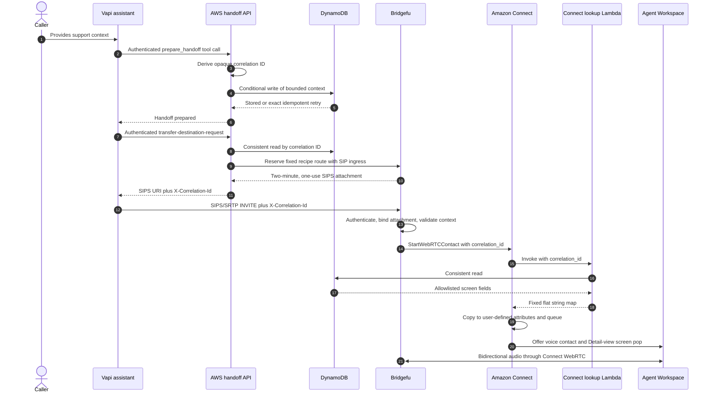
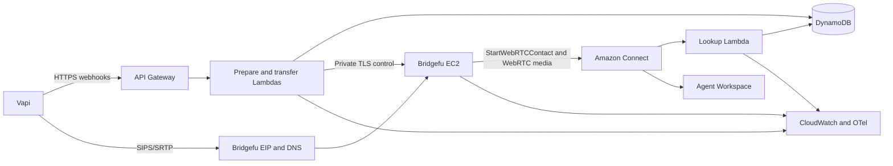
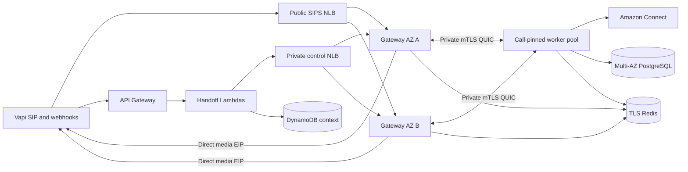

# Bridgefu Recipe-First Production Implementation Plan

- **Status:** Implemented locally; protected AWS foundation and live
  qualification await account-owner inputs
- **Date:** 2026-07-31
- **Target line:** Bridgefu 0.9.x, additive and backward-compatible
- **First canonical recipe:** `vapi-amazon-connect-screen-pop`
- **Primary deployment target:** AWS
- **Primary AWS packaging:** CloudFormation
- **Portable infrastructure packaging:** Terraform
- **Google Cloud native packaging:** Infrastructure Manager roadmap

## Current execution scope — 2026-08-02

The approved deployment scope is now the single-server Starter profile in
separate nonproduction and production workload accounts. HA is removed from the
current free/community release critical path and is deferred to a separately
packaged premium AWS Marketplace product. The detailed executable plan is
[`BRIDGEFU-AWS-STARTER-WORKPLAN.md`](BRIDGEFU-AWS-STARTER-WORKPLAN.md).

Historical HA design and implementation detail below remains useful technical
reference, but it is not a current launch, qualification, or support gate.

## 1. Executive summary

Bridgefu should become a recipe-first application for connecting one support
transport or media format to another. Most administrators should choose a
supported recipe, answer a short set of questions, deploy it, and run its
built-in verification. They should not need to understand Bridgefu's internal
leg model, profile bindings, RTP port partitioning, Amazon Connect start
specifications, or low-level route catalog.

The existing durable two-leg call engine is a strong execution target and does
not need to be rewritten. The new recipe layer will be a declarative package
and catalog boundary that compiles into the existing route, profile, context,
adapter, persistence, and call-lifecycle models.

The first supported built-in recipe will be:

```text
Vapi voice assistant
    -> SIP/RTP or SIPS/SRTP transfer
    -> Bridgefu
    -> Amazon Connect WebRTC media
    -> Lambda/DynamoDB context lookup
    -> Amazon Connect Agent Workspace screen pop
```

This recipe will be completely independent of the reference tenant. The
reference tenant is useful as evidence of the proven live behavior and as a
contract reference, but no reference-tenant service, database, endpoint,
credential, name, or code will be required by the canonical recipe.

The AWS deployment will have two production profiles:

1. **Starter Production**: one hardened, low-complexity, low-latency Bridgefu
   host with AWS-native management, monitoring, backup, and recovery.
2. **High Availability**: a multi-AZ ECS-on-EC2 gateway/worker topology with
   durable shared state, safe autoscaling, direct media networking, and
   coordinated call draining.

Kubernetes is intentionally out of scope. It would add operational complexity
without automatically solving SIP dialog affinity, RTP address advertisement,
media EIP ownership, active-call draining, or stateful scale-in.

Documentation, observability, hardening, infrastructure, samples, and test
evidence are part of each recipe's definition of done. They are not follow-up
tasks after feature implementation.

## 2. Goals

### 2.1 Product goals

- Make a **Bridgefu Recipe** the normal user-facing unit of installation,
  configuration, documentation, qualification, and support.
- Make the Vapi-to-Amazon-Connect screen-pop path the flagship first recipe.
- Support both clear SIP/RTP and secure SIPS/SRTP variants, with SIPS/SRTP as
  the production default.
- Preserve the existing expert configuration for advanced installations and
  backward compatibility.
- Make it straightforward for Bridgefu maintainers to add new built-in recipes.
- Make it possible for users to author declarative custom recipes without
  loading arbitrary executable plugins into the Bridgefu runtime.
- Advertise only combinations that have exact, retained qualification evidence.
- Label other real but not fully qualified combinations `development` or
  `preview`, rather than implying production support.

### 2.2 Administrator goals

- Deploy through familiar AWS tools: CloudFormation, CloudWatch, CloudTrail,
  SNS, Systems Manager, IAM, Secrets Manager, and AWS Config/drift detection.
- Require only a small number of meaningful inputs.
- Generate endpoints, secrets, Bridgefu configuration, contact flows, Lambda
  associations, dashboards, and verification resources automatically.
- Provide clear `status`, `doctor`, `test`, upgrade, rollback, and destroy
  workflows.
- Avoid hand-editing Amazon Connect flow JSON, Vapi assistant JSON, or Bridgefu's
  generated low-level route catalog.
- Make every alarm actionable through a documented runbook.

### 2.3 Engineering goals

- Reuse the existing durable call engine and adapter model.
- Preserve `config_version: 1` throughout the 0.9.x work.
- Keep recipe compilation deterministic, bounded, strictly typed, and
  revision-fingerprinted.
- Keep customer data out of SIP except for one opaque correlation ID.
- Keep credentials, raw customer fields, transcripts, and correlation IDs out
  of normal logs and metrics.
- Keep telemetry collection and orchestration out of the RTP/SRTP media path.
- Treat call draining and effect cleanup as deployment primitives.

## 3. Non-goals for the first hardened release

- A Bridgefu web configuration or monitoring console. AWS-native administration
  and the Bridgefu CLI are sufficient for the first hardened release. A web
  console is roadmap.
- Kubernetes, EKS, GKE, Helm, or service-mesh deployment.
- Automatic migration of every existing expert configuration into a recipe.
- A remote public recipe marketplace or automatic network download of recipes.
- Arbitrary runtime code hooks supplied by external recipes.
- Genesys WebRTC support. Genesys is roadmap.
- Production claims for Telnyx, WHIP/WHEP, UCTP, MOQT, generic outbound WSS, or
  other combinations without their own exact qualification gates.
- Cross-cloud production claims for the Amazon Connect recipe. Bridgefu should
  run in the same AWS region as Amazon Connect for the flagship path until
  cross-cloud latency has been independently qualified.
- Creating or modifying all of an administrator's Amazon Connect users,
  routing profiles, queues, telephony, or security profiles without explicit
  opt-in.

## 4. Decisions already made

| Decision | Result |
|---|---|
| Primary product interface | Recipe-first |
| First built-in recipe | `vapi-amazon-connect-screen-pop` |
| Canonical SIP header | `X-Correlation-Id` |
| Canonical Connect attribute | `correlation_id` |
| Customer context store | DynamoDB |
| AWS deployment interface | CloudFormation |
| Portable infrastructure interface | Terraform |
| Runtime orchestration | EC2 for Starter, ECS on EC2 for HA |
| Kubernetes | No |
| Production SIP default | SIPS/SRTP |
| Plain SIP/RTP | Explicit compatibility variant |
| Amazon Connect mode | Existing instance and target flow by default; optional demo bootstrap |
| First-version admin UI | AWS consoles, dashboards, alarms, CLI |
| Bridgefu web admin console | Roadmap |
| Google Cloud native service | Infrastructure Manager roadmap |
| Config compatibility | Additive `config_version: 1` |
| Recipe runtime extension model | Declarative, data-only manifests |

## 5. Current-state review

### 5.1 What is already strong

Bridgefu already has the major runtime building blocks needed by recipes:

- Named routes accept SIP or WebRTC ingress.
- Named destinations support SIP, interactive WebRTC/WSS, Amazon Connect, and
  Telnyx.
- The call engine models exactly two logical full-duplex call legs and supports
  controlled leg replacement without creating an unintended conference.
- The SIP stack supports PCMU, PCMA, Opus, RTP, SRTP, Digest, TLS roots, client
  certificates, proxies, and isolated outbound profile children.
- The WebRTC stack supports audio, ICE, DTLS/SRTP, Opus, context DataChannels,
  and browser attachment credentials.
- Amazon Connect is represented as a first-class outbound destination with a
  durable `StartWebRTCContact` specification and cleanup authority.
- `correlation_id` is already a first-class field in Bridgefu's context
  envelope.
- Context header mapping already has allowlist and redaction concepts.
- Amazon cleanup is journaled and reconciled across restart.
- The canonical container is distroless, non-root, lockfile-driven, digest-
  pinned at its build inputs, and already has SBOM/provenance/scanning work.
- Local tests cover significant SIP, RTP, WebRTC, transcoding, teardown,
  replacement, persistence, and Amazon adapter behavior.

Relevant implementation areas include:

- [`src/config.rs`](src/config.rs)
- [`src/call_service/service.rs`](src/call_service/service.rs)
- [`src/call_service/execution.rs`](src/call_service/execution.rs)
- [`src/call_service/model.rs`](src/call_service/model.rs)
- [`src/context.rs`](src/context.rs)
- [`src/api.rs`](src/api.rs)
- [`src/amazon_cleanup.rs`](src/amazon_cleanup.rs)
- [`src/gateway_native_ingress.rs`](src/gateway_native_ingress.rs)

### 5.2 Product and configuration gaps

- `NamedRouteCfg` exposes low-level endpoint mechanics, profiles, and
  compatibility switches directly to administrators.
- The complete browser/Vapi/Amazon example is hundreds of lines and repeats
  transport, tenant, Amazon, TLS, TURN, mapping, and profile information.
- The term `VapiIngressProfileCfg` is vendor-specific even though the underlying
  capability is authenticated SIP ingress.
- Stable `sip:<user>@host` admission is still embedded in the
  reference-tenant-specific canary path rather than a generic recipe route.
- Ordinary named SIP ingress does not currently carry authenticated INVITE
  header context into Amazon destinations in the same way the compatibility
  server does.
- Recipe-only all-in-one startup still requires and constructs the legacy
  `ConnectScreenPopServer` path.
- The top-level `aws` and legacy `sip` blocks are required even when a recipe
  could generate the needed runtime configuration.
- Current product documentation is still shaped around Vapi/Amazon and the
  historical compatibility server instead of a general transport bridge with
  a recipe catalog.

### 5.3 Infrastructure gaps

The root Terraform deployment is a useful proven POC but is not a production
template:

- It uses SSH and a user-supplied key.
- It uploads source and builds on the EC2 host.
- It uses a public host and clear SIP/RTP.
- Its Connect policy contains wildcard resources.
- The observed live root volume is unencrypted.
- It does not provision DynamoDB, Lambda, Vapi resources, agent views, or
  end-to-end tests.

The more advanced [`deploy/terraform/aws`](deploy/terraform/aws) module is a
useful HA blueprint, but is not turnkey:

- It expects environment-owned VPCs, subnets, ASGs, EIPs, launch templates,
  DNS, certificates, configurations, and secrets.
- Gateway EIPs are bound to exact instance IDs, so ASG replacement is not
  automatically self-healing.
- It does not provide the final SIPS listener/certificate path.
- It has not been deployed and live-qualified as the complete recipe topology.
- It contains no Vapi/DynamoDB/Lambda/Agent Workspace recipe components.

The release-image candidate workflow intentionally does not publish an image.
One-click infrastructure is impossible until Bridgefu publishes an immutable,
reviewed multi-architecture image digest and immutable Lambda/template assets.

### 5.4 Qualification gaps

Current local qualification is strongest for:

- SIP/RTP PCMU to Amazon Connect-shaped media.
- Browser-shaped WebRTC to Amazon Connect.
- WebRTC to Digest-authenticated SIPS/SRTP using PCMU and PCMA.
- SIPS/SRTP PCMU to WebRTC.
- Vapi-shaped SIPS assistant replacement to Amazon or SIP, including resume on
  failed replacement.

The remaining gaps are material:

- Real Chromium tests are present but ignored rather than required release
  gates.
- No direct live SIPS/SRTP-to-Amazon qualification is retained.
- No complete PCMU/PCMA/DTMF matrix exists for the first recipe.
- AWS and Chime behavior is mostly seam-mocked in repository tests.
- The protected live smoke proves lifecycle stages, not audible bidirectional
  media, DTMF, DynamoDB, Lambda lookup, or visible Agent Workspace rendering.
- CloudFormation is not linted, deployed, updated, rolled back, or destroyed
  because it does not yet exist.
- The outbound WebRTC/Chromium RFC 4733 DTMF issue remains open in
  [rvoip issue #54](https://github.com/eisenzopf/rvoip/issues/54).

### 5.5 Live proof and its role

The reference tenant deployment and AWS control-plane history confirm that the
Vapi-to-Bridgefu-to-Amazon-Connect path has worked repeatedly in the real
environment. This is valuable baseline evidence.

The new recipe should preserve the proven behavioral contracts:

- Vapi uses a destination-less `transferCall` and asks a server for the
  destination.
- The server owns the destination and correlation authority.
- Vapi places a SIP transfer carrying `X-Correlation-Id`.
- Bridgefu maps the correlation into the initial Amazon Connect attributes.
- Amazon Connect invokes a lookup Lambda and routes to an agent.

The new implementation must not copy the reference tenant application boundary.
It will replace the Google-hosted application database/API with a small,
AWS-native handoff service owned by the recipe.

## 6. Product support model

### 6.1 Support tiers

Every built-in recipe and transport combination will publish one support tier:

| Tier | Meaning |
|---|---|
| `supported` | Exact advertised matrix has retained hermetic and live evidence; covered by release gates and runbooks. |
| `preview` | Intended product path with substantial testing, but at least one external or production gate remains. |
| `development` | Real implementation that users may experiment with; no production support claim. |
| `custom` | User-authored declarative recipe; validated structurally but not qualified by Bridgefu. |
| `roadmap` | Planned and not currently delivered. |

Only embedded Bridgefu packages may declare `supported`. External recipes are
reported as `custom` or `experimental` regardless of their own metadata.

### 6.2 Planned recipe catalog

| Order | Recipe | Initial target |
|---|---|---|
| 1 | `vapi-amazon-connect-screen-pop` | Supported after full live gate |
| 2 | `browser-vapi-to-contact-center` | WebRTC browser to Vapi, then SIP or Amazon Connect handoff |
| 3 | `sip-webrtc-bridge` | SIP/RTP or SIPS/SRTP to interactive WebRTC and back |
| 4 | `genesys-webrtc-bridge` | Roadmap: SIP/SRTP to Genesys WebRTC |

Telnyx, WHIP/WHEP, UCTP, MOQT, and other existing capabilities remain visible
in the expert/development catalog but are not part of the initial promoted
recipes.

## 7. Recipe package architecture

### 7.1 Repository layout

```text
recipes/
  schema/
    recipe-v1.schema.json
    values-v1.schema.json

  vapi-amazon-connect-screen-pop/
    recipe.yaml
    README.md
    CHANGELOG.md
    values.example.yaml
    handoff-contract.json

    bridgefu/
      bridgefu.yaml.tmpl

    cloudformation/
      template.yaml
      nested/
        network.yaml
        runtime-starter.yaml
        runtime-ha.yaml
        handoff-service.yaml
        connect.yaml
        vapi.yaml
        observability.yaml
        demo-site.yaml
      guard/

    terraform/
      modules/
        aws-starter/
        aws-ha/

    lambda/
      prepare_handoff/
      transfer_destination/
      connect_lookup/
      vapi_provisioner/

    vapi/
      assistant.json.tmpl
      prepare-handoff-tool.json.tmpl
      transfer-tool.json.tmpl

    connect/
      inbound-flow.json.tmpl
      agent-guide-flow.json.tmpl
      flow-test.json.tmpl

    web/
      minimal-vapi-demo/

    tests/
      unit/
      contract/
      integration/
      live/
```

The runtime-side implementation will be organized approximately as:

```text
src/recipes/
  mod.rs
  manifest.rs
  catalog.rs
  compiler.rs
  view.rs
  validation.rs

src/recipe_admission.rs
```

### 7.2 Package rules

- Built-in recipe manifests are embedded in the binary so startup does not
  depend on a mutable working directory.
- External packages load only from administrator-configured paths.
- Exact versions are required. No semver ranges or automatic network fetching
  are allowed in the first version.
- Files, maps, strings, lists, recipe counts, bridges, and inputs have explicit
  size limits.
- Paths are canonicalized and constrained to the package root.
- Unknown manifest fields are rejected.
- Missing inputs and unused inputs are rejected.
- Recipe paths, IDs, and map keys are sorted before compilation.
- `$input` substitution may replace only a complete typed YAML node. There is
  no string interpolation, shell expansion, templating language, or script
  execution in the runtime compiler.
- Recipe, route, profile, listener, URI-user, port, and capability collisions
  fail startup with a clear error.
- Resolved non-secret semantics plus recipe ID/version produce the recipe
  revision fingerprint persisted with calls.
- Secrets remain references and are excluded from revision/debug output.

Infrastructure assets may contain reviewed Lambda and deployment code, but
that code is deployed through an explicit CloudFormation/Terraform change set.
It is not loaded as a Bridgefu runtime plugin.

### 7.3 Draft recipe manifest

```yaml
api_version: bridgefu.dev/recipe/v1
kind: bridge_recipe

metadata:
  name: vapi-amazon-connect-screen-pop
  version: 1
  title: Vapi to Amazon Connect screen pop
  support: preview

inputs:
  vapi_signaling_cidrs:
    type: cidr_list
    required: true
  connect_instance_arn:
    type: aws_arn
    required: true
  connect_contact_flow_id:
    type: aws_connect_resource_id
    required: true
  sip_security:
    type: enum
    values: [sips_srtp, sip_rtp]
    default: sips_srtp

spec:
  bridges:
    transfer:
      source:
        type: sip
        security:
          $input: sip_security
        admission:
          mode: managed_attachment
          trusted_cidrs:
            $input: vapi_signaling_cidrs
      destination:
        type: amazon_connect
        media: webrtc
        instance_arn:
          $input: connect_instance_arn
        contact_flow_id:
          $input: connect_contact_flow_id
      context:
        correlation:
          required: true
          from_sip_header: X-Correlation-Id
          to_amazon_attribute: correlation_id
          format: opaque_id_v1

deployments:
  aws_cloudformation:
    starter: cloudformation/template.yaml
    high_availability: cloudformation/template.yaml
  terraform:
    aws_starter: terraform/modules/aws-starter
    aws_high_availability: terraform/modules/aws-ha

assets:
  documentation: README.md
  contract: handoff-contract.json
```

### 7.4 Minimal administrator configuration

The target user-authored configuration should resemble:

```yaml
config_version: 1

edge:
  public_host: sip.example.com
  sip_security: sips_srtp

aws:
  region: us-west-2

recipes:
  support:
    use: builtin:vapi-amazon-connect-screen-pop@1
    with:
      connect_instance_arn: arn:aws:connect:...
      connect_contact_flow_id: 00000000-0000-0000-0000-000000000000
      vapi_signaling_cidrs: [198.51.100.0/24]
```

In normal CloudFormation deployments, even this file is generated. The
administrator should not repeat route legs, destination profiles, Amazon start
specifications, header mappings, persistence settings, TLS listener details,
worker capabilities, or `generic_bridge.enabled`.

## 8. Runtime implementation design

### 8.1 Compiled recipe catalog

Recipe compilation should produce a private model similar to:

```rust
struct CompiledRecipeCatalog {
    routes: ResolvedNamedRoutes,
    stable_sip_admissions: RecipeSipAdmissionCatalog,
    sip_ingress_profiles: BTreeMap<ProfileId, CompiledSipIngressProfile>,
    sip_egress_profiles: BTreeMap<ProfileId, CompiledSipEgressProfile>,
    webrtc_profiles: BTreeMap<ProfileId, CompiledWebRtcProfile>,
    descriptors: BTreeMap<RecipeInstanceId, RecipeDescriptor>,
    required_capabilities: BTreeSet<String>,
    fingerprint: String,
}
```

The compiler merges this catalog with explicit advanced `api.routes` only
after each side has been independently validated. Any collision fails closed.

### 8.2 Configuration compatibility

Keep `config_version: 1` and make these additive changes:

- Add optional `recipe_catalog`, `recipes`, and simplified `edge` keys.
- Relax syntactic requirements for top-level legacy `aws` and `sip`; require
  them semantically only when their legacy consumers are enabled.
- Add an explicit `legacy_vapi_connect.enabled` compatibility switch.
- Infer legacy mode for existing configurations that contain legacy tenants or
  legacy Amazon instance/flow settings, while emitting a deprecation notice.
- Do not construct the legacy `ConnectScreenPopServer` for a recipe-only
  configuration.
- Keep `api.routes`, `vapi_ingress_profiles`, `sip_profiles`,
  `webrtc_profiles`, `context`, and `generic_bridge` as the expert surface.
- Permit recipes and expert routes together only when identities, listeners,
  policies, profiles, and ports are disjoint.
- Add a new `NamedProfileKind::SipIngress` without deleting or renaming the
  persisted `VapiIngress` variant.
- Defer `config_version: 2` until a later release actually removes or renames
  old fields or changes existing defaults.

### 8.3 Generic SIP recipe admission

Replace the reference-tenant-specific stable admission seam with a generic
`RecipeSipAdmissionCatalog`.

The catalog must support two modes:

1. `managed_attachment`: a backend reserves a two-minute, one-use SIP/SIPS
   attachment through the existing named-route API.
2. `stable_uri`: a configured Request-URI user selects a server-owned recipe,
   intended for fixed SIP endpoints and the clear SIP/RTP compatibility mode.

Admission must:

- Match an exact recipe-owned URI user or exact one-use attachment.
- Require the correct authenticated ingress principal/profile revision.
- Reject ambiguous, duplicate, malformed, overlong, or control-character
  correlation headers.
- Require the correlation header to match server-owned route context for
  managed attachments.
- Derive a tenant-, recipe-, and operation-bound idempotency digest.
- Create a named-route call rather than an arbitrary low-level call.
- Persist recipe, route, and profile revisions.
- Consume one-use proof exactly once.
- Preserve rejection, cancellation, deadline, restart, cleanup, and drain
  semantics.

The legacy reference tenant configuration can construct one compatibility
catalog entry, but the canonical built-in recipe must not reference
reference tenant.

### 8.4 Context propagation fix

Authenticated SIP context must be available to Amazon Connect destinations.
The implementation must:

- Parse `X-Correlation-Id` case-insensitively but expose one canonical name.
- Retain only allowlisted fields.
- Bind the context to tenant, recipe, call, source leg, and authenticated
  principal.
- Reject a header that conflicts with the server-owned context established
  during attachment reservation.
- Persist the initial context snapshot before starting Amazon Connect.
- Project only `correlation_id` and recipe-owned fixed attributes into
  `StartWebRTCContact`.
- Never let SIP headers select an AWS account, Connect instance, flow, queue,
  destination, tenant, route, or credential.

### 8.5 SIP security posture constraint

The current inbound stack can listen on clear SIP and SIPS, but it shares one
inbound SRTP policy. Therefore it cannot truthfully offer plain SIP/RTP and
mandatory SIPS/SRTP as independent policies in one process.

For the first release:

- A Starter deployment selects exactly one posture.
- `sips_srtp` is the default and supported production posture.
- `sip_rtp` is an explicit compatibility posture restricted by signaling
  CIDRs, rate limits, and media binding.
- Running both simultaneously requires separate listener policy children or
  separate gateway processes/pools and is an HA/follow-up implementation item.

## 9. Canonical AWS-native handoff service

### 9.0 End-to-end sequence



### 9.1 Data-flow contract

Only one opaque identifier crosses SIP:

| Boundary | Value |
|---|---|
| Vapi tool to AWS | Bounded display fields plus server-trusted Vapi call identity |
| DynamoDB partition key | Opaque `correlation_id` |
| Vapi transfer to Bridgefu | `X-Correlation-Id` |
| Bridgefu to Amazon Connect | Contact attribute `correlation_id` |
| Amazon Connect to lookup Lambda | `$.Attributes.correlation_id` |
| Lookup Lambda to flow | Fixed flat string map |
| Flow to Agent Workspace | Allowlisted user-defined contact attributes |

No customer record, transcript, credential, account number, destination URI,
queue, or routing authority crosses SIP.

### 9.2 Correlation ID

Use a deterministic, versioned opaque key:

```text
bf1_<base64url(HMAC-SHA256(
  correlation_key_v1,
  "bridgefu|deployment-id|vapi-org-id|vapi-call-id"
))>
```

Properties:

- High entropy and not guessable without the AWS-only key.
- No customer information.
- Stable across prepare/transfer retries.
- Directly usable as the DynamoDB partition key.
- No GSI or call-ID mapping table required for the first one-handoff-per-call
  recipe.
- Version prefix supports key rotation.

The Vapi webhook authentication credential and correlation derivation key must
be separate secrets. During rotation, the lookup/transfer path must retain the
previous correlation key for at least the maximum context TTL and call lifetime.

### 9.3 Vapi assistant and tools

The recipe provisions:

- One Vapi assistant intended for browser/WebRTC or configured phone use.
- One `prepare_handoff` function tool.
- One destination-less `transferCall` tool.
- One Vapi Custom Credential for authenticating calls to the recipe endpoints.

Flow:

1. The assistant gathers a small fixed set of sample fields.
2. The assistant calls `prepare_handoff`.
3. A server-trusted call identifier is injected outside the model-controlled
   function schema.
4. AWS validates the request and stores the context.
5. The assistant invokes `transferCall` with no model-selected destination.
6. Vapi sends `transfer-destination-request` to AWS.
7. AWS recomputes the correlation ID, strongly reads the row, reserves the
   Bridgefu attachment, and returns the fixed SIPS destination plus header.

Initial example display fields:

- `customer_name`
- `issue_summary`
- `intent`
- `verification_status`
- `vapi_call_reference`

All fields are untrusted display data. They cannot control routing, IAM,
destinations, code paths, URLs, or resource identifiers.

Vapi's documented Custom Credential mechanism should be used for authenticated
webhooks. If raw-body signed webhooks are available in the exact Vapi API/org
version used for release, add and qualify signature verification. Do not claim
or depend on a signature scheme until it is confirmed live.

### 9.4 Vapi CloudFormation custom resource

The custom-resource provider creates, updates, and deletes only Vapi resources
that it can prove it owns:

- Custom Credential.
- `prepare_handoff` tool.
- destination-less transfer tool.
- assistant.
- endpoint URLs and relevant server event subscriptions.
- recipe/stack ownership metadata where Vapi supports it.

Required external prerequisite:

- Existing Vapi organization and private API key stored in AWS Secrets Manager.

Optional prerequisites:

- Vapi public key for the browser demo.
- Existing model/voice credential IDs if the Vapi organization does not use
  defaults.

The provider must:

- Be idempotent across CloudFormation retries.
- Use deterministic ownership names/tags.
- Read the API key from Secrets Manager without outputting or logging it.
- Detect conflicting pre-existing unowned resources.
- Verify ownership before update/delete.
- Support `RetainVapiResourcesOnDelete`.
- Return only non-secret IDs.
- Have unit tests against a strict fake Vapi API and a protected live contract
  test against a nonproduction Vapi organization.

### 9.5 DynamoDB schema

Recommended table:

| Property | Design |
|---|---|
| Partition key | `correlation_id` string |
| Billing | On-demand initially |
| TTL key | `expires_at` epoch seconds |
| Default TTL | 24 hours, configurable |
| Encryption | AWS-owned by default; customer KMS option |
| Recovery | Point-in-time recovery enabled |
| Delete behavior | Retain in production; delete optional in demo mode |
| Streams | Off initially unless later cleanup/audit requires them |

Stored fields:

- `schema_version`
- `correlation_id`
- bounded screen-pop fields
- one-way Vapi call fingerprint
- stable content hash
- `created_at`
- `updated_at`
- `expires_at`
- handoff status
- optional consumed/released timestamps

Never store:

- Full transcript.
- Recording.
- Vapi private key.
- Bridgefu bearer/HMAC keys.
- AWS credentials.
- Full payment, banking, SSN, authentication, or PCI data.

### 9.6 `prepare_handoff` Lambda

Responsibilities:

- Authenticate the Vapi Custom Credential using constant-time comparison.
- Enforce API Gateway body limits, content type, and request timeout.
- Validate exact event/tool type and server-injected call identity.
- Bound field count, names, lengths, Unicode/control characters, and total size.
- Compute the versioned correlation ID and stable content hash.
- Use a conditional DynamoDB write.
- Treat an exact same-content retry as success.
- Reject a conflicting replay for the same correlation ID.
- Return only a generic success result and, if needed by the tool flow, the
  opaque correlation ID.
- Emit low-cardinality result metrics without logging customer data.

### 9.7 `transfer_destination` Lambda

Responsibilities:

- Authenticate independently from `prepare_handoff`.
- Validate the exact `transfer-destination-request` envelope.
- Recompute the correlation ID from the server-trusted call identity.
- Perform a consistent DynamoDB `GetItem`.
- Reject missing, expired, conflicting, or unprepared handoffs before transfer.
- Call only the stack-owned private Bridgefu API and fixed recipe route.
- Use a stable idempotency key for Bridgefu attachment creation.
- Never accept a route, tenant, SIP URI, Bridgefu URL, header name, Connect ID,
  or queue from the Vapi payload.
- Return only a complete approved destination:

```json
{
  "destination": {
    "type": "sip",
    "sipUri": "sips:<one-use-token>@sip.example.com:5061;transport=tls",
    "sipHeaders": {
      "X-Correlation-Id": "<opaque-id>"
    }
  }
}
```

For the explicit clear SIP/RTP compatibility variant, the Lambda may return a
fixed `sip:` URI owned by the recipe. That mode still never accepts a caller-
selected URI.

### 9.8 `connect_lookup` Lambda

Responsibilities:

- Have no public endpoint.
- Accept only the Amazon Connect invocation shape.
- Validate `Details.ContactData.Attributes.correlation_id`.
- Perform a consistent DynamoDB read.
- Enforce TTL and handoff status.
- Return only a fixed flat string map because Amazon Connect attributes are
  string-only.
- Convert booleans/numbers to bounded strings where necessary.
- Never return internal hashes, keys, secrets, raw database records, or
  unrecognized fields.
- Return a generic `context_available=false` result for missing/expired data.
- Allow the voice call to continue to an agent when context is unavailable.

### 9.9 Cleanup and retention

- The inbound flow must not depend on data deletion for correctness.
- DynamoDB TTL provides eventual deletion after the configured retention.
- A disconnect flow or Connect event consumer may mark the handoff released and
  shorten TTL.
- Bridgefu remains responsible for `StopContact` cleanup and its durable cleanup
  journal.
- Repeated cleanup is idempotent.
- Production stack deletion retains the table by default.
- Demo stack deletion may delete the table only after an explicit parameter and
  clear warning.

## 10. Amazon Connect design

### 10.1 Production integration mode

The recommended production stack integrates into an existing Amazon Connect
instance and the customer's existing target contact flow. Required inputs:

- Connect instance ARN.
- Existing target contact-flow ARN or ID.
- Optional list of agent users/security profiles for explicit validation or
  opt-in association.

The recipe must not rewrite or take ownership of the customer's target flow.
It creates a narrow, recipe-owned wrapper entry flow that performs the context
lookup and screen pop, then transfers into the supplied target flow. Bridgefu's
`StartWebRTCContact` destination uses the generated wrapper-flow ID, not the
customer flow directly. If the target flow owns queue selection and routing,
no queue ARN is required.

Create:

- Lambda integration association.
- Exact Lambda invoke permission for the Connect instance/account.
- Dedicated wrapper entry flow used by Bridgefu's `StartWebRTCContact`
  destination.
- Dedicated Agent Workspace guide flow.
- Optional recipe-owned security profile containing the minimum custom-view
  permission.
- Connect flow test case where supported.

### 10.2 Inbound contact flow

The flow will:

1. Invoke `connect_lookup` synchronously with a short timeout.
2. Copy the safe returned values from the external/Lambda namespace into
   user-defined contact attributes.
3. Configure the Agent UI event flow to the recipe's guide flow.
4. Transfer to the customer-supplied target contact flow.
5. On lookup error/timeout, set generic `context unavailable` attributes and
   still transfer to the customer flow.

Copying Lambda results is required because a later Lambda invocation replaces
the external result namespace. The copied user-defined fields are the screen-
pop contract.

### 10.3 Agent Workspace guide flow

- Use Amazon Connect's Detail view through `ShowView`.
- Render only recipe-owned allowlisted attributes.
- Start when the contact is offered to the agent.
- Show a clear `Context unavailable` state instead of a blank or broken page.
- Handle view error/timeout without affecting the voice call.
- Avoid external third-party pages for the first version.

Agents need the appropriate custom-view application permission. The stack may
create a recipe-owned security profile, but must not silently attach it to all
agents. Options:

1. Document the one explicit administrator attachment step; or
2. Offer an opt-in custom resource that modifies only listed users and records
   enough prior state to restore it on rollback/delete.

Option 1 is the recommended first hardened behavior.

### 10.4 New demo instance mode

A separate `New demo Connect` launch path may provision a minimal nonproduction
Connect instance, queue, routing profile, security profile, test user, target
flow, wrapper flow, and views. This path exists for automated qualification or
for customers deliberately creating their first Amazon Connect environment;
it is not the normal customer deployment path.

This is not the production default because:

- Connect instance creation is an operational/account decision.
- The CloudFormation resource is still documented as preview.
- AWS limits instance create/delete attempts over a rolling period.
- Agent identity, telephony, recording, storage, compliance, routing, and
  retention settings should not be guessed for a real contact center.

Recurring CI will use a persistent nonproduction Connect instance while
deploying the remaining recipe resources ephemerally.

## 11. Infrastructure packaging

### 11.1 Release artifacts

Before a one-click stack can be supported, publish:

- Signed multi-architecture Bridgefu image at an immutable digest.
- Immutable Lambda ZIP artifacts with checksums.
- Versioned regional S3 copies of nested CloudFormation templates.
- A signed recipe release manifest containing:
  - Bridgefu version and source revision.
  - Container image digest.
  - Lambda object versions and checksums.
  - Template URLs/checksums.
  - Recipe manifest and contract versions.
  - Vapi and Connect asset revisions.
- SBOM, provenance, and vulnerability-policy evidence.

Never use `latest`. Allow private registry mirrors by parameter, but default to
the reviewed public immutable digest.

### 11.2 Root CloudFormation template

The root template will use nested stacks for separation and update safety:

```text
template.yaml
  -> network.yaml
  -> runtime-starter.yaml OR runtime-ha.yaml
  -> handoff-service.yaml
  -> connect.yaml
  -> vapi.yaml
  -> observability.yaml
  -> demo-site.yaml (optional)
```

Use `AWS::CloudFormation::Interface` metadata to group and label parameters in
the console.

Recommended required inputs:

1. Vapi API key secret ARN.
2. Vapi region.
3. Connect instance ARN.
4. Existing target contact-flow ARN or ID.
5. Route 53 hosted zone ID.
6. Desired SIP hostname.

Useful optional inputs:

- Starter or HA profile.
- Existing VPC/subnets or new VPC.
- Secure or compatibility SIP posture.
- Context retention.
- Instance/worker capacity.
- KMS key ARNs.
- SNS alarm topic/email bootstrap.
- Vapi model/voice settings.
- Demo website enablement/public key.
- Explicit agent users for opt-in permission changes.
- Retain/delete behavior for data and Vapi resources.

Outputs:

- Recipe ID/version/support tier.
- Exact Bridgefu image digest.
- SIP/SIPS hostname and URI pattern.
- Vapi assistant/tool IDs.
- Connect flow/guide IDs and ARNs.
- DynamoDB table name.
- Runtime instance/cluster identifiers.
- SSM entry point.
- CloudWatch dashboard URL.
- Test project/execution entry point.
- Redacted verification command.

Never output:

- Vapi private key.
- Webhook credential.
- Correlation HMAC key.
- Bridgefu API bearer/HMAC key.
- TLS private key/passphrase.
- Live correlation IDs.

### 11.3 Stack readiness

The stack must not reach `CREATE_COMPLETE` until:

- Runtime image is pulled by digest.
- Durable storage is mounted and writable.
- Required certificate/key files are available.
- Bridgefu configuration passes the real Bridgefu validator.
- `/livez` and `/readyz` pass.
- Public SIPS certificate chain matches the hostname.
- Vapi resources exist and point to the correct endpoints.
- DynamoDB and Lambdas pass structural checks.
- Connect Lambda association and flows are published.
- Dashboard and alarms exist.

Do not place a billed external call as part of ordinary stack creation. The
stack may run safe synthetic infrastructure checks; live calls require an
explicit test command/environment approval.

## 12. Starter Production topology



### 12.1 Network

- New-VPC default and existing-VPC option.
- Two public and two private subnets so the stack can evolve without a VPC
  replacement, although the first Bridgefu host occupies one AZ.
- Direct EIP for public SIP/SIPS and RTP/SRTP.
- Route 53 A record for the recipe SIP hostname.
- Operations and control endpoints are not public.
- Vapi webhook API is fronted by API Gateway with throttling, body limits,
  authentication, and optional WAF controls where supported.
- Transfer Lambda reaches Bridgefu through a private TLS endpoint and security-
  group allowlist.
- DynamoDB gateway endpoint and appropriate Secrets Manager/SSM endpoints for
  private resources.

### 12.2 Compute and storage

- Amazon Linux 2023 EC2.
- Immutable Bridgefu image by digest.
- No SSH listener or EC2 key pair.
- SSM Session Manager only.
- IMDSv2 required, hop limit one.
- Encrypted root volume.
- Separate encrypted gp3 data volume for SQLite durable call/effect/cleanup
  state.
- Data Lifecycle Manager snapshots or equivalent backup policy.
- EC2 automatic recovery alarm.
- Non-root, read-only container filesystem and no Linux capabilities.
- Host networking only where required for deterministic SIP/RTP media ports.

### 12.3 SIP and media security groups

- SIPS/TCP 5061 only from current verified Vapi signaling CIDRs.
- Clear SIP/UDP or TCP 5060 only when an explicit compatibility parameter is
  enabled.
- RTP/SRTP only on the configured bounded media port range.
- Where Vapi media IPs are dynamic, accept any source only on that bounded
  range and rely on dialog/media binding, symmetric RTP validation, probation,
  sequence checks, call capacity, and signaling authentication.
- Operations/API ports only from management or Lambda security groups.
- Outbound access reduced to required AWS/Vapi/DNS/time endpoints where
  practical.

### 12.4 Certificates

- Route 53 DNS validation.
- Exportable public ACM certificate for the SIP hostname.
- AWS Workload Credentials Provider or an equally reviewed mechanism exports
  and refreshes certificate/key files on the host.
- Certificate private key and export passphrase never enter CloudFormation
  outputs, user data, logs, or the image.
- Bridgefu must support graceful certificate reload. Restarting active calls on
  routine certificate renewal is not acceptable.

### 12.5 Private Bridgefu control API

The transfer Lambda must reserve one-use attachments through a private,
authenticated API.

Required application work:

- Add TLS to the all-in-one private API listener; or
- Put a narrowly scoped local TLS proxy in front of it.

Direct application TLS is preferred. Any proxy must remain outside the RTP
path and have its own drain/readiness behavior.

## 13. High Availability topology



### 13.1 Runtime roles

- Minimum two public gateways across AZs.
- Minimum two private call workers across AZs.
- ECS on EC2 with host networking where required.
- No Fargate for the core media path until port-range, source-address, and
  performance behavior are independently qualified.
- No service mesh.

### 13.2 Shared state

- Multi-AZ PostgreSQL for authoritative durable calls, effects, assignments,
  and cleanup state.
- TLS-only Redis for clustered projections, admission, and coordination.
- Encrypted backups and tested restore.
- Schema migrations compatible with rolling forward deployment and documented
  rollback limits.

### 13.3 Public signaling and media

- Public Network Load Balancer with SIPS/TCP pass-through.
- Internal API NLB for transfer Lambda to gateway control APIs.
- Direct media EIP per gateway; each gateway advertises its own EIP in SDP.
- Shared attachment/assignment state so a one-use SIPS URI may land on any
  healthy gateway.
- Correct SIP dialog affinity and Contact/Record-Route behavior.
- Cross-zone behavior qualified explicitly rather than assumed.

### 13.4 Gateway identity and EIP lifecycle

The current static instance-ID-to-EIP Terraform mapping must be replaced.

Implement:

- Pre-provisioned bounded gateway slots, each containing an ordinal, gateway
  identity, EIP allocation, DNS/advertisement data, and capacity state.
- ASG lifecycle hook or controller that atomically claims a free slot on launch.
- EIP association and Bridgefu configuration before readiness.
- Drain and target deregistration before releasing a slot.
- Recovery/reconciliation when an instance dies before normal release.
- No reuse of a gateway identity while old assignments or media authority
  remain live.

### 13.5 Autoscaling

Workers scale on:

- Active calls versus safe per-worker capacity.
- Setup/admission queue depth.
- Media graph/transcode utilization.
- CPU and memory as secondary signals.
- Cleanup backlog and dependency readiness as scale-blocking signals.

Gateways scale only within available pre-provisioned media EIP slots and based
on:

- Active ingress dialogs.
- Attachment/signaling admission capacity.
- RTP port availability.
- Network packet rate.
- Private-forwarding queue pressure.

Do not scale either role on CPU alone.

### 13.6 Safe scale-in and deployment

- ECS managed termination protection enabled.
- ASG scale-in protection while a host owns active calls or cleanup authority.
- Readiness closes before deregistration.
- New call admission stops before drain.
- Existing calls drain to a bounded deadline.
- Unresolved cleanup remains durably owned after a forced deadline.
- Instance refresh occurs one slot at a time.
- Deployment circuit breaker and automatic rollback.
- Canary image weight before fleet rollout where the signaling topology allows
  it.

HA must not be labeled supported until replacement, failover, drain, database
failover, Redis failover, EIP reassignment, and active-call behavior have live
evidence.

## 14. Terraform and Google Cloud roadmap

### 14.1 Terraform

CloudFormation is the easiest AWS administrator path. Terraform remains the
portable/composable path.

Provide matching modules:

- `terraform/modules/aws-starter`
- `terraform/modules/aws-ha`

CloudFormation and Terraform do not need to be generated from each other, but
they must implement one versioned infrastructure contract with parity tests for:

- Required inputs.
- Outputs.
- Ports and security groups.
- IAM actions/resources.
- encryption/retention.
- immutable artifacts.
- readiness.
- dashboards/alarms.
- recipe/config revisions.

Reuse safe pieces of the current Terraform modules, but do not inherit the
static EIP/instance binding or incomplete SIPS path.

### 14.2 Google Cloud

Google Deployment Manager is no longer the correct target. Google Cloud's
supported managed infrastructure service is Infrastructure Manager, which
deploys Terraform configurations.

Roadmap:

1. Create provider-neutral recipe infrastructure contracts.
2. Complete and qualify the AWS Terraform modules.
3. Create GCP Terraform modules for Bridgefu runtime, networking, secrets,
   logging, and monitoring.
4. Package those modules for Google Cloud Infrastructure Manager.
5. Qualify latency and failure behavior before supporting an Amazon Connect
   recipe with Bridgefu hosted outside AWS.
6. Reuse the same recipe model for future non-AWS CCaaS destinations.

## 15. Administrator experience

### 15.1 CLI

Extend the existing CLI with:

```text
bridgefu recipe available
bridgefu recipe init <recipe@version>
bridgefu recipe validate [path]
bridgefu recipe list --config <path>
bridgefu recipe explain <instance> --config <path>
bridgefu recipe deploy <path> --profile starter|ha
bridgefu recipe status <deployment>
bridgefu recipe doctor <deployment>
bridgefu recipe test <deployment> [--live]
bridgefu recipe destroy <deployment>
```

`recipe explain` returns a redacted report containing:

- Source signaling/media/security.
- Admission mode and stable/managed URI behavior.
- Destination adapter.
- Codec and DTMF contract.
- Context/header/attribute mapping.
- Required network ports.
- AWS permissions and external prerequisites.
- Required runtime capabilities.
- Generated route/profile IDs and non-secret revisions.
- Support tier and remaining limitations.
- Conflicts and unsupported listener combinations.

`recipe doctor` checks:

- CloudFormation/Terraform deployment state.
- DNS and certificate chain.
- Bridgefu liveness/readiness and version digest.
- Private control API reachability through an in-stack probe.
- Vapi object IDs and endpoint configuration.
- DynamoDB/Lambda health.
- Connect association and flow publication.
- Dashboard/alarm existence.
- No active high-severity alarm.

It must not expose secret values or run a billable call.

### 15.2 AWS console experience

- Launch Stack link from recipe documentation.
- Grouped CloudFormation parameters with plain-language descriptions.
- Change set preview before update.
- Stack outputs link directly to dashboard, logs, Connect flows, Vapi IDs, and
  test entry point.
- Drift detection documented and optionally scheduled.
- CloudWatch dashboard is the normal operational home.
- SNS routes alarms to the administrator's existing notification system.
- SSM is the only host access path.

### 15.3 Web console roadmap

A future Bridgefu web console may provide:

- Recipe selection/configuration.
- Deployment inventory.
- Call health/capacity summary.
- Alarm/runbook navigation.
- Redacted call diagnostics.
- Upgrade/rollback workflows.

It should be built only after recipe schemas, metrics, support tiers, and
administrative actions are stable.

The optional S3/CloudFront Vapi test page is not this admin console. It is a
small qualification/demo client and contains no private credentials.

## 16. Observability plan

### 16.1 Principles

- Give administrators AWS-native dashboards, alarms, logs, traces, and
  runbooks.
- Keep metric labels bounded and low-cardinality.
- Do not emit a trace span or log line for every RTP packet.
- Collect media-quality aggregates asynchronously.
- Keep telemetry exporters and agents outside the media forwarding path.
- Use hashed/fingerprinted correlation for operational joins.
- Make every alarm identify a first diagnostic query and runbook.

### 16.2 Metrics

#### Recipe and Vapi

- Prepare requests, success, auth failure, validation failure, replay, conflict.
- Transfer-destination requests, success, missing context, expired context.
- Prepare and transfer duration histograms.
- Vapi provisioner create/update/delete outcomes.
- One-use attachment creation latency and error class.

#### SIP/SIPS

- INVITEs by accepted/rejected reason.
- TLS handshake failure.
- SRTP negotiation failure.
- Auth/profile mismatch.
- Missing/duplicate/malformed/mismatched correlation header.
- SIP response code class.
- Setup/cancel/BYE latency.
- Active dialogs and RTP-port capacity.

#### Amazon Connect

- `StartWebRTCContact` attempts, successes, typed failures, and latency.
- Chime join/subscription/ICE/DTLS establishment failures and latency.
- Contacts started/connected/stopped.
- Cleanup attempts, retries, backlog, oldest age, and terminal failure.
- Screen-pop lookup available/unavailable/error.
- Guide view error/timeout path.

#### Media

- Packets/bytes each direction.
- Loss, reordering, duplicates, late packets, and jitter.
- Media queue depth and drops.
- Transcode frames/errors/duration.
- DTMF sent/received/dropped.
- Silence/no-media deadline.
- Bridge processing latency separate from network/mouth-to-ear latency.
- Codec distribution.

#### AWS dependencies

- Lambda errors, throttles, concurrency, cold starts where measurable, duration.
- DynamoDB system errors, throttles, consumed capacity, lookup latency.
- API Gateway 4xx/5xx, latency, throttling.
- EC2/ECS readiness, CPU, memory, disk, network packets/errors.
- PostgreSQL/Redis connections, failover, replication/cluster health.
- Certificate days to expiry and refresh outcome.

### 16.3 Dashboard

The default CloudWatch dashboard should have these sections:

1. **Service status**: readiness, current version/digest, active alarms.
2. **Calls**: active, attempted, connected, failed, ended, cleanup backlog.
3. **Setup**: Vapi prepare/transfer, SIP setup, Connect start, media connect.
4. **Media quality**: packet loss, jitter, drops, transcode, DTMF, silence.
5. **Screen pop**: context writes, lookup available/unavailable, view outcomes.
6. **Capacity**: calls versus limit, RTP ports, queues, CPU/memory, worker slots.
7. **Dependencies**: Lambda, DynamoDB, API Gateway, PostgreSQL, Redis.
8. **Security**: auth failures, replay, malformed input, unexpected signaling.
9. **Certificates**: status, expiry, last refresh.
10. **Canary**: last successful protected canary and evidence revision.

### 16.4 Logs

Structured logs may contain:

- Timestamp and severity.
- Recipe/version/revision.
- Deployment and process role.
- Call/leg/correlation fingerprints.
- Fixed event and error class.
- Durations and bounded counts.
- AWS request IDs where safe.

Logs must not contain:

- Raw correlation ID.
- Raw SIP headers.
- Customer name, summary, intent, accounts, or verification data.
- Vapi request/event body.
- Lambda event body.
- Transcript or recording URL.
- Tokens, keys, cookies, bearer headers, private URLs, or TLS key material.

Remove existing documentation that suggests enabling logs that expose full SIP
headers. Add automated redaction tests.

### 16.5 Tracing

Trace control-plane operations only:

- Vapi webhook receipt.
- DynamoDB prepare/read.
- Bridgefu attachment reservation.
- SIP admission/setup state changes.
- Amazon Connect start.
- Chime media establishment summary.
- Lambda lookup.
- cleanup.

Use sampling and bounded attributes. Do not create per-packet spans.

### 16.6 Alarms and runbooks

Minimum actionable alarms:

- Recipe readiness unavailable.
- Call setup failure rate elevated.
- `StartWebRTCContact` failure elevated.
- Media connection deadline failures.
- Packet/media queue drops above zero at normal capacity.
- Cleanup backlog nonzero beyond drain/retry window.
- Lambda errors/throttles.
- DynamoDB throttling/system error.
- Vapi auth/replay spike.
- Context-unavailable screen pops elevated.
- Certificate refresh failure or expiry threshold.
- Disk/capacity threshold.
- Protected canary stale or failed.

Each runbook must include impact, likely causes, safe read-only checks,
mitigation, escalation, rollback criteria, and evidence to retain.

## 17. Latency and media-quality plan

### 17.1 Architecture rules

- Run the flagship recipe in the same AWS region as Amazon Connect.
- Use direct EIP media paths.
- Do not put an application load balancer, service mesh, HTTP proxy, NAT
  gateway, telemetry proxy, or Lambda in the RTP path.
- In HA, use private direct QUIC forwarding between gateway and pinned worker.
- Use host networking and bounded queues.
- Keep telemetry aggregation nonblocking.
- Pre-scale before media capacity is exhausted; do not wait for CPU saturation.

### 17.2 Measurements

Measure separately:

- Vapi tool-to-transfer-destination resolution.
- SIP INVITE to accepted/answered.
- SIP admission to `StartWebRTCContact` completion.
- Amazon contact start to media connected.
- Bridgefu packet processing/queue latency.
- Codec transcode latency.
- RTP inter-arrival jitter/loss/reordering.
- Synthetic end-to-end audio marker latency in both directions.
- Agent offer and screen-pop render timing.

### 17.3 SLO setting

Do not invent production latency claims from local media-graph tests. The
existing broad 100 ms local bridge threshold is not enough for an advertised
real-time path.

Before GA:

1. Collect a retained live baseline from Starter under nominal and peak load.
2. Separate Bridgefu-added processing latency from Vapi/AWS/network latency.
3. Ratify absolute p50/p95/p99 setup and media budgets.
4. Add release gates that fail both absolute violations and material regression
   from the approved baseline.
5. Publish only the measurements the complete deployed recipe actually proves.

Nominal capacity requires zero Bridgefu queue drops, zero transcode errors, and
no sustained cleanup backlog.

## 18. Security and production hardening

### 18.1 Deployment authority

- Do not deploy with the AWS account root identity.
- Create an IAM Identity Center permission set or assumed deployment role.
- Separate deployment, runtime, test, and read-only operator roles.
- Require explicit approval for live/billed test environments.
- Use CloudTrail and retained CloudFormation change sets.

### 18.2 IAM

- Scope `connect:StartWebRTCContact` to the exact contact-flow resource allowed
  by AWS authorization semantics.
- Scope `StopContact`/`DescribeContact` to the exact instance/contact resources
  where supported.
- Give each Lambda a distinct role.
- `prepare_handoff`: write/read only the one table as needed.
- `transfer_destination`: read the table and call only the private Bridgefu
  endpoint; no Connect authority.
- `connect_lookup`: `GetItem` only on the one table.
- Vapi provisioner: read only the Vapi API-key secret and its own state.
- Runtime: no DynamoDB customer-context permission unless a future design
  explicitly requires it.
- KMS decrypt permission only for exact keys and roles.
- Avoid wildcard resources; document unavoidable AWS exceptions.

### 18.3 Secrets

Store in Secrets Manager or an equivalent managed secret boundary:

- Vapi private API key.
- Vapi webhook Custom Credential value.
- Correlation HMAC key(s).
- Bridgefu control bearer/HMAC key.
- Certificate export passphrase where required.

Requirements:

- No secret in CloudFormation parameters as plaintext, outputs, user data,
  image layers, source, Terraform state, or logs.
- Rotation runbook and overlapping-key behavior.
- Short-lived credentials where possible.
- Separate secrets by purpose; never reuse the webhook credential as the
  correlation key or Bridgefu control credential.

### 18.4 Network and abuse controls

- SIPS/SRTP production default.
- Verified Vapi signaling CIDRs.
- Bounded media range.
- Authenticated one-use attachments.
- Rate limits on Vapi endpoints and Bridgefu route creation.
- Per-tenant and global call capacity.
- Idempotency and replay fences.
- Fixed destination and header allowlist.
- Request/body/field bounds.
- No redirects from credential-bearing clients.
- Cost alarms for Connect contacts, EC2/ECS, Lambda, API Gateway, and DynamoDB.

### 18.5 Host/container

- Encrypted volumes.
- IMDSv2.
- SSM only; no SSH.
- Minimal patch baseline and documented patch cadence.
- Non-root, read-only container.
- Dropped capabilities and no Docker socket mount.
- Immutable image digest.
- Health/readiness/drain hooks.
- Automatic recovery without bypassing call cleanup.

### 18.6 Supply chain

- Locked dependencies.
- Signed image and recipe manifest.
- SBOM and provenance.
- Vulnerability scan policy.
- Pinned GitHub Actions and build tools.
- Lambda dependency lock/checksums.
- Immutable nested templates.
- No remote build from a mutable branch on the production host.

### 18.7 Data protection

- Fixed bounded screen fields.
- No transcript/recording by default.
- Encryption and PITR.
- TTL and retention documented.
- Deletion behavior explicit.
- No PII in logs, metrics, traces, stack outputs, or test evidence.
- Synthetic-only data in automated tests.

## 19. Testing and qualification strategy

### 19.1 Required recipe matrix

The first recipe must qualify:

| Source | Destination | Codecs | Required evidence |
|---|---|---|---|
| SIP/RTP | Amazon Connect WebRTC | PCMU, PCMA | Audio both directions, DTMF, context, both hangups |
| SIPS/SRTP | Amazon Connect WebRTC | PCMU, PCMA | TLS/SRTP, audio both directions, DTMF, context, both hangups |
| Vapi web call transfer | Amazon Connect WebRTC | Negotiated supported codec | Actual custom header on outbound INVITE, screen pop, agent audio |

Every advertised row must prove:

- Non-silent full-duplex audio.
- Expected codec/transcode behavior.
- RFC 4733 DTMF in each advertised direction.
- Exact initial context contract.
- Source-led and destination-led termination.
- Rejection, timeout, cancellation, and auth failure.
- No duplicate Connect contact on retry.
- No unintended three-party audio.
- Exact call/contact/route/task cleanup.
- The minimal recipe config and assets used directly by the test.

### 19.2 Unit and contract tests

#### Recipe compiler

- Valid built-in and external package.
- Unknown field, unused/missing input.
- Wrong type and unsafe path.
- Bounds and package-count limits.
- Deterministic ordering and fingerprints.
- Route/profile/listener/URI-user collision.
- Secret redaction.
- Backward-compatible config fixtures.

#### Context service

- Correlation derivation and key version.
- Exact retry idempotency.
- Conflicting replay.
- Expired/missing row.
- Field/body bounds and control characters.
- Authentication failure.
- No caller-selected route/URI/header.
- Strong read behavior.
- Fixed flat Connect response.
- Sensitive log redaction.

#### Bridgefu

- Stable and managed SIP admission.
- Duplicate/malformed/mismatched header rejection.
- Context persisted before Amazon start.
- Amazon attribute mapping.
- Restart and cleanup reconciliation.
- Recipe revision mismatch/drain behavior.
- Legacy reference tenant compatibility fixture unchanged.

#### Vapi/Connect assets

- Vapi assistant/tool JSON schema and semantic snapshots.
- Contact-flow semantic validation, not string-only snapshots.
- Agent guide fields match `handoff-contract.json`.
- Lambda association/permission shape.

### 19.3 Required PR CI

- Rust formatting and strict Clippy.
- All locked Rust tests.
- Recipe JSON Schema validation.
- Validate every built-in recipe/value example.
- Compile every recipe into a valid Bridgefu config.
- Run recipe-specific hermetic tests by recipe ID.
- Install, typecheck, and test the browser SDK.
- Run pinned real Chromium recipe tests; do not leave them ignored.
- Lambda unit tests and package/checksum build.
- `cfn-lint`.
- `aws cloudformation validate-template` where credentials are available.
- `cfn-guard` rules.
- Terraform format/validate for both profiles.
- Documentation link/snippet/config tests.
- Image build policy and vulnerability checks.

### 19.4 CloudFormation guardrails

Automated guard rules must reject:

- SSH or public operations/control ports.
- Unencrypted volumes/tables/log groups where encryption is configurable.
- IMDSv1.
- Mutable image tags.
- Public Lambda/Bridgefu control endpoints without required auth.
- Wildcard Connect flow permission where exact resources are supported.
- Plain SIP enabled without explicit compatibility parameter and CIDR policy.
- Missing log retention.
- Missing backups/PITR in production profile.
- Secrets in outputs or user data.

### 19.5 Disposable AWS integration

Use a nonproduction AWS account and persistent test Connect instance:

1. Deploy exact immutable recipe assets.
2. Assert CloudFormation readiness.
3. Verify DNS, SIPS chain, SG exposure, IAM allow/deny, encryption, backups.
4. Verify Vapi resources and endpoints.
5. Send an authenticated prepare fixture; assert one DynamoDB row.
6. Retry; assert same correlation and no duplicate/conflict.
7. Send transfer request; assert one approved SIPS URI/header.
8. Consume the one-use attachment and reject replay.
9. Invoke Connect-shaped lookup fixture; assert safe flat map.
10. Execute the recipe's Amazon Connect TestCase.
11. Update the stack and prove safe/no replacement where expected.
12. Exercise rollback.
13. Delete and verify the documented retain/delete contract.

### 19.6 Protected live release gate

The GA gate must run the exact published image/template/recipe revision:

1. Start a real Vapi web call through the optional test site or controlled
   client.
2. Provide synthetic sample fields.
3. Observe `prepare_handoff` write one DynamoDB record.
4. Trigger transfer.
5. Prove the actual outbound Vapi INVITE uses SIPS/SRTP and contains exactly one
   `X-Correlation-Id` with the expected opaque value.
6. Prove Bridgefu maps the same value into the exact Amazon contact attribute.
7. Prove `StartWebRTCContact` reaches the recipe contact flow.
8. Prove lookup Lambda reads the exact row.
9. Use Playwright or another controlled browser harness to prove Agent Workspace
   visibly renders the expected Detail view.
10. Inject deterministic non-silent audio markers both directions and measure
    delivery/latency.
11. Send/receive DTMF.
12. Test Vapi/caller-led hangup.
13. Test Connect/agent-led hangup.
14. Assert exactly one contact cleanup and zero backlog.
15. Restart Starter runtime and repeat recovery scenarios.
16. Run HA gateway/worker/failover variants when HA is being released.
17. Test missing/expired context: agent still receives the call with a generic
    screen.
18. Retain only redacted evidence tied to exact revisions.

Live/billed gates require environment approval and controlled test identities.

### 19.7 Interoperability and adverse-network testing

- SIPp contract scenarios.
- Asterisk and FreeSWITCH interoperability.
- Public NAT behavior.
- TURN-only WebRTC where applicable.
- Packet loss, delay, jitter, reordering, duplication, and media rebinding.
- Dependency timeouts and partial AWS failures.
- Host process crash and restart.
- Database/Redis failover for HA.
- Repeated runs without retry masking.

### 19.8 Load and soak

The existing media-graph soak does not qualify a deployed recipe. Add complete
signaling/provider/cloud load tests that retain:

- attempted/active/completed calls.
- setup and media latency percentiles.
- packets, delivery, loss, jitter, drops, transcodes.
- CPU, memory, network, file descriptors, RTP ports.
- DynamoDB/Lambda/Connect errors.
- cleanup backlog and zero-state after drain.
- exact image/recipe/infrastructure revisions.

Do not publish concurrency claims until this end-to-end evidence exists.

## 20. Documentation plan

### 20.1 Documentation principles

- Recipes are documented as complete products, not snippets.
- Admin quickstarts lead with outcomes and prerequisites.
- Every sample is validated or deployed in CI.
- The support tier and limitations appear near the top.
- Generated tables prevent contract drift.
- Troubleshooting follows the actual hop-by-hop path.
- Security, cost, retention, rollback, and teardown are first-class.
- Expert details remain available but do not dominate the normal path.

### 20.2 Root documentation changes

Refactor the root README to:

- Describe Bridgefu as a general support transport/media bridge.
- Show the supported recipe catalog first.
- Lead with the Vapi/Amazon Connect recipe.
- Show a small support matrix.
- Link to Starter and HA deployment paths.
- Move advanced transports and internal architecture to dedicated documents.
- Clearly label development and roadmap capabilities.

### 20.3 First recipe documentation

`recipes/vapi-amazon-connect-screen-pop/README.md` must include:

1. Problem solved.
2. Supported variants and limitations.
3. Architecture and sequence diagrams.
4. Data/context contract.
5. Prerequisites.
6. Existing-Connect Launch Stack quickstart.
7. New-demo launch path and warnings.
8. Vapi assistant/tool behavior.
9. Amazon Connect flow/view behavior.
10. Starter versus HA choice.
11. Required ports and DNS.
12. Security/IAM/secrets.
13. Context fields, retention, and privacy.
14. Verification and live test.
15. CloudWatch dashboard and alarms.
16. Troubleshooting by hop.
17. Cost drivers and budgets.
18. Upgrade, drain, rollback, and restore.
19. Teardown/retention behavior.
20. Exact test evidence and support tier.

### 20.4 Administrator runbooks

- Deployment failure.
- DNS/certificate failure.
- Vapi provisioning/auth failure.
- Prepare or transfer timeout.
- SIP/SIPS rejection.
- No/one-way audio.
- DTMF failure.
- `StartWebRTCContact` failure.
- Context unavailable.
- Screen pop missing but audio connected.
- Agent view permission failure.
- Cleanup backlog/orphan contact.
- Capacity alarm.
- Certificate rotation.
- Starter recovery.
- HA drain/failover.
- Upgrade rollback.
- Data restore and disaster recovery.

### 20.5 Recipe authoring guide

Document:

- Manifest/version rules.
- Typed inputs and safe substitution.
- Source/destination capability model.
- Context contract.
- Admission modes.
- Deployment adapter declarations.
- Support tiers.
- Required tests and documentation.
- External recipe security constraints.
- Packaging/version pinning.
- How a custom recipe moves toward a Bridgefu-supported built-in recipe.

### 20.6 Documentation verification

CI must:

- Check links.
- Validate every YAML/JSON snippet.
- Compile recipe examples.
- Run documented commands in dry-run/test mode where practical.
- Compare generated contract tables.
- Fail on a support claim without referenced retained evidence.
- Detect stale version/digest/template references.

## 21. Implementation phases

### Phase 0: Establish baseline and implementation branch

Deliverables:

- Create an additive 0.9.x feature branch from the released mainline.
- Record exact current source, config schema, test matrix, image policy, and live
  non-secret AWS topology.
- Record the proven live Vapi/Amazon behavioral contract without importing
  reference tenant code.
- Replace root-account deployment practice with a scoped deployment role.
- Define owner-approved initial screen fields, retention, and cost controls.

Exit criteria:

- Clean reproducible baseline.
- No production mutation.
- Decisions recorded in this plan or an ADR.

### Phase 1: Recipe schema, catalog, compiler, and CLI views

Deliverables:

- `recipes/schema/recipe-v1.schema.json`.
- `src/recipes/*` manifest/catalog/compiler/view/validation modules.
- Embedded built-in catalog and explicit external path loader.
- Typed whole-node input substitution.
- Collision/bounds/secret/revision rules.
- Additive `edge`, `recipe_catalog`, and `recipes` config fields.
- `recipe available/list/validate/explain/init` commands.
- Golden compilation fixtures and backward compatibility tests.

Exit criteria:

- Canonical recipe compiles deterministically to existing internal route/profile
  models.
- Existing config fixtures and reference tenant contracts remain unchanged.
- Invalid/unsafe packages fail closed.

### Phase 2: Generic SIP recipe admission and context propagation

Deliverables:

- `src/recipe_admission.rs`.
- Managed-attachment and stable-URI admission modes.
- Generic `SipIngress` profile kind with legacy persistence compatibility.
- Duplicate/malformed/mismatch header validation.
- Tenant/recipe/principal-bound context.
- SIP context persistence and Amazon projection.
- Recipe-only startup independent of legacy screen-pop server.
- Explicit SIP security posture validation.

Exit criteria:

- Hermetic SIP/RTP and SIPS/SRTP recipe calls reach the named Amazon destination
  with exact context.
- Restart/drain/cleanup tests pass.
- Legacy paths still pass.

### Phase 3: AWS-native context, Vapi, and Connect assets

Deliverables:

- `handoff-contract.json`.
- DynamoDB definition.
- Prepare, transfer, lookup, and Vapi provisioner Lambdas.
- Vapi assistant/tool templates.
- Connect inbound/guide/test flow templates.
- Unit/contract tests and redaction tests.
- Explicit agent permission workflow.

Exit criteria:

- Fake Vapi and Connect-shaped contract suites pass.
- All generated assets agree with the one handoff contract.
- No reference tenant dependency/name exists in the canonical package.

### Phase 4: Starter Production CloudFormation

Deliverables:

- Root/nested templates.
- New/existing VPC support.
- EC2, EIP, Route 53, exportable ACM certificate, SSM, encrypted storage.
- Private Bridgefu control TLS.
- API Gateway/Lambda/DynamoDB networking.
- Connect/Vapi custom resources.
- Dashboard, alarms, logs, SNS, backup, automatic recovery.
- Immutable public release artifacts.
- `recipe deploy/status/doctor/destroy` AWS path.
- CloudFormation lint/guard/change-set/update/rollback/delete tests.

Exit criteria:

- Existing-Connect stack launches from documented inputs.
- Stack readiness proves every internal component.
- Safe synthetic test passes.
- Update, rollback, and destroy behavior is retained as evidence.

### Phase 5: Documentation and AWS administrator experience

This phase runs in parallel with Phases 1-4 and closes after the real assets are
stable.

Deliverables:

- Root product/recipe catalog rewrite.
- Complete first-recipe README.
- Launch Stack guide.
- Operations/security/cost/retention/DR/runbooks.
- Generated support/contract tables.
- Recipe authoring guide.
- Documentation CI.

Exit criteria:

- A reviewer unfamiliar with Bridgefu can deploy Starter using only the recipe
  guide and AWS/Vapi prerequisites.
- Every command and sample is tested.

### Phase 6: Protected live qualification and Starter support declaration

Deliverables:

- CloudFront/S3 test client or controlled equivalent.
- Real Vapi transfer header evidence.
- Agent Workspace automation.
- Bidirectional audio markers and DTMF.
- SIP/RTP and SIPS/SRTP PCMU/PCMA matrix.
- Both hangup directions.
- Error/retry/replay/missing-context cases.
- Load/latency baseline and approved SLOs.
- Redacted immutable evidence manifest.
- Scheduled nonproduction canary.

Exit criteria:

- Every first-recipe definition-of-done item passes against exact released
  assets.
- Recipe support tier changes from `preview` to `supported`.

### Phase 7: Terraform Starter parity

Deliverables:

- AWS Starter Terraform module.
- Input/output/security/readiness parity tests with CloudFormation.
- Documentation for composition into existing AWS estates.

Exit criteria:

- Terraform deploy/update/destroy passes the same recipe integration gates.

### Phase 8: High Availability implementation

Deliverables:

- Complete ECS/EC2 gateway and worker stacks.
- Automated gateway slot/EIP lifecycle.
- Multi-AZ PostgreSQL and TLS Redis.
- SIPS NLB/internal API NLB.
- Safe autoscaling/draining/termination protection.
- HA CloudFormation and Terraform parity.
- Multi-AZ/failover/load/upgrade evidence.

Exit criteria:

- HA definition of done passes.
- HA becomes a supported deployment profile rather than a blueprint.

### Phase 9: Follow-on recipes

1. Browser WebRTC to Vapi assistant, then Amazon Connect or SIP contact center.
2. SIP/RTP and SIPS/SRTP to interactive WebRTC and back.
3. Keep the rvoip 0.3.7 generic-WSS Chromium regression green; it closes the
   outbound-DTMF defect tracked as rvoip #54.
4. Genesys WebRTC bridge on the roadmap.

### Phase 10: Google Cloud and web administration roadmap

- GCP Terraform modules.
- Infrastructure Manager packaging.
- Cross-cloud latency qualification.
- Provider-neutral operational contract.
- Bridgefu recipe/config/monitoring web console after contracts stabilize.

## 22. Release and rollout strategy

### 22.1 Versioning

- Recipe package: exact integer/package version, beginning with
  `vapi-amazon-connect-screen-pop@1`.
- Bridgefu: additive 0.9.x implementation.
- Configuration: remain `config_version: 1`.
- Infrastructure contract: independently versioned in the recipe release
  manifest.
- Persist exact recipe, route, profile, image, and infrastructure revisions in
  diagnostics/evidence.

### 22.2 Promotion stages

1. Internal development.
2. `preview` with hermetic and disposable AWS integration tests.
3. Protected nonproduction live qualification.
4. Starter Production `supported`.
5. Scheduled canary and limited adopters.
6. HA preview.
7. HA supported after failure/load gates.

### 22.3 Upgrade

- Generate CloudFormation change set.
- Validate recipe/catalog fingerprint compatibility.
- Stop new admission when a route/profile revision requires drain.
- Drain active calls and cleanup work.
- Deploy exact immutable assets.
- Run doctor and safe tests.
- Run protected canary where required.
- Promote or roll back.

### 22.4 Rollback

- Keep prior immutable image, templates, Lambdas, recipe manifest, and config.
- Never mix an old image with an incompatible new recipe catalog.
- Do not roll back across a non-backward-compatible database migration without
  its tested restore/forward-fix procedure.
- Drain before rollback.
- Verify cleanup backlog and persistent assignments.
- Re-run live canary after rollback.

## 23. Risks and mitigations

| Risk | Mitigation |
|---|---|
| Vapi does not emit the expected header on the exact web-call transfer path | Protected live Vapi contract gate before support claim |
| Plain SIP/RTP and secure SIPS/SRTP policy conflict | One posture per Starter deployment; separate policy children/gateway pools later |
| Amazon Agent Workspace view/flow behavior differs by region/account feature state | Existing-instance preflight, semantic flow tests, live UI gate, documented permission step |
| Connect instance creation quotas make ephemeral full stacks unreliable | Existing/persistent nonproduction Connect for CI; new-demo mode explicit and nonrecurring |
| HA gateway replacement loses media EIP/identity | Pre-provisioned gateway slot controller and lifecycle reconciliation |
| Autoscaling terminates active media | Capacity-based scaling, termination protection, readiness close, call drain |
| Observability increases jitter | No per-packet logs/spans; asynchronous bounded aggregation outside media path |
| PII leaks through logs/evidence | Fixed schema, redaction tests, synthetic test data, hashed identifiers |
| Mutable/unpublished artifacts block one-click deployment | Publish signed immutable image/Lambda/template manifest before stack release |
| Outbound WebRTC DTMF regression | Pin checksummed rvoip 0.3.7 and keep the exact generic-WSS Chromium qualification in the release gate |
| Cross-cloud hosting adds audio latency | Same-region AWS default; GCP path remains roadmap until measured |
| CloudFormation custom resource deletes unowned Vapi resources | Deterministic ownership metadata and verify-before-update/delete |
| Root-account deployment authority | Use IAM Identity Center/assumed deployment role before implementation deployment |

## 24. Definition of done: first supported recipe

The first recipe is `supported` only when all of the following are true.

### Recipe and runtime

- Built-in manifest/schema/version exists.
- Minimal recipe configuration compiles deterministically.
- Expert config remains compatible.
- No reference tenant dependency.
- Managed SIPS/SRTP and explicit SIP/RTP variants work.
- Correlation header is validated, persisted, and mapped exactly.
- Amazon destination and cleanup are durable across restart.

### AWS application

- Vapi assistant/tools/credential provision idempotently.
- DynamoDB has encryption, PITR, TTL, and bounded schema.
- Prepare/transfer/lookup Lambdas pass security and contract tests.
- Connect flow and Agent Workspace guide are published.
- Missing context still routes safely.
- Agent permission step is explicit.

### Infrastructure

- Immutable public image and assets.
- Starter CloudFormation create/update/rollback/destroy proven.
- No SSH, IMDSv2, encrypted volumes, SSM, backups.
- SIPS certificate issuance/renewal/reload proven.
- Private control API.
- CloudWatch dashboard, alarms, SNS, logs, and runbooks.
- Terraform Starter parity follows before claiming Terraform support.

### Functional qualification

- SIP/RTP and SIPS/SRTP.
- PCMU and PCMA.
- Real Vapi transfer and actual header evidence.
- Non-silent audio both directions.
- DTMF.
- Visible Agent Workspace screen pop.
- Both hangup directions.
- Replay/retry/missing/expired/error cases.
- No leaked calls, contacts, routes, tasks, or cleanup.
- Approved latency/capacity evidence.

### Documentation

- Admin quickstart.
- Architecture/data flow.
- Security/privacy/IAM.
- Costs/retention/teardown.
- Monitoring/alarms/runbooks.
- Troubleshooting.
- Upgrade/rollback/DR.
- Tested examples.
- Published support matrix and exact evidence revision.

## 25. Definition of done: High Availability

HA is `supported` only when, in addition to the first-recipe definition of done:

- Two or more gateways and workers run across AZs.
- Gateway identity/EIP replacement is automated and reconciled.
- Shared attachments can land on any healthy gateway.
- PostgreSQL and Redis failover are qualified.
- Workers autoscale without exceeding call/media capacity.
- Gateways scale only within media slot capacity.
- Active calls are protected from ordinary scale-in.
- Drain completes or durably retains unresolved cleanup authority.
- Gateway loss, worker loss, AZ loss, deploy, rollback, and instance refresh have
  retained evidence.
- End-to-end load and latency targets pass at advertised capacity.
- CloudFormation and Terraform HA profiles have parity.

## 26. Review defaults and owner choices

Unless changed during review, implementation should use these defaults:

| Choice | Default |
|---|---|
| Public recipe name | `vapi-amazon-connect-screen-pop` |
| Production transport | SIPS/SRTP |
| Plain SIP/RTP | Explicit compatibility mode |
| Ingress admission | Managed one-use attachment |
| Header/attribute | `X-Correlation-Id` / `correlation_id` |
| Context retention | 24 hours |
| Context fields | Name, issue summary, intent, verification status, Vapi reference |
| Connect mode | Existing instance plus customer-supplied target flow; recipe-owned wrapper flow |
| New Connect instance | Separate demo/test or first-instance path |
| Agent permissions | Documented explicit attachment step |
| Production table deletion | Retain |
| Demo table deletion | Configurable explicit delete |
| Image distribution | Signed public immutable digest, private mirror override |
| Starter runtime | One hardened EC2 host |
| HA runtime | ECS on EC2 gateway/worker split |
| Kubernetes | None |
| First admin interface | AWS console + Bridgefu CLI |
| Web admin console | Roadmap |

## 27. Authoritative external references

- Vapi dynamic server events and transfer destination behavior:
  <https://docs.vapi.ai/server-url/events>
- Vapi server authentication and Custom Credentials:
  <https://docs.vapi.ai/server-url/server-authentication>
- Amazon Connect Lambda contact attributes:
  <https://docs.aws.amazon.com/connect/latest/adminguide/attribs-with-lambda.html>
- Amazon Connect Agent Workspace Detail screen-pop view:
  <https://docs.aws.amazon.com/connect/latest/adminguide/display-contact-attributes-sg.html>
- Amazon Connect Show View block:
  <https://docs.aws.amazon.com/connect/latest/adminguide/show-view-block.html>
- `AWS::Connect::TestCase`:
  <https://docs.aws.amazon.com/AWSCloudFormation/latest/TemplateReference/aws-resource-connect-testcase.html>
- `AWS::Connect::Instance` limitations:
  <https://docs.aws.amazon.com/AWSCloudFormation/latest/TemplateReference/aws-resource-connect-instance.html>
- Exportable ACM public certificates:
  <https://docs.aws.amazon.com/acm/latest/userguide/export-public-certificate.html>
- Google Deployment Manager deprecation and Infrastructure Manager direction:
  <https://docs.cloud.google.com/deployment-manager/docs/deprecations>
- Google Cloud Infrastructure Manager and Terraform:
  <https://docs.cloud.google.com/infrastructure-manager/docs/terraform>

## 28. Final implementation principle

Bridgefu should make the safe, tested, observable path the easiest path.

For most administrators, the experience should be:

1. Choose a supported Bridgefu Recipe.
2. Select Starter Production or High Availability.
3. Supply the small set of external account/resource inputs.
4. Review and launch the infrastructure change set.
5. Run `bridgefu recipe doctor` and the built-in test.
6. Use the CloudWatch dashboard and runbooks to operate it.

Everything below that interface—the call legs, codecs, route revisions,
security profiles, context projection, AWS effects, media topology, cleanup,
and qualification evidence—remains explicit and rigorous inside Bridgefu, but
does not become repetitive configuration work for the administrator.
