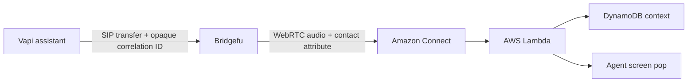

# Bridgefu

Bridgefu is a Rust media gateway that terminates two call legs and bridges
audio, DTMF, and explicitly allowed context between them. It is built on
[rvoip](https://github.com/eisenzopf/rvoip) and is designed to connect voice AI,
SIP, WebRTC, provider call control, and contact-center systems without making
either side understand the other.

The first product-qualified deployment target is a Vapi SIP transfer into
Amazon Connect with a correlated agent screen pop:



## Deploy Vapi transfers to Amazon Connect

The customer CloudFormation template, AMI build, Lambdas, Vapi provisioning,
and full live qualification harness live in the dedicated
[bridgefu-vapi-awsconnect](https://github.com/eisenzopf/bridgefu-vapi-awsconnect)
repository. That is the canonical place to deploy and operate this integration.

This repository owns the Bridgefu runtime and its built-in declarative recipe
contract. The deployment repository pins an immutable Bridgefu commit and
builds the customer AMIs from it.

## SIP security modes

- `sips_srtp` — TLS signaling and SDES-SRTP are required. This is the secure
  default.
- `sips_optional_srtp` — TLS signaling is required; Bridgefu negotiates SRTP
  when the peer offers it and accepts RTP/AVP otherwise. Use this deliberately
  for peers such as the currently observed Vapi transfer path that do not offer
  SRTP in SDP.
- `sip_rtp` — clear SIP and RTP. This is an explicit diagnostic compatibility
  posture, not the production default.

Every SIPS recipe uses one-use managed attachment URIs and a DNS `sips:`
Contact. Bridgefu does not silently downgrade signaling from TLS.

## Local development

Bridgefu pins the coordinated crates.io rvoip package graph exactly at `0.3.7`;
there are no Git, path, or local rvoip overrides.

```bash
cargo test --locked
cargo clippy --locked --all-targets -- -D warnings
```

Inspect the embedded, credential-free recipe catalog with:

```bash
cargo run -- recipe available
cargo run -- recipe show builtin:vapi-amazon-connect-screen-pop@1
cargo run -- recipe validate builtin:vapi-amazon-connect-screen-pop@1 \
  --values recipes/vapi-amazon-connect-screen-pop/values.example.yaml
```

Low-level configuration remains available for custom integrations. Start with
[the product overview](docs/product-overview.md), [architecture](docs/architecture.md),
[configuration schema](config/schema.json), and [security model](docs/security.md).

Bridgefu is MIT licensed. See [CONTRIBUTING.md](CONTRIBUTING.md) for development
and security-reporting expectations.
