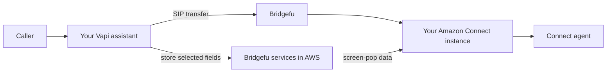

# Bridgefu

Bridgefu connects real-time voice systems without making either side understand
the other side's signaling, media, or customer-context format.

Today, the release path we test as one product is simple: **Vapi transfers a
call over SIP, Bridgefu starts an Amazon Connect WebRTC contact, and the Connect
agent sees the caller context collected before the transfer.**

[**Deploy Vapi transfers to Amazon Connect →**](recipes/vapi-amazon-connect-screen-pop/README.md)

## What Setup does

Bridgefu Setup is a cross-platform desktop wizard for developers who may not be
AWS administrators. It discovers the AWS account, Connect instance, published
flow, and Route 53 zone; lets you choose the screen-pop fields; shows exactly
what will change; optionally maps a reviewed choice field to multiple published
Connect flows; and creates a resumable `.bridgefu` deployment bundle.

For safety, v1 creates a **new Vapi template assistant**. It does not overwrite
an existing assistant. You can test the template and copy your own prompts and
behavior into it when you are ready.

Bridgefu, DynamoDB, and the Lambda functions deploy in the same AWS region as
Amazon Connect. Amazon Connect itself is an AWS-managed regional service, not a
resource inside your VPC.

## Direction

Bridgefu aspires to bridge SIP, WebRTC, telephony providers, contact centers,
and real-time media systems through one programmable Rust data plane. Other
recipes and transports in this repository remain preview or development work;
they are not part of the supported Vapi → Amazon Connect release claim.

The runtime uses the exact crates.io `rvoip = 0.3.7` packages recorded in
`Cargo.lock`; no local rvoip checkout or patch is a build input.

For contributors, see [CONTRIBUTING.md](CONTRIBUTING.md). For release evidence,
see [qualification](docs/qualification.md).
