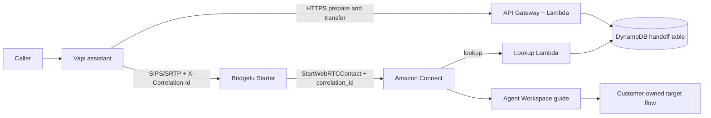

# Vapi to Amazon Connect screen-pop

`vapi-amazon-connect-screen-pop@1` is Bridgefu's flagship recipe. It lets a
caller talk to a Vapi voice assistant, transfer over SIP, arrive as an Amazon
Connect WebRTC contact, and give the agent the context already collected by
the assistant.

**Support tier: `preview` for Starter.** Starter is the only current
production-pilot candidate. HA is outside this release, plan, qualification,
and support claim. Promotion requires a new immutable release whose
exact image and templates pass two governed nonproduction deploy/qualification/
teardown cycles plus the retained live Vapi, SIPS/SRTP, Amazon Connect, Agent
Workspace, bidirectional-audio, DTMF, hangup, recovery, negative-case, and
one-hour soak gates. An unqualified working branch is not a support claim.
The current evidence state is recorded in
[`BRIDGEFU-RECIPE-IMPLEMENTATION-PROGRESS.md`](../../BRIDGEFU-RECIPE-IMPLEMENTATION-PROGRESS.md).

## What this recipe solves

Voice AI systems commonly collect a name, intent, verification result, and
problem summary before the caller asks for a person. A plain SIP transfer can
move the audio, but Amazon Connect cannot use arbitrary SIP headers directly
as Agent Workspace data. This recipe provides the missing bridge:

1. Vapi calls a bounded `prepare_handoff` tool.
2. The AWS-native handoff service stores approved fields in DynamoDB and
   derives an opaque correlation ID.
3. Vapi requests a dynamic transfer destination.
4. Bridgefu reserves a one-use SIP attachment.
5. Vapi sends exactly one `X-Correlation-Id` header in its SIP INVITE.
6. Bridgefu validates the header and projects it to the Amazon Connect contact
   attribute `correlation_id`.
7. A recipe-owned Connect wrapper flow invokes Lambda, copies the approved
   fields to contact attributes, opens an Agent Workspace guide, and transfers
   to the customer's existing target flow.

No transcript, recording, password, payment-card data, or full customer record
is placed in SIP.

## Deployment modes and ownership

The normal customer deployment assumes Amazon Connect already exists. The
administrator supplies:

- the existing Connect instance ARN;
- an existing customer-owned target contact-flow ARN;
- a Vapi private API key stored in AWS Secrets Manager;
- a public Route 53 hosted zone and a new SIP hostname; and
- an immutable Bridgefu image and versioned recipe release bundle.

The recipe creates its own wrapper flow, Agent Workspace guide, Lambda
association, Lambdas, DynamoDB table, Vapi assistant/tools, runtime, dashboard,
and alarms. It **references but never updates or deletes the supplied customer
target flow or Connect instance**. Deleting the stack removes only
recipe-owned Connect objects and associations.

A separate full demo/test path may create a nonproduction Connect instance for
automated qualification or for a customer deliberately creating a first
instance. That is not the production default: Connect identity, queues,
telephony, routing, recording, retention, and compliance are account-owner
decisions, and instance create/delete attempts are quota-sensitive.

## Qualified transport variants

| Source | Destination | Security | Recipe status |
|---|---|---|---|
| Vapi SIP transfer | Amazon Connect WebRTC | SIPS/SRTP | Preview on Starter; production-pilot default |
| Vapi SIP transfer | Amazon Connect WebRTC | SIP/RTP | Preview on Starter; explicit compatibility posture |

The secure variant listens on TCP 5061 and uses SRTP. The compatibility variant
must be selected explicitly and limits SIP signaling to approved Vapi CIDRs.
Both variants use the bounded UDP media range 16384-32767. Media source
addresses are dynamic, so runtime dialog binding, symmetric RTP checks, call
capacity, and one-use attachment admission provide the media authorization
boundary.

PCMU and PCMA are required release codecs. Opus may be negotiated on supported
legs, but its presence does not replace the PCMU/PCMA qualification gates.

## Architecture



The handoff/control services are outside the RTP/SRTP packet path. Audio moves
directly between Vapi, Bridgefu, and Amazon Connect; CloudWatch collection and
DynamoDB lookups do not add per-packet latency.

## Data contract

The exact machine-readable contract is
[`handoff-contract.json`](handoff-contract.json).

| Field | Maximum | Purpose |
|---|---:|---|
| `customer_name` | 128 characters | Display label only |
| `issue_summary` | 1,024 characters | Short summary for the agent |
| `intent` | 128 characters | Bounded routing/display label |
| `verification_status` | 64 characters | Display-only status; not authorization |
| `vapi_call_reference` | 128 characters | Troubleshooting reference |

The correlation ID is a deterministic, versioned HMAC result shaped as
`bf1_<43 URL-safe characters>`. It is opaque, contains no customer data, is
bound to the deployment and Vapi organization/call identity, and is the only
customer-context value allowed in SIP. Normal logs and metrics do not contain
it.

The DynamoDB key is `correlation_id`. Records are idempotent, expire through
TTL, and move through `PREPARED` and `RESERVED` states. Repeating the same Vapi
event returns the same result; a conflicting replay fails closed. A missing or
expired record makes screen-pop context unavailable but does not block voice
routing.

## Prerequisites

- AWS CLI v2 authenticated as a non-root IAM or federated identity.
- Permission to assume the reviewed deployment role or a deployment pipeline
  that uses an equivalent CloudFormation service role.
- An active Amazon Connect instance in the same AWS region as Bridgefu.
- A published target `CONTACT_FLOW` owned by the customer.
- Permission to add a Lambda association and recipe-owned flows to that
  Connect instance.
- A Vapi organization private key in an existing Secrets Manager secret.
- For production SIPS/SRTP only, a public DNS name in Route 53. The IP-only
  nonproduction proof uses SIP/RTP and accepts no DNS input.
- An immutable Bridgefu image reference containing `@sha256:`.
- Agent security-profile permission to use the configured Agent Workspace
  guide/view. The stack reports the required manual permission; it does not
  silently change agent profiles.

Do not use AWS account root credentials for the application deployment. Root
may be used only for one-time identity bootstrap if required by the account's
governance model, and the guarded controller requires the explicit
`--allow-root-bootstrap` acknowledgement at `init`. That exception is written
to the execution ledger. IAM Identity Center and other assumed-role sessions
are bound to their durable IAM role ARN rather than to a transient STS session
ARN.

The bootstrap creates separate deployer and CloudFormation service roles. The
human/session role can publish artifacts, review change sets, and execute only
the execution-scoped stacks. CloudFormation assumes the service role for
resource provisioning; the controller verifies that exact role on each review
stack before execution.

## Existing-Connect deployment

The release publisher uploads private, versioned S3 objects and a digest-pinned
image, then produces the parameters required by
[`cloudformation/template.yaml`](cloudformation/template.yaml). The root stack
selects exactly one runtime and its matching observability stack. The browser
test page remains optional:

```text
network -> handoff service -> Connect wrapper -> Starter runtime
                                      |                 |
                                      +-> Vapi ---------+
                                      +-> observability
                                      +-> optional demo site
```

For an approved qualification run, use the guarded lifecycle helper. It refuses
to overwrite an existing ledger, calculates a conservative budget, reviews a
complete recursively nested CloudFormation change-set tree before execution,
and requires the execution ID again for deploy, lifecycle testing, and
destroy. Every child stack must expose its AWS-generated child change-set ID;
unreviewable, unallowlisted, or over-bounded trees fail closed.

Live authority defaults to
`${XDG_STATE_HOME:-$HOME/.local/state}/bridgefu/aws-live/<execution-id>/`.
`BRIDGEFU_AWS_LIVE_STATE_DIR` may replace the whole root only with an absolute,
private, real (non-symlink) directory ending in `bridgefu/aws-live` and outside
the repository, `CARGO_TARGET_DIR`, and every build target directory. The
controller enforces mode `0700` directories and mode `0600` files. Keep each
ledger and browser credential on its originating host; never copy them between
operators or systems. Remote recovery capsules are write-only evidence and
are not consumed. There is no cross-host distributed lock, so one operator and
host owns a recovery at a time.

The secure existing-Connect example below is not the current no-DNS
nonproduction procedure. For the Starter SIP/RTP IP-only recovery and fresh
qualification, follow the
[dedicated runbook](runbooks/nonproduction-live-qualification.md) and omit all
hosted-zone, hostname, certificate, secure-SIPS, and HA inputs.

```bash
export AWS_PROFILE='<approved-federated-profile>'
aws login --profile "$AWS_PROFILE"
aws sts get-caller-identity --profile "$AWS_PROFILE"

export VAPI_PRIVATE_KEY='...'

AWS_PROFILE="$AWS_PROFILE" python3 scripts/aws-recipe-live-test.py \
  --execution-id bft-YYYYMMDDa init \
  --region us-west-2 \
  --max-usd 200 \
  --planned-hours 8 \
  --connect-minutes 30 \
  --runtime-profile starter \
  --connect-instance-arn arn:aws:connect:...:instance/... \
  --target-flow-arn arn:aws:connect:...:instance/.../contact-flow/... \
  --hosted-zone-id Z123EXAMPLE \
  --sip-hostname sip.bridgefu.example.com

AWS_PROFILE="$AWS_PROFILE" python3 scripts/aws-recipe-live-test.py --execution-id bft-YYYYMMDDa bootstrap
AWS_PROFILE="$AWS_PROFILE" python3 scripts/aws-recipe-live-test.py --execution-id bft-YYYYMMDDa publish
AWS_PROFILE="$AWS_PROFILE" python3 scripts/aws-recipe-live-test.py --execution-id bft-YYYYMMDDa \
  bootstrap-refresh --confirm bft-YYYYMMDDa
# Independently review bootstrap-refresh-change-set-review.json. An authorized
# administrator must execute only the exact reviewed ChangeSetId ARN against
# the exact immutable bootstrap StackId ARN:
aws cloudformation execute-change-set \
  --profile "$AWS_PROFILE" \
  --region us-west-2 \
  --stack-name '<exact immutable bootstrap StackId ARN>' \
  --change-set-name '<exact reviewed ChangeSetId ARN>'
aws cloudformation wait stack-update-complete \
  --profile "$AWS_PROFILE" \
  --region us-west-2 \
  --stack-name '<exact immutable bootstrap StackId ARN>'
AWS_PROFILE="$AWS_PROFILE" python3 scripts/aws-recipe-live-test.py --execution-id bft-YYYYMMDDa \
  bootstrap-refresh-verify --confirm bft-YYYYMMDDa
AWS_PROFILE="$AWS_PROFILE" python3 scripts/aws-recipe-live-test.py --execution-id bft-YYYYMMDDa dns-status
# Bind only the public /32 of the controlled direct-SIP qualification host.
AWS_PROFILE="$AWS_PROFILE" python3 scripts/aws-recipe-live-test.py --execution-id bft-YYYYMMDDa \
  bind-qualification-source --cidr 203.0.113.10/32 --confirm bft-YYYYMMDDa
AWS_PROFILE="$AWS_PROFILE" python3 scripts/aws-recipe-live-test.py --execution-id bft-YYYYMMDDa change-set
# Review the exact absolute change-set-review.json path printed by the controller.
# Disposable-Connect runs also require the controller-printed absolute
# qualification-change-set-review.json.
AWS_PROFILE="$AWS_PROFILE" python3 scripts/aws-recipe-live-test.py --execution-id bft-YYYYMMDDa \
  execute --confirm bft-YYYYMMDDa
AWS_PROFILE="$AWS_PROFILE" python3 scripts/aws-recipe-live-test.py --execution-id bft-YYYYMMDDa verify
AWS_PROFILE="$AWS_PROFILE" python3 scripts/aws-recipe-live-test.py --execution-id bft-YYYYMMDDa \
  lifecycle-test --confirm bft-YYYYMMDDa
# Review lifecycle-evidence.json, then prove the restored stack again.
AWS_PROFILE="$AWS_PROFILE" python3 scripts/aws-recipe-live-test.py --execution-id bft-YYYYMMDDa verify
AWS_PROFILE="$AWS_PROFILE" python3 scripts/aws-recipe-live-test.py --execution-id bft-YYYYMMDDa \
  destroy --confirm bft-YYYYMMDDa
```

### Lost local ledger and retired execution IDs

Never recreate or copy a missing ledger. An existing valid legacy ledger may
be migrated automatically by the controller, but the former repository-local
live-state files are absent and were not migrated. Historical cleanup reports
therefore remain point-in-time observations rather than retained evidence.

The privately recorded historical execution is permanently retired,
bootstrap-only, and teardown-only. Its
local ledger was lost and **no application change set was executed**. Use only
the runbook's exact sequence:

```text
recover-lost-ledger-review
→ independent review of the immutable file and exact file-byte SHA-256
→ recover-lost-ledger-execute (local adoption only; no AWS mutation)
→ inventory → destroy
→ retain three identical complete zero observations spanning at least 60 seconds
→ choose a fresh execution ID
```

Recovered authority permits only `inventory`, `destroy`, and, after a prior
destroy intent plus separately authorized external cleanup when needed,
`destroy-finalize`. It never permits publication, application change sets,
deployment, or qualification. The expired execution deadline blocks paid work
but never blocks teardown.

Replace the example `/32`; documentation ranges are rejected by the live
guard. The binding is immutable for an execution, is added as the third SIP
signaling allowlist entry, and is checked again against the runner's current
public IPv4 address immediately before every direct media call. A changed
source address requires a new execution rather than widening ingress.

For disposable-Connect proof runs, the CodeBuild qualification runner and the
demo application are separate root stacks with separate reviewed change sets.
`execute` creates and validates the runner stack first and does not execute the
application change set unless the runner reaches `CREATE_COMPLETE` with the
expected fixed source `/32`. Both qualification CREATE change sets use
CloudFormation's preserve-success (`DO_NOTHING`) behavior so a provider error
does not erase diagnostic evidence. This is a test-only diagnostic posture;
the mandatory `destroy` command deletes the application first, then the runner,
then bootstrap resources, and proves an empty execution inventory.

`lifecycle-test` first reviews and applies a one-second bounded context-TTL
change, exercising the idempotent Lambda/Vapi update path without replacing
the runtime. It then reviews an update containing an intentionally nonexistent
version of the already-owned lookup artifact. CloudFormation must reject that
artifact during execution, reach `UPDATE_ROLLBACK_COMPLETE`, and restore the
previous published version. Both change sets must contain only non-replacing
`Modify` actions from the resource allowlist. The command retains only
redacted timings/actions/status; it never records secret parameter values.

If publication is interrupted, rerun `publish` with the same execution ID.
The helper reuses only resources whose recorded identifiers and ownership tags
match, verifies the image digest and signed staged release, and resumes recorded
object versions. It excludes Terraform/provider caches, Terraform state,
bytecode, and build caches and refuses a release that exceeds its object-count
or byte-size guards.

If source changes after a candidate was published but before any change-set
review or application deployment, supersede it explicitly:

```bash
python3 scripts/aws-recipe-live-test.py --execution-id bft-YYYYMMDDa \
  publish --refresh-candidate
```

The refresh is refused once deployment review has started. It freezes the
complete tracked/non-ignored source digest, advances the immutable image tag,
retains an audit record for the superseded image/release, and leaves all prior
object versions owned by the same mandatory teardown. A changed working tree
during an in-progress publication fails closed instead of silently mixing an
old image with new templates.

Some accounts require a separate privileged identity to create the two
temporary roles. After that identity creates the exact reviewed bootstrap
stack, the authorized non-root test identity can run `bootstrap
--adopt-existing`. Adoption succeeds only for a `CREATE_COMPLETE` stack whose
parameters, ownership tags, and exact output role ARNs match the local ledger.
This exception is for temporary qualification bootstrap; application
publication, deployment, verification, and teardown still run through the
scoped roles rather than account root.

If a resumed qualification needs newer permissions in those temporary roles,
`bootstrap-refresh --confirm EXECUTION_ID` uses the existing scoped deployer
only to create and review an immutable change set. It cannot execute the IAM
update. An authorized administrator executes that one reviewed change-set ARN,
without granting the test user permission to rewrite its own roles. The
non-root test identity then runs `bootstrap-refresh-verify --confirm
EXECUTION_ID`. Verification requires the exact executed change set, published
template hash, parameters, ownership tags, unchanged role ARNs, and successful
assumption of both refreshed roles before application review can continue.

Do not select `--runtime-profile high_availability`. HA is outside the current
release and qualification plan; historical HA assets in the repository are
not deployment instructions or Starter evidence.

For externally managed parent DNS, replace `--hosted-zone-id` with
`--delegated-zone-name`. After publication, add the printed NS set at the
parent, then run `dns-status` before creating the change set. The temporary
zone is in the teardown ledger.

Ordinary customer releases should use the published Launch Stack URL and
release manifest rather than build from a working tree. A qualification bundle
may be signed with an ephemeral key for evidence, but that does not substitute
for the release publisher's trusted signing identity.

### Simple administrator lifecycle

`bridgefu recipe init` creates `deployment.yaml` and
`parameters-starter.json` alongside the recipe values. Some current builds may
also emit a legacy HA parameter file; do not use or publish it. Replace the
Starter file's marked release and account placeholders with values from the
signed release manifest, then use the same schema-2 descriptor for every
lifecycle operation. Schema 2
binds the expected account, environment, exact CloudFormation service role,
manifest digest, stack policy, termination-protection posture, and rollback
alarms. Schema 1 remains readable for migration/status but cannot deploy.

Before application deployment, provision the account-level templates once:

- `cloudformation/account-governance.yaml` enables the durable trail, Config,
  Access Analyzer, GuardDuty, production Security Hub, and budget alerts that
  preflight requires.
- `cloudformation/account-foundation.yaml` owns the persistent versioned
  artifact bucket, immutable ECR repository, GitHub-environment-bound deployer,
  and exact CloudFormation service role.
- In the dedicated test account only,
  `cloudformation/nonproduction-foundation.yaml` creates the persistent Connect
  instance and test flows used by repeatable qualification. Protect all three
  root foundation stacks with termination protection.

Follow the [account-foundations runbook](runbooks/account-foundations.md) for
the exact order and acceptance checks. Production removal is documented only
in the separately approved [deletion break-glass runbook](runbooks/production-destroy.md).

The active CLI identity must be an Identity Center or GitHub OIDC session. Root
and long-term IAM-user credentials are rejected by application preflight.

```bash
bridgefu recipe preflight deployment.yaml --profile starter
bridgefu recipe deploy deployment.yaml --profile starter \
  --change-set-name bridgefu-production-r1
# Review the printed CloudFormation change set.
bridgefu recipe deploy deployment.yaml --profile starter \
  --execute --change-set-name bridgefu-production-r1 \
  --confirm bridgefu-bft-production

bridgefu recipe status deployment.yaml
bridgefu recipe doctor deployment.yaml
bridgefu recipe test deployment.yaml
```

`deploy` is review-only unless `--execute` and the exact stack name are both
provided. A named execute reopens and revalidates the same available change
set created by the review command; it never silently creates a replacement
review. The change-set description and tags bind the release-manifest and
parameter-file digests. Review recursively traverses every nested change set, rejects
unapproved resource types, deletes, and replacements, and always passes the
exact service role. Production create failures roll back. On success the CLI
applies the reviewed root policy, generated stateful-resource policies to each
nested stack, and root termination protection. `status` omits credential-like
outputs. `doctor` additionally verifies the persisted role, protections,
rollback alarms, and recursive drift without placing a call. `test` remains the
nonbillable structural gate; live audio and screen-pop qualification stays
behind the protected test workflow. Production `destroy` is intentionally
blocked and requires the separate break-glass runbook.

Terraform-managed AWS estates can use
[`terraform/modules/aws-starter`](terraform/modules/aws-starter/README.md).
The module owns the same canonical CloudFormation application rather than a
second, drifting copy of its IAM, Connect, Lambda, DynamoDB, runtime, alarms,
update, and deletion behavior. Its plan-time contract requires all immutable
artifact inputs, a digest-pinned image, and the exact Bridgefu ownership tags.
Module validation and a mocked plan contract run in CI. A real apply/update/
destroy remains part of the protected AWS qualification gate.

Legacy HA scripts and modules are excluded from this lifecycle. Do not use them
for nonproduction proof or production deployment.

### Optional browser test page

For an authorized nonproduction qualification, the same stack can publish a
minimal Vapi call page behind CloudFront. The S3 origin is private, CloudFront
uses origin access control, assets are never cached, and the page receives only
the Vapi browser-safe public key, the recipe-owned assistant ID, and a release
revision. It never receives an AWS credential, Vapi private key, Bridgefu API
token, correlation ID, or customer context.

Set the public key in the environment and add `--enable-demo-site` to the
normal `init` command shown above:

```bash
export VAPI_PUBLIC_KEY='pk_...'
```

The conservative ledger adds an explicit CloudFront/S3 allowance. Verification
checks the HTTPS page, isolation headers, exact public configuration, assistant
identity, release revision, and browser automation surface. Teardown separately
inventories the site bucket, distribution, origin access control, cache policy,
and response-headers policy because some global resources are not reliably
returned by regional tag searches. Keep this page disabled for ordinary
production deployment.

## Optional full demo or first-instance deployment

[`cloudformation/demo-template.yaml`](cloudformation/demo-template.yaml) is a
separate, intentionally nonproduction launch path. It creates a new
Connect-managed Amazon Connect instance, always-open demo queue, routing and
security profiles, one soft-phone agent, and a target flow, then passes that
instance and flow into the normal existing-Connect recipe template. The normal
[`cloudformation/template.yaml`](cloudformation/template.yaml) never creates an
instance.

Use the full demo only for a disposable qualification environment or when an
administrator has deliberately decided that this will be the account's first
Connect environment. Before launch, review account/region instance quotas,
identity and access, telephony, recording, storage, retention, compliance, and
expected charges. The template remains disabled until
`DemoAcknowledgement=CREATE_NONPRODUCTION_CONNECT` is selected.

For repeatable qualification, use
[`cloudformation/nonproduction-foundation.yaml`](cloudformation/nonproduction-foundation.yaml)
instead. It creates Connect once in the dedicated nonproduction account and
keeps its lifecycle separate from the ordinary Bridgefu application and
qualification runner. Its explicitly owned `/aws/connect/<alias>` log group has
seven-day retention and is deleted with the foundation, preventing the orphaned
log groups produced by implicit Connect logging.

The demo returns an agent username and a Secrets Manager **ARN**, never the
generated password. An authorized administrator can retrieve the JSON value
without placing it in shell history:

```bash
read -r -s BRIDGEFU_DEMO_SECRET_ARN
export BRIDGEFU_DEMO_SECRET_ARN
aws secretsmanager get-secret-value \
  --secret-id "$BRIDGEFU_DEMO_SECRET_ARN" \
  --query SecretString --output text
unset BRIDGEFU_DEMO_SECRET_ARN
```

Sign in through the `ConnectLoginUrl` output, set the demo agent Available, and
run only synthetic calls. Delete the root demo stack promptly after the test.
Do not add phone numbers, users, integrations, storage, or other manually owned
objects to a disposable instance: those can make instance deletion fail. Use a
persistent, governed nonproduction Connect instance for recurring CI instead
of repeatedly creating and deleting instances.

For a packaged proof run, use the guarded live-test controller with
`--create-connect-demo`. The reviewed bootstrap allocates a fixed runner EIP;
the demo application adds that exact `/32` to the SIP allowlist, while a
separate qualification root stack creates an outbound-only CodeBuild project
in a private subnet. The default proof posture
uses the runtime EIP directly with SIP/RTP, so it requires no domain or DNS.
`run-headless` retrieves
the generated Connect-managed agent credential inside AWS, authenticates Agent
Workspace in headless Chromium, makes synthetic SIP/RTP and Vapi transfer
calls, verifies the screen pop and bidirectional media, downloads the redacted
evidence, checks its SHA-256 and call count, and writes a local proof JSON:

```text
python3 scripts/aws-recipe-live-test.py --execution-id "$EXECUTION" run-headless --suite smoke --confirm "$EXECUTION"
python3 scripts/aws-recipe-live-test.py --execution-id "$EXECUTION" destroy --confirm "$EXECUTION"
```

Every teardown re-audits even a ledger previously marked `destroyed`. If an old
failed review left only empty preview shells or an empty Connect log group, use
the exact confirmation-gated inventory. Run `destroy` first. For a normal
(non-recovered) ledger, `cleanup-orphans` may remove only the controller's exact
owned leftovers. `destroy-finalize` is not a shortcut: use it only after a
durable incomplete destroy and separately authorized external cleanup, then
retain its evidence. Lost-ledger recovery does not authorize
`cleanup-orphans`.

```text
python3 scripts/aws-recipe-live-test.py --execution-id "$EXECUTION" inventory
python3 scripts/aws-recipe-live-test.py --execution-id "$EXECUTION" destroy --confirm "$EXECUTION"
# Only if the prior destroy is incomplete and exact external cleanup was authorized:
python3 scripts/aws-recipe-live-test.py --execution-id "$EXECUTION" cleanup-orphans --confirm "$EXECUTION"
python3 scripts/aws-recipe-live-test.py --execution-id "$EXECUTION" destroy-finalize --confirm "$EXECUTION"
```

The evidence bucket is versioned and encrypted. Generated credentials,
Playwright storage state, correlation IDs, and private runner inputs are never
included in the evidence archive. The disposable Connect instance, NAT gateway,
runner, recipe infrastructure, temporary secrets, image, and artifact bucket
remain teardown-owned by the execution ledger.

This IP-only proof does not claim to test public-certificate issuance or
SIPS/SRTP interoperability. Add `--secure-sips-proof`, a public Route 53 zone,
and a hostname to the guarded initialization command when that separate gate is
required. Normal production SIPS deployments require the customer-controlled
hostname documented above.

## What CloudFormation creates

### Network

- Either a new two-AZ VPC or supplied VPC/subnets.
- Two public and two private subnets in new-VPC mode.
- No NAT gateway in the Starter application VPC.
- DynamoDB gateway endpoint plus Secrets Manager and CloudWatch Logs interface
  endpoints.
- A dedicated security group for the private transfer Lambda.

### Handoff service

- Encrypted, point-in-time-recoverable, TTL-enabled DynamoDB table.
- Separate least-privilege roles for prepare, transfer, and lookup Lambdas.
- HTTP API with bounded routes, concurrency, throttling, body size, fields,
  authentication, idempotency, and no credential-bearing redirects.
- Separate correlation, Vapi webhook, and Bridgefu control secrets.

### Connect integration

- One Lambda integration association.
- One recipe-owned wrapper entry flow.
- One recipe-owned Agent Workspace guide flow.
- Lambda invoke permission constrained to the supplied Connect instance.

### Vapi

- One owned assistant.
- One owned `prepare_handoff` function tool.
- One assistant-owned custom bearer credential.
- An inline transfer tool whose destination is always returned by the recipe
  service; the model never chooses a URI, route, header, or contact center.

Updates and deletes verify deterministic ownership metadata before touching a
Vapi object. Ambiguous or unowned matches fail closed.

### Starter runtime

- One Amazon Linux 2023 Arm instance and direct Elastic IP.
- No SSH key, no inbound administration port, and SSM-only host access.
- IMDSv2, encrypted root/data volumes, non-root read-only container, no Docker
  socket mount, no Linux capabilities, and a digest-pinned image.
- Exportable ACM public certificate, private control hostname, automatic
  certificate refresh, atomic HAProxy reload, and Bridgefu certificate
  activation only when active sessions reach zero.
- A stack readiness signal only after the real Bridgefu validator, data mount,
  image pull, secrets, certificate, `/livez`, `/readyz`, and SIPS hostname checks
  pass.
- Production data retention/backup or explicit test deletion behavior.

### Excluded legacy HA assets

The repository still contains historical HA implementation material, but HA
is not part of the current release, deployment, validation, support, or
production-readiness plan. Do not select or publish it through this recipe.

### Observability

- CloudWatch Agent host metrics, bounded runtime logs, and Prometheus scraping.
- Low-cardinality handoff and runtime outcome/duration metrics.
- Dashboard, SNS topic, and alarms for API/Lambda errors, throttles, missing
  context, runtime readiness/errors, cleanup backlog, certificate age, CPU, and
  EC2 system recovery.

## Vapi behavior

The assistant prompt is intentionally narrow. It may collect only the approved
display fields, must call `prepare_handoff` before transfer, and cannot invent
or accept a destination. The prepare response intentionally does not reveal the
correlation ID to the model. The transfer webhook receives the Vapi call
identity again, derives the same correlation, reserves the fixed Bridgefu
route, and returns one SIPS URI plus one header.

The default assistant disables recording. Customers who enable Vapi or Connect
recording take ownership of consent, storage, retention, and access control;
recording is not required by this recipe.

## Amazon Connect behavior

The wrapper flow invokes the lookup Lambda with
`$.Attributes.correlation_id`, copies only the bounded return fields, sets the
Agent Workspace guide as `DefaultAgentUI`, and transfers to the supplied flow.
On lookup or view-hook failure it sets safe generic values and continues. The
customer flow continues to own queues, hours, prompts, routing, recording, and
disconnect behavior.

Agents must have access to the Agent Workspace application and the relevant
views/guide features. This is an explicit administrator step because changing
security profiles can affect many users.

## Security and privacy

- SIPS/SRTP is the default; clear SIP/RTP is visibly opt-in.
- Vapi signaling CIDRs and the RTP/SRTP range are separate inputs.
- Public access is limited to voice signaling/media and the authenticated Vapi
  handoff API.
- The Lambda-to-Bridgefu control path is private TLS and accepts only the fixed
  route-reservation endpoint.
- Each purpose has a different secret. Secrets are read from Secrets Manager,
  cached for at most five minutes, and never output by CloudFormation.
- Correlation/customer values are excluded from logs, metrics, traces, stack
  outputs, release manifests, and retained automated-test evidence.
- DynamoDB encryption, PITR, TTL, deletion protection, and stack retention are
  explicit by profile.
- The test profile uses synthetic values and deletes the table and volume.

Webhook-key rotation uses a blue/green deployment: deploy a new recipe ID with
a fresh secret and assistant, verify it, move the website/phone-number binding,
drain the old assistant, then delete the old stack. Both deployments work
during the overlap without teaching one endpoint two unrelated credentials.
The Vapi API does not expose a standalone custom-credential delete endpoint in
the API contract consumed by this recipe, so in-place credential churn is not
claimed as ownership-safe.

## Cost controls

Primary cost drivers are the EC2 instance, interface endpoint hours/data,
exportable ACM certificate issuance, Elastic IP, EBS, CloudWatch ingestion and
alarms, Route 53, and any Amazon Connect/Vapi call minutes. Lambda, HTTP API,
DynamoDB on-demand, S3, and ECR are usually small at Starter scale but are still
metered.

Before a live test:

1. Set an account budget and notification path.
2. Use the guarded estimate and an approved maximum.
3. Keep the test window short.
4. Use `TestDelete`, one-day logs, minimum volumes, and a small instance.
5. Run the teardown verifier immediately after evidence collection.
6. Review Cost Explorer after AWS has posted the usage.

The guard is an abort boundary, not a claim that AWS Budgets can stop spend in
real time.

HA cost planning is outside this workstream. The approved qualification cost
estimate must be Starter-only.

## Verification

Stack creation performs non-billable structural readiness checks. The explicit
`verify` command then proves:

- prepare idempotency and bounded DynamoDB storage;
- deterministic opaque correlation;
- one fixed SIPS destination and exactly one correlation header;
- private Bridgefu reservation;
- Connect-shaped lookup and fail-open behavior;
- no SSH key, IMDSv2, and encrypted volumes;
- issued certificate and DNS/EIP agreement; and
- owned Vapi resources.

The protected release gate additionally requires a real Vapi web call, actual
INVITE/SRTP evidence, `StartWebRTCContact`, visible Agent Workspace rendering,
non-silent audio both directions, DTMF, both hangup directions, missing/expired
context, cleanup zero-state, restart recovery, capacity, and a one-hour soak.
Only redacted evidence tied to the image digest and release ID is retained.
The guarded `lifecycle-test` separately proves a successful CloudFormation
update and a controlled automatic rollback, after which `verify` must pass
again before functional qualification or teardown.

## Operations

Use the CloudFormation output `DashboardUrl` as the normal operations entry
point. Use `SsmStartSessionCommand` only when a runbook requires host-level
inspection. Never enable SSH as an incident shortcut.

Runbooks live in [`runbooks/`](runbooks/):

- [deployment and readiness](runbooks/deployment-readiness.md)
- [DNS and certificates](runbooks/dns-certificate.md)
- [Vapi provisioning and authentication](runbooks/vapi-provisioning.md)
- [handoff API and context](runbooks/handoff-context.md)
- [SIP/SRTP, audio, and DTMF](runbooks/media.md)
- [Amazon Connect and Agent Workspace](runbooks/amazon-connect.md)
- [cleanup backlog](runbooks/cleanup-backlog.md)
- [capacity](runbooks/capacity.md)
- [IP-only nonproduction live qualification](runbooks/nonproduction-live-qualification.md)
- [Starter recovery and disaster recovery](runbooks/starter-recovery.md)
- [upgrade and rollback](runbooks/upgrade-rollback.md)

Every runbook starts with impact, safe read-only checks, decision points,
remediation, verification, and escalation evidence.

## Upgrade, rollback, and teardown

For a persistent customer production stack, supply a dedicated CloudFormation
service role, enable termination protection immediately after initial create,
and apply
[`cloudformation/production-stack-policy.json`](cloudformation/production-stack-policy.json).
The policy allows ordinary modifications but blocks accidental replacement or
removal of the network, data/handoff, Connect, runtime, and Vapi nested stacks.
A planned profile migration or other replacement requires a separately
reviewed temporary stack-policy override. For example:

```text
aws cloudformation set-stack-policy --stack-name STACK_NAME \
  --stack-policy-body file://recipes/vapi-amazon-connect-screen-pop/cloudformation/production-stack-policy.json
aws cloudformation update-termination-protection --stack-name STACK_NAME \
  --enable-termination-protection
aws cloudformation detect-stack-drift --stack-name STACK_NAME
```

Do not use the qualification controller's preserve-on-create-failure setting as
the ordinary production rollback policy. Production changes should retain
automatic rollback and alarm-based rollback triggers selected by the customer;
preservation is for bounded qualification diagnosis and is followed by
mandatory teardown.

- Review a CloudFormation change set and immutable release manifest before
  every update.
- Drain active calls before changing certificates, routes, image digests, or
  runtime shape.
- Never roll a database or configuration contract backward unless the target
  image explicitly supports it.
- Roll back by restoring the previous immutable image/artifact versions and
  CloudFormation parameters, then re-run readiness and synthetic checks.
- Production deletion retains the DynamoDB table, data volume, and backup vault
  by design; the administrator must identify and approve their eventual
  deletion.
- Test deletion removes all recipe-owned data and Vapi objects. The guarded
  lifecycle also deletes its artifact bucket, all object versions, image
  repository, temporary Vapi-key secret, delegated zone, roles, and bootstrap
  stack, then proves no resources with the execution ID remain.

Do not delete the customer Connect instance or target flow. They are never part
of the recipe ownership ledger.

## Profiles and future infrastructure

Starter Production minimizes complexity and latency for the first hardened
release. The bounded High Availability implementation is packaged now but
retains a preview support label until its live definition of done passes.
Kubernetes is intentionally not part of either profile.

AWS CloudFormation is the primary administrator experience. AWS Terraform
parity follows the same contracts. Google Terraform and Google Infrastructure
Manager packaging are roadmap and must pass cross-cloud latency qualification
before making an Amazon Connect production claim.
