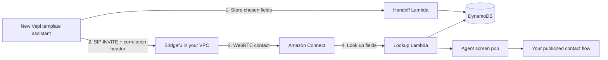

# Deploy Vapi transfers to Amazon Connect

This is the one setup guide for the Bridgefu Vapi → Amazon Connect recipe.
Starter is currently a **preview** release: use a nonproduction Connect instance
or an approved production pilot until the published release completes live
qualification.

Bridgefu Setup creates a new Vapi template assistant and deploys Bridgefu beside
your existing Amazon Connect instance. It does not change an existing Vapi
assistant or your selected customer contact flow.



## Before you start

You need:

- an AWS CLI v2 profile or AWS SSO profile;
- an active Amazon Connect instance and a published `CONTACT_FLOW`;
- permission to deploy CloudFormation and associate a Lambda and owned flow
  with that Connect instance;
- a public Route 53 hosted zone for a name such as
  `bridgefu.example.com`; and
- a Vapi private API key. Setup keeps it in native memory and never saves it in
  the deployment bundle, command arguments, environment variables, or logs.

Connect, Bridgefu, DynamoDB, and the Lambdas must use the same AWS region.
Amazon Connect is regional and AWS-managed; it is not inside a customer VPC.

## 1. Open Bridgefu Setup

Download **Bridgefu Setup** for your operating system from the Bridgefu GitHub
release. The application bundle includes the companion `bridgefu` CLI.

Until signed preview packages are published, a contributor can run the source
build:

```bash
cargo run -p bridgefu-setup
```

Choose **New deployment**. Nothing is changed while you move through the
wizard.

## 2. Select AWS and Amazon Connect

1. Choose your AWS profile and sign in if Setup asks you to refresh SSO.
2. Confirm the displayed AWS account and principal.
3. Select the Amazon Connect instance. This locks the AWS region.
4. Select the published flow that should receive the call after the screen pop.

Setup references that flow; it does not edit or delete it. The deployment owns
a small wrapper flow and an Agent Workspace guide in front of it.

## 3. Create the Vapi template

Paste your Vapi private API key and name the new assistant. Setup creates:

- one private webhook credential;
- one `prepare_bridgefu_amazon_connect_transfer` function tool;
- one destination-less `transferCall` tool; and
- one new template assistant with placeholder instructions.

Existing assistants are not read or modified. After deployment, open the new
assistant in Vapi and replace the placeholder business instructions with your
own. Keep the marked Bridgefu safety instructions and both transfer tools.

The template asks for explicit caller confirmation before transfer. Vapi also
evaluates a deterministic rejection rule outside the language model: a recent
human-agent request or confirmation is required, and `cancel`, `stop`, or
`wait` rejects the action. AWS separately refuses to issue a SIP route until
the exact call has stored valid context.

## 4. Choose the screen-pop fields

Setup starts with four editable fields:

- Customer name
- Issue summary
- Intent
- Verification status

You can use one to eight fields, reorder them, rename the labels, and choose
either text or a fixed list of choices. These definitions become the Vapi tool
schema, DynamoDB validation rules, and Connect screen-pop rows.

Only configured values are stored. Bridgefu does not store the transcript,
recording, Vapi API key, SIP route, or arbitrary Vapi payload. The default
retention is one hour; the wizard allows 5 minutes through 7 days.

To use more than one Connect destination, make a field such as `queue` or
`group` a **choice** field, then turn on **Reviewed routing**. Map each allowed
choice to a published flow discovered from the selected Connect instance. The
choice is stored with the other context before transfer; the lookup Lambda
returns its validated value and the Bridgefu wrapper chooses from the reviewed
map. The caller and model cannot provide a flow ARN. Missing or unmapped values
use the default flow.

## 5. Select DNS and review

Select a public Route 53 hosted zone. Setup suggests
`bridgefu.<your-zone>` and verifies public delegation.

The Review screen separates:

- AWS and Connect resources;
- the new Vapi resources;
- screen-pop fields and retention;
- IAM permissions; and
- immutable release artifacts.

Save the result as a `.bridgefu` bundle. It contains human-readable desired
state and a SHA-256 manifest, but no credentials or customer values. Changing
an artifact breaks the seal and requires another review.

Choose **Execute now** to create and show a CloudFormation change set. Enter
the exact stack name only after reviewing it. AWS is deployed first; Vapi is
not changed if CloudFormation fails. If Vapi fails afterward, reopen the same
bundle and resume rather than creating another stack.

You can also choose **Save and close** and give the bundle plus its sibling
state journal to an administrator. The administrator never needs your Vapi
key unless they are also completing the Vapi step.

## 6. Customize and connect the new assistant

Setup displays the created assistant ID. In the Vapi dashboard:

1. Open that new assistant.
2. Replace only the placeholder business instructions.
3. Keep the Bridgefu-marked safety policy, preparation tool, dynamic transfer
   tool, server URL, and credential attachment.
4. Test the assistant before assigning your production Vapi phone number or
   web entrypoint.

The language model never creates or sees a correlation ID, SIP URI,
reservation token, or webhook credential. The handoff Lambda derives the
opaque `bf1_…` ID from the authenticated Vapi organization and call, stores the
record first, and only then permits the transfer endpoint to return a one-use
SIP destination with `X-Correlation-Id`.

On the Connect side, Bridgefu maps that header to the `correlation_id` contact
attribute. The wrapper flow calls the lookup Lambda, populates the configured
screen-pop rows, and continues to your selected flow. Missing or expired
context is fail-open: the call continues without a screen pop.

## 7. Verify one transfer

Call the new Vapi assistant and ask for a person. Confirm the transfer when it
asks, then check:

1. the preparation tool returns `prepared`;
2. the Connect agent receives the contact and two-way audio;
3. the configured values appear before the customer flow begins; and
4. DTMF and hangup work normally.

For a structural check that does not place a call:

```bash
bridgefu setup status customer.bridgefu
```

Use the stack outputs for direct links to the CloudWatch dashboard and alarms.
Logs contain result categories and hashes, not configured field values.

## 8. Operate the deployment

Keep the `.bridgefu` bundle and its `.state.json` sibling together. They are
the deployment record used for status, resume, update, and ownership checks.

- **Monitor:** use `bridgefu setup status`, the CloudWatch dashboard, and alarm
  links in the stack outputs.
- **Update fields:** reopen the saved bundle, change the field schema, review a
  new sealed bundle and change set, then verify another transfer.
- **Rotate the webhook credential:** use Setup's rotation action and then run a
  verification call. Do not paste credentials into a shell command.
- **Detach:** stop assigning calls to the generated Vapi template before
  changing or removing AWS resources.
- **Uninstall:** retain the generated Vapi assistant and DynamoDB/audit data by
  default. Deleting the customized assistant or retained customer context is a
  separate destructive action with exact confirmation.

## Manual CloudFormation path

The wizard is the normal path. If policy requires a pipeline, choose **Export
artifacts** and give the sealed bundle to the administrator. The export
contains the exact template URL, versioned parameters, stack policy, expected
account and region, and required actions. The administrator can review without
receiving the Vapi API key.

The companion CLI uses the same setup engine:

```bash
bridgefu setup inspect customer.bridgefu
bridgefu setup export customer.bridgefu --output reviewed-artifacts
bridgefu setup apply customer.bridgefu
```

The last command creates a review-only change set. Add `--execute`, the exact
stack confirmation, and enter the Vapi key at the hidden prompt only after the
review is approved.

## Maintainer: disposable full proof

The full environment prove-out creates disposable AWS and Vapi resources,
runs real call scenarios and a 60–65 minute soak, then proves teardown. It is a
release-maintainer test, not a prerequisite for deploying beside an existing
Connect instance.

Follow the guarded
[nonproduction live qualification runbook](runbooks/nonproduction-live-qualification.md).
It includes the optional CloudFront demo page, smoke/full/negative/drill
matrices, rollback, and zero-resource evidence.

For the exact test inventory, see [qualification](qualification/README.md).
