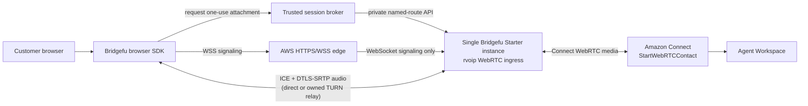

# Bridgefu-Owned Browser WebRTC to Amazon Connect Plan

Status: runtime dependency qualified; nonproduction core implemented and live dry-run review in progress
Scope: nonproduction first, then a separate non-HA production deployment  
Target region for the first proof: `us-west-2`  
Current release verdict: not yet proven live end to end

## 1. Decision

The browser call must terminate on WebRTC infrastructure controlled by
Bridgefu. A hosted browser-call provider cannot sit between the browser and
Bridgefu because that provider would own the first WebRTC session and would
have to supply a compatible transfer mechanism before Bridgefu could receive
the call.

The target call path is therefore:

There is no Vapi, Daily, SIP transfer, PSTN leg, or third-party browser media
server in this path. CloudFront or another AWS edge may proxy WebSocket
signaling, but it never terminates the peer connection or handles call audio.
The browser's `RTCPeerConnection` terminates at Bridgefu's rvoip WebRTC
adapter. Bridgefu creates and owns the separate Amazon Connect WebRTC leg and
bridges the two media graphs.

## 2. What already exists

This is not a plan to write a second browser SDK or media server from zero.
The repository already contains the main building blocks:

- `sdk/typescript` contains the alpha `@bridgefu/webrtc-browser` client. It
  owns the browser `RTCPeerConnection`, microphone and remote audio, WSS
  signaling, ICE, DataChannels, DTMF, reconnect behavior, and teardown.
- Bridgefu already exposes authenticated `rvoip.webrtc.v1` WSS signaling and
  consumes short-lived, one-use WebRTC attachments.
- `webrtc-amazon-connect-bridge@1` already describes the direct WebRTC to
  Amazon Connect route.
- Hermetic tests already cover the built SDK through the real Bridgefu
  adapters to the Amazon Connect adapter seams, including two-way audio,
  DTMF, initial contact attributes, both hangup directions, exactly one
  `StopContact`, and cleanup.
- The separate direct SIP-to-Bridgefu-to-Connect live proof demonstrated the
  downstream Connect flow, agent pickup, two-way audio, DTMF, and hangup. It
  is useful downstream evidence, but it is not evidence for this browser
  WebRTC ingress.

The open work is to productionize the existing browser ingress, package its
AWS edge and session-broker infrastructure, and produce retained live evidence
for the exact browser-to-Connect path.

### 2.1 rvoip hardening intake

Additional local rvoip work was reviewed before freezing this runtime
dependency and was not imported wholesale:

- Bridgefu pins the exact checksummed rvoip `0.3.7` crate family from crates.io,
  published from `dba121e95be128a5333d0986cb077596bc509e21`. It descends from the prior
  Connect-specific startup media-route and establishment-eviction fixes, adds
  a bounded inclusive UDP allocator, avoids unnecessary Opus-to-Opus
  transcoding when only `fmtp` differs, and preserves the browser's offered
  codec preference order in SDP answers.
- All 11 Bridgefu-local commits after 0.3.5 are represented in 0.3.7. Ten are
  patch-equivalent in the release history; the primary-audio-without-MID change
  has equivalent release logic and its regression test after intervening RTP
  work.
- Published-package regressions pass for late Connect tracks, wildcard Contact
  routing, driver backpressure and responsive unbind, no-MID audio and DTMF,
  Connect route retention, establishment backpressure, bounded UDP allocation,
  Opus fmtp passthrough, and answer codec preference.
- Most other changes are specifically for `rvoip-vapi` raw WebSocket audio
  framing, jitter, pacing, queueing, control, and telemetry. That transport is
  not present in this architecture and must not become a new dependency.
- The SIP listener-policy commit is also outside this direct path.
- Any separate `vapi-local` worktree remains evidence and a test consumer, not
  a release source for Bridgefu.

The historical clean candidate was created from the prior Bridgefu pin, preserving the
Connect startup-route fix. A follow-up experiment that reduced the media queue
to 500 ms and re-armed eviction history on renegotiation failed the Chromium
gate twice with timing-sensitive replacement-media failures; it was excluded.
The later Chromium failure was traced to answer codec ordering: rvoip removed
matching codecs from the offer in reverse-index order but failed to reverse the
result, causing Chrome to prefer PCMA while the graph recorded Opus as primary.
The accepted candidate corrects that ordering and passed:

1. bounded allocator uniqueness, exhaustion, invalid-range, and reuse tests,
   2/2;
2. rvoip RTC library tests, 181/181, plus the new codec-order regression;
3. rvoip media-graph tests, 46/46;
4. the full `rvoip-webrtc` package suite and `rvoip-amazon-connect` package
   suite with every non-ignored test green;
5. four consecutive bounded direct browser-protocol-to-Connect hermetic
   qualifications, including one from the pushed Git revision;
6. four consecutive bounded real-Chromium assistant-handoff-to-Connect
   qualifications, including one from the pushed Git revision; and
7. three consecutive real-Chromium qualifications of the exact direct
   browser-to-Connect route, covering two-way Opus, DTMF, initial context,
   replay rejection, both hangup directions, and cleanup; and
8. exact SDP evidence that Chromium received the single configured UDP port.

Repeated live Connect proof remains part of the AWS deployment gate.

Bridgefu must consume a pushed immutable revision or published, checksummed
crate release. It must not depend on a developer-local checkout, an unpushed
commit, or a mutable branch name.

## 3. Boundaries and non-goals

### In scope

- Audio-only browser WebRTC.
- A Bridgefu-owned TypeScript SDK and signaling protocol.
- A single Bridgefu Starter EC2 instance. No active/standby runtime, Auto
  Scaling Group, multi-node state replication, or other HA design.
- Short-lived, one-use browser attachments issued by a trusted backend.
- Direct Bridgefu `StartWebRTCContact` integration with an existing Connect
  instance and entry flow.
- Agent ring, automated test-agent pickup, screen-pop attributes, two-way
  audio, DTMF, and deterministic hangup.
- A no-custom-DNS nonproduction deployment using AWS-assigned service names.
- A separate non-HA production template that adds a customer-controlled HTTPS
  name and certificate when the owner is ready.

### Not in scope

- Vapi or Daily provisioning, APIs, SDKs, media, or transfer tools.
- SIP, SIPS, RTP, PSTN origination, or telephone numbers in this call path.
- Video or screen sharing in the first release.
- Anonymous public attachment issuance.
- Changing a customer's Connect routing logic without an explicit deployment
  parameter or operator action.
- Claiming production support from mock or local-only tests.

## 4. Required request and media contracts

### 4.1 Session broker contract

The browser must never receive the Bridgefu control-plane bearer or AWS
credentials. The application uses a trusted session broker:

1. The browser calls `POST /session` from the same HTTPS origin.
2. The broker authenticates and authorizes the application user, applies rate
   limits, creates an idempotency key, and accepts only allowlisted context.
3. The broker calls the private Bridgefu named-route API with fixed route
   `browser-amazon-connect` and ingress `webrtc`.
4. Bridgefu returns the call identifiers and one-use attachment.
5. The broker returns only the normalized public attachment descriptor. It
   must remove internal legs, provider identifiers, control-plane endpoints,
   and all reusable credentials.

The descriptor contains:

- the AWS-issued or production `wss://` signaling URI;
- one attachment token with a maximum two-minute lifetime and one-use policy;
- a separately scoped, attachment-bound signaling credential;
- the exact WebSocket subprotocol list;
- temporary ICE/TURN credentials; and
- the expiry time plus the minimum call/leg identifiers required by the SDK.

The broker must reject unknown JSON fields, unbounded strings, reserved
metadata names, invalid origins, replayed idempotency keys with different
payloads, and requests outside its caller/session quotas.

### 4.2 WebSocket signaling contract

The SDK offers these subprotocols during the WebSocket handshake:

1. `rvoip.webrtc.v1`
2. `token.<attachment-bound-credential>`
3. `bridgefu.attach.<one-use-attachment-token>`

The AWS edge must preserve the complete offered `Sec-WebSocket-Protocol`
header and the server's selected subprotocol. The implementation must add a
deployment test for this exact property; a successful generic WebSocket echo
test is insufficient.

Bridgefu validates both credentials, their binding to the same attachment,
expiry, tenant, call, leg, route, and usage. It consumes the attachment once
and rejects replay. Any socket or peer loss requires a newly issued attachment
rather than reuse of the old token.

### 4.3 Browser-to-Bridgefu media contract

- Audio codec: Opus as the deterministic primary browser codec.
- Signaling: WSS only, except explicit `localhost` development mode.
- Media security: ICE + DTLS-SRTP; no clear RTP.
- DTMF: `RTCDTMFSender` from the browser, translated by the Bridgefu media
  graph as required by the Connect leg.
- Remote audio: a browser `MediaStreamTrack` attached only after authenticated
  admission and successful media establishment.
- Hangup: browser disconnect sends route-scoped `bye`, closes socket and data
  channels, stops microphone tracks, closes the peer, and causes exactly one
  downstream `StopContact` when applicable.

### 4.4 Bridgefu-to-Connect contract

Bridgefu calls `StartWebRTCContact` with a fixed Connect instance and flow from
the named route. The broker-supplied context becomes only allowlisted initial
contact attributes. For this direct path, the initial allowlist should be:

- `correlation_id`
- `customer_name`
- `issue_summary`
- `intent`
- `verification_status`
- `source_call_reference`

`vapi_call_reference` was removed from this recipe. The direct route does not need
DynamoDB merely to recover context because Bridgefu supplies the bounded
attributes when it creates the Connect contact. Add durable call-state storage
only if live restart/reconciliation testing demonstrates a requirement that
cannot be met by the current production persistence implementation.

The Connect flow must route the WebRTC contact to the nonproduction queue and
test agent. The test harness may automate Agent Workspace pickup, audio, DTMF,
and hangup through the already established browser automation approach. It
must not modify the customer's production flow.

## 5. Nonproduction AWS architecture

### 5.1 Why a raw IP is not sufficient for the browser edge

The earlier nonproduction SIP endpoint could be addressed by IP. A browser
microphone cannot use the equivalent raw `http://<ip>` page: `getUserMedia()`
requires a secure context, and the SDK requires WSS. Nonproduction can still
avoid customer DNS by using the HTTPS hostname and default certificate AWS
assigns to a CloudFront distribution.

The nonproduction template will output:

- `DemoUrl=https://<distribution>.cloudfront.net/`
- `SignalingUrl=wss://<distribution>.cloudfront.net/webrtc`

This is no-custom-DNS, not no-hostname. Browser TLS requires a trusted
hostname. Production can later add an owned domain and ACM certificate without
changing the SDK protocol.

### 5.2 Single-server topology

Use one Bridgefu Starter EC2 instance and one service installation. Do not add
runtime replicas or HA state services.

For the first deployable version:

- CloudFront serves the private S3 demo application under `/` using Origin
  Access Control.
- `/session` routes to the session-broker HTTPS endpoint with caching disabled.
- `/webrtc` routes WebSocket upgrade requests to the Bridgefu instance's rvoip
  signaling listener with caching disabled and the required WebSocket headers
  forwarded.
- A public Application Load Balancer provides the stable CloudFront custom
  origin. It does not add a second runtime or runtime HA: its target group
  contains exactly the single Starter instance. The managed origin breaks a
  bootstrap dependency cycle that otherwise requires the instance to know the
  CloudFront hostname before CloudFront can know the instance hostname. A small
  host reverse proxy binds the target port, verifies a random
  CloudFront-to-origin header, and proxies only `/webrtc` to Bridgefu on
  `127.0.0.1:18080`. Bridgefu itself stays on loopback. Restrict ALB ingress to
  the AWS managed CloudFront origin-facing prefix list and runtime origin
  ingress to the ALB security group. Account for the prefix list's rule weight
  during static validation.
- The Bridgefu control API remains on the private VPC address and accepts only
  the session-broker security group. It is never routed by CloudFront.
- The EC2 instance has a stable Elastic IP for ICE/NAT advertisement and
  controlled direct media testing. Nonproduction media ingress is restricted
  to an explicit test-client CIDR parameter until TURN is enabled.
- The host reverse proxy is required for path and origin-secret enforcement,
  but origin-side TLS is not required for the first nonproduction stack if the
  origin port is reachable only from CloudFront's managed prefix list.
  Production must use either TLS to the origin or a CloudFront VPC origin after
  the exact WebSocket subprotocol qualification passes.

CloudFront must use a purpose-built origin request policy that forwards the
required WebSocket headers, especially `Sec-WebSocket-Protocol`. Do not route
the rvoip socket through API Gateway or a Lambda target because those services
do not transparently proxy the existing signaling connection and subprotocol
lease.

### 5.3 ICE and TURN

Signaling success does not prove media reachability. The initial CloudFormation
implementation must make the rvoip UDP binding and ICE candidate behavior
deployable with bounded security-group rules.

The runtime spike found a concrete gap in the initial qualified rvoip revision:

- `rvoip-webrtc` passes one configured `udp_bind` address into every new peer
  connection.
- `rvoip-webrtc-stack` calls `std::net::UdpSocket::bind` while constructing
  each peer connection. There is no process-wide ICE UDP mux and no bounded
  port allocator.
- `0.0.0.0:0` therefore chooses a different unbounded ephemeral port for each
  browser or Connect peer. A single fixed port is not an alternative: the
  browser and Connect legs of one call are separate peer connections and the
  second bind would collide.

The accepted rvoip revision `7eb6f3f0` implements the bounded allocator and is
now Bridgefu's immutable pin. Its unit tests prove concurrent uniqueness,
exhaustion, reuse, and invalid-range rejection. The media-graph pass-through
and codec-answer-order fixes close the two failures exposed by Chromium, and
the bounded Chromium gate passed four consecutive times. Bridgefu now maps the
range into both browser and Connect adapters and rejects ranges smaller than
two ports per configured concurrent call. Deployment remains blocked until the
CloudFormation security-group range and generated YAML are derived from the
same parameters.

The accepted implementation must bind exactly one available UDP socket per
peer from a configured inclusive range. Binding must be atomic at socket
creation (not a probe followed by a second bind), safe under concurrent peer
creation, fail closed with a typed capacity error when the range is exhausted,
and release the port when the peer is destroyed. Preserve `udp_bind` for
compatibility, add explicit bind IP, port-start, and port-end configuration,
and expose it through Bridgefu's schema, generated config,
readiness/capacity reporting, and CloudFormation parameters. Qualification
must cover unique concurrent allocations, exhaustion, reuse after teardown,
invalid ranges, every gathered host candidate being inside the configured
range, and the full Chromium media test. Do not solve this by opening all UDP
ports.

Qualify two media modes:

1. `all`: host/server-reflexive ICE over the Bridgefu Elastic IP from the
   controlled nonproduction client CIDR.
2. `relay`: TURN-only, proving calls from networks that block direct UDP.

For the shareable stack, provide one non-HA coturn instance or a clearly
defined external TURN input. The default plan is a separate small coturn EC2
instance so media relay resource pressure and package lifecycle do not share
the Bridgefu process host. It is still a single TURN node, not HA. Configure:

- UDP/TCP 3478 and TLS 5349 as explicitly selected by parameters;
- a bounded relay port range;
- time-limited HMAC credentials, never static browser passwords;
- allocation, per-user, bandwidth, and total quotas;
- a secret in Secrets Manager, with the broker generating short-lived
  credentials; and
- logs and metrics that exclude credentials and raw user identifiers.

TURN TLS needs a trusted name and certificate. For nonproduction, direct UDP
TURN is sufficient for the first direct-media proof; TURN/TLS qualification
requires either an AWS-assigned endpoint that supports the needed protocol or
the later production DNS/ACM step. This limitation must remain visible in the
stack outputs and test report.

### 5.4 Session broker and demo application

Package a minimal broker for proof and adopter onboarding, not as a universal
customer identity system.

- Lambda runs in the VPC and calls Bridgefu's private control API.
- The Bridgefu API bearer and TURN shared secret are read from Secrets Manager
  and never logged or returned.
- The public endpoint uses an HTTP API with a JWT authorizer. The demo stack
  may create a Cognito user pool and one operator-created test user; it must
  not create or output a password.
- CloudFront presents `/session` under the same origin as the static demo page.
- The browser page contains no AWS, Bridgefu, Connect, or TURN reusable secret.
- The page provides call, mute, DTMF, and hangup controls plus safe connection
  state and test-marker output.
- Production permits replacing the demo broker with the adopter's existing
  authenticated backend while retaining the same descriptor schema.

### 5.5 Least-privilege permissions

The Bridgefu EC2 role needs only:

- `connect:StartWebRTCContact` restricted to the configured entry flow;
- `connect:StopContact` restricted as tightly as the Connect resource model
  permits;
- read access to its exact runtime secret/version and release artifact; and
- the existing bounded logging/metrics permissions.

The broker role needs only read access to its exact Bridgefu API secret and
TURN secret plus VPC logging. It does not need Amazon Connect permissions.
The browser receives no IAM permissions.

## 6. CloudFormation deliverables

Create a new template family under
`recipes/webrtc-amazon-connect-bridge/cloudformation`. Do not bolt this onto
the Vapi/SIP template or inherit its resources by accident.

Planned files:

| File | Responsibility |
|---|---|
| `template.yaml` | Non-HA composition, parameters, conditions, outputs, and nested-template wiring |
| `nonproduction-foundation.yaml` | Artifact bucket and roles needed before packaging/deploying nested templates |
| `nested/network.yaml` | VPC, public/private subnets as actually required, routes, endpoints, and narrowly scoped security groups |
| `nested/runtime-starter.yaml` | One EC2 instance, EIP, service, private control API, WSS origin listener, bounded WebRTC media ports, persistence, IAM, and health |
| `nested/webrtc-edge.yaml` | CloudFront distribution, S3 demo origin, WSS behavior, origin request/cache policies, origin secret, and logging |
| `nested/session-broker.yaml` | Lambda, HTTP API, JWT authorization, secrets access, VPC networking, quotas, and safe logs |
| `nested/turn.yaml` | Optional single coturn node, EIP, bounded relay range, temporary credentials, metrics, and explicit non-HA warning |
| `nested/connect.yaml` | Existing-instance/flow validation inputs and least-privilege Connect policy; no destructive Connect ownership |
| `nested/observability.yaml` | Alarms, log groups, dashboards, retention, and redaction controls |
| `nested/demo-site.yaml` | Static browser harness and immutable SDK artifact publishing |
| `nested/qualification-runner.yaml` | Opt-in real-browser runner, evidence bucket, and bounded test permissions |
| `guard/nonproduction.guard` | No public control API, no reusable browser secrets, bounded media ranges, encrypted stores, and no Vapi/Daily/SIP resources |
| `guard/production.guard` | Nonproduction rules plus owned TLS name, deletion protection/retention choices, stricter log retention, backups, and production allowlists without adding HA |
| `production-stack-policy.json` | Prevent accidental replacement/deletion of the single runtime data and secret resources |

Required template parameters include the existing Connect instance ARN and
entry flow ID, allowed browser/test CIDRs, artifact version and digest,
instance size, log retention, media UDP range, TURN mode, demo-site mode, and
optional production hostname/certificate. No account ID, customer name,
company name, endpoint, token, or credential is checked into the repository.

Required outputs contain only safe deployment information: demo URL, signaling
URL, stack/version identifiers, instance/flow suffixes if needed for operator
diagnostics, test-run command, and cleanup command. Secret values and full
account-scoped ARNs must not be outputs.

## 7. Implementation phases

### Phase 0 — Freeze the exact contracts

- Give the descriptor, signaling subprotocols, context allowlist, DTMF,
  hangup, and reconnect contracts versioned fixtures.
- Remove the Vapi-specific context field from the direct recipe.
- Keep the accepted immutable rvoip revision from section 2.1 and record the
  generated SDK package digest. Do not use a local path dependency or mutable
  branch.
- Add an architecture decision record stating that the browser peer terminates
  at Bridgefu and that provider-hosted WebRTC is excluded.
- Define redaction-safe call, leg, attachment, and Connect contact correlation.

Exit gate: SDK, server, broker, and recipe fixtures agree byte-for-byte on the
public contract.

### Phase 1 — Close runtime and SDK gaps locally

- Complete the bounded UDP/range spike and implementation.
- Run TypeScript type checking, unit tests, mocked signaling tests, and the
  ignored real-Chromium qualification.
- Add real-browser tests for single-use attachment replay, expiry, wrong
  credential, mismatched subprotocol, signaling drop, new-token reconnect,
  microphone denial, autoplay policy, DTMF-unavailable, and deterministic
  track cleanup.
- Prove the built package tarball, not the source tree, against the pinned
  runtime dependency graph.
- Add Firefox and WebKit Playwright projects for contract-level browser
  coverage, while reserving final Safari evidence for a real supported Safari
  host.

Exit gate: all local tests pass repeatedly, including real Chromium and both
hangup directions, with no leaked graph/session/track resources.

### Phase 2 — Build and statically audit CloudFormation

- Implement the new nested templates and package script.
- Reuse generic, already-audited snippets only after removing Vapi/SIP/HA
  assumptions; do not copy account-specific defaults.
- Run YAML parsing, `aws cloudformation validate-template`, `cfn-lint`, Guard,
  IAM policy analysis, shell/static analysis, secret scanning, public-repo
  identifier scanning, and unit tests for generated runtime config.
- Generate a change set in the target account and inspect every replacement,
  ingress rule, IAM action, secret, and output before execution.
- Run at least three clean independent static/dry-run audit passes. Any new
  defect resets the clean-pass count for the affected layer.

Exit gate: three consecutive clean dry-run/audit passes and an approved change
set with no unexpected resource or permission.

### Phase 3 — Deploy retained nonproduction infrastructure

- Deploy the new stack alongside the retained SIP proof; do not alter or tear
  down the known-good path.
- Leave the WebRTC stack running while debugging until the acceptance suite is
  complete or cost/safety requires an explicit stop.
- Verify instance bootstrap, artifact digest, service health, private control
  API isolation, CloudFront WSS upgrade, exact subprotocol preservation,
  single-use token consumption, and ICE candidate advertisement.
- Verify direct requests to the WSS origin without the CloudFront origin secret
  are rejected.
- Verify the browser can call the broker only with valid JWT authorization and
  cannot select another route, instance, flow, or tenant.

Exit gate: a real browser reaches authenticated Bridgefu WebRTC ingress over
the AWS-assigned HTTPS/WSS endpoint and establishes stable inbound/outbound
audio tracks before Connect qualification begins.

### Phase 4 — Live Amazon Connect end-to-end proof

Run the exact path:

`real browser -> packaged SDK -> WSS/ICE/DTLS-SRTP -> Bridgefu -> StartWebRTCContact -> nonproduction flow -> queued test agent`

Automate the test agent where the Connect UI/API permits it. Each run must:

1. Create a fresh authenticated browser session and one-use attachment.
2. Establish the browser peer directly with Bridgefu.
3. Observe one successful `StartWebRTCContact` with exact allowlisted initial
   attributes.
4. Confirm the expected Agent Workspace screen pop.
5. Ring and have the designated test agent accept the contact.
6. Keep both parties connected for at least 30 seconds after pickup.
7. Send distinguishable timestamped audio markers browser-to-agent and
   agent-to-browser; capture each remote side and programmatically detect the
   expected markers.
8. Send a DTMF sequence in each direction where the Connect surface supports
   it and verify exact digits/order at the receiving boundary.
9. Run one browser-initiated hangup and one agent-initiated hangup, verifying
   prompt peer teardown and exactly one `StopContact` where required.
10. Store sanitized signaling, ICE, state-transition, contact-trace, audio
    analysis, and cleanup evidence under the test run ID.

The browser and agent recordings are test fixtures/evidence only. Enable them
only for the synthetic nonproduction participants and use a short retention
period.

Exit gate: three consecutive clean live end-to-end runs. Any unexplained
failure or new defect resets the clean-run count after the fix.

### Phase 5 — Adverse-path and interoperability qualification

- Direct UDP and TURN-only ICE.
- UDP blocked with TURN/TCP or TURN/TLS where the deployed endpoint permits.
- Chrome, Firefox, and real Safari current supported versions.
- Microphone permission denied/revoked and device removal.
- WebSocket interruption, ICE disconnect/failure, browser refresh, and EC2
  service restart.
- Attachment expired, replayed, malformed, wrong origin, wrong tenant, and
  credential/token mismatch.
- Broker auth failure, quota, duplicate request, and Connect throttling.
- Connect no-agent, agent reject, flow failure, start timeout, media failure,
  and stop retry/reconciliation.
- Packet loss, latency, jitter, and temporary route change.
- Concurrent-call load to the declared Starter capacity, followed by a soak at
  the intended nonproduction concurrency.
- Verify that restarting the only runtime interrupts active calls, as expected
  for the explicitly non-HA design, but reconciles their downstream contacts
  and accepts new calls after recovery.

Exit gate: every advertised capability has retained evidence; limitations are
documented rather than hidden behind a general success claim.

### Phase 6 — Make the proof reusable

- Publish a versioned SDK release candidate and checksum without publishing to
  a public registry until owner authorization.
- Add a one-command package/validate/deploy workflow and a separate explicit
  cleanup workflow.
- Provide an adopter values file containing placeholders only.
- Provide runbooks for deploy, identity setup, Connect inputs, test execution,
  logs/evidence, upgrade, rollback, and cleanup.
- Add a cost inventory and warn that retained EC2, CloudFront, NAT, TURN, logs,
  and Connect usage incur charges.
- Test the documentation from a clean checkout and a second AWS principal that
  has only the documented deployment role.

Exit gate: a new operator can deploy the nonproduction stack without repository
knowledge or account-specific edits and can reproduce the three-run proof.

### Phase 7 — Non-HA production promotion

Production is a separate stack and explicit decision, not a parameter flip on
the retained proof stack.

- Add the owned HTTPS/WSS hostname and ACM certificate.
- Disable the demo broker/site unless explicitly retained behind the production
  identity provider.
- Integrate the adopter's authenticated backend with the frozen session
  contract.
- Apply production CIDRs/origin rules, secret rotation, alarms, backups,
  retention, budgets, stack policy, and change-management gates.
- Run a production change set, security review, rollback rehearsal, canary call,
  and the same two-way media/DTMF/hangup proof.
- Document the single-server availability limitation: EC2 or service failure
  interrupts active calls and prevents new calls until recovery. Do not label
  the deployment HA.

Exit gate: owner approval of the limitation and retained production canary
evidence. Only then promote the recipe support tier.

## 8. Acceptance matrix

| Area | Required evidence |
|---|---|
| Path ownership | Network/resource trace shows no Vapi, Daily, SIP, or PSTN resource or packet in the call path |
| Browser ingress | Packaged SDK connects by WSS with exact three subprotocols and one-use attachment |
| Security | Expired/replayed/mismatched tokens fail; reusable secrets never enter browser, URL, logs, or outputs |
| ICE/media | Direct UDP and TURN-only modes pass; bounded public port ranges match the template |
| Connect creation | Exactly one expected `StartWebRTCContact`; no caller-selected instance or flow |
| Agent behavior | Correct queue rings, designated agent accepts, and expected screen-pop fields render |
| Audio | Timestamped marker is detected in both directions for every accepted run |
| DTMF | Exact digits and order are observed in every advertised direction |
| Duration | Media remains established for at least 30 seconds after agent pickup |
| Teardown | Both terminal directions pass; tracks/sockets/graphs drain; one `StopContact` when required |
| Recovery | Failed/abandoned calls reconcile; service restart returns to healthy and accepts new calls |
| Browsers | Current Chrome, Firefox, and real Safari evidence is retained |
| Repeatability | Three consecutive clean nonproduction end-to-end runs from versioned artifacts |
| Portability | Clean-checkout operator can deploy with placeholder values and documented least-privilege role |

## 9. Known risks and decisions that must not be deferred

1. **Bounded WebRTC UDP allocation.** The spike confirmed that
   `udp_bind: 0.0.0.0:0` allocates an unbounded ephemeral socket per peer and
   that a fixed port collides across the browser and Connect legs. Implement
   and qualify the inclusive allocator contract in section 5.3 before any
   media security-group rule or deployment. Revision `7eb6f3f0` has passed the
   allocator and Chromium gates and is now pinned. The remaining requirement
   is one-source-of-truth integration across Bridgefu configuration,
   readiness/capacity output, and CloudFormation ingress rules.
2. **TURN/TLS without custom DNS.** The first no-custom-DNS proof can use
   direct ICE and TURN/UDP. A broadly portable TURN/TLS endpoint needs a
   trusted name/certificate or a compatible managed relay provider; this must
   be settled before production qualification.
3. **CloudFront subprotocol preservation.** Attachment credentials are carried
   in `Sec-WebSocket-Protocol`. Test the exact CloudFront policy and response,
   not merely a 101 status.
4. **CloudFront-to-origin security.** A public EC2 custom origin is acceptable
   only for the nonproduction Starter proof with managed-prefix-list
   restriction plus an origin secret. Evaluate CloudFront VPC origin for
   production after its exact WebSocket behavior is qualified.
5. **Single-server failure.** No HA means active calls are interrupted during
   runtime restart or host failure. Persistence must still prevent orphaned
   Connect contacts and recover admission for new calls.
6. **Browser autoplay and permissions.** A real user gesture, microphone
   permission, and remote-audio policy are part of the SDK contract and must be
   tested on real browsers.
7. **Connect automation boundary.** Automate agent pickup and media proof only
   using supported interfaces or isolated UI automation. Do not assume
   `StartWebRTCContact` itself answers the agent side.
8. **Divergent rvoip hardening.** The current Bridgefu pin and the Vapi
   hardening branch are divergent. Replacing one with the other could either
   lose the Connect startup fix or pull irrelevant raw-audio behavior into the
   direct path. Selective integration plus A/B qualification is mandatory.

## 10. Immediate next work

Execute in this order:

1. Freeze the remaining descriptor fixtures and record the SDK package digest.
2. Complete readiness/capacity reporting for the bounded UDP configuration;
   schema, runtime, Connect-adapter, and capacity validation are integrated.
3. Build the minimal session broker and exact CloudFront WSS subprotocol spike.
4. Implement the new non-HA CloudFormation template family.
5. Complete three clean static/change-set audits.
6. Deploy and retain the nonproduction stack.
7. Prove real browser-to-Bridgefu media, then the full Connect agent call.
8. Run three consecutive clean live end-to-end calls and the adverse-path
   matrix.
9. Package the reproducible adopter workflow.
10. Design and deploy production only after nonproduction acceptance.

## 11. Authoritative references

- [Amazon Connect `StartWebRTCContact`](https://docs.aws.amazon.com/connect/latest/APIReference/API_StartWebRTCContact.html)
- [Amazon Connect service authorization](https://docs.aws.amazon.com/service-authorization/latest/reference/list_connect.html)
- [CloudFront WebSocket requirements and headers](https://docs.aws.amazon.com/AmazonCloudFront/latest/DeveloperGuide/distribution-working-with.websockets.html)
- [CloudFront default HTTPS certificate](https://docs.aws.amazon.com/AmazonCloudFront/latest/DeveloperGuide/DownloadDistValuesGeneral.html)
- [CloudFront origin-facing managed prefix list](https://docs.aws.amazon.com/AmazonCloudFront/latest/DeveloperGuide/LocationsOfEdgeServers.html)
- [Application Load Balancer WebSocket behavior](https://docs.aws.amazon.com/elasticloadbalancing/latest/application/load-balancer-listeners.html)
- [Browser `getUserMedia()` secure-context requirement](https://developer.mozilla.org/en-US/docs/Web/API/MediaDevices/getUserMedia)
- [coturn time-limited credentials and bounded relay ports](https://github.com/coturn/coturn/wiki/turnserver)
